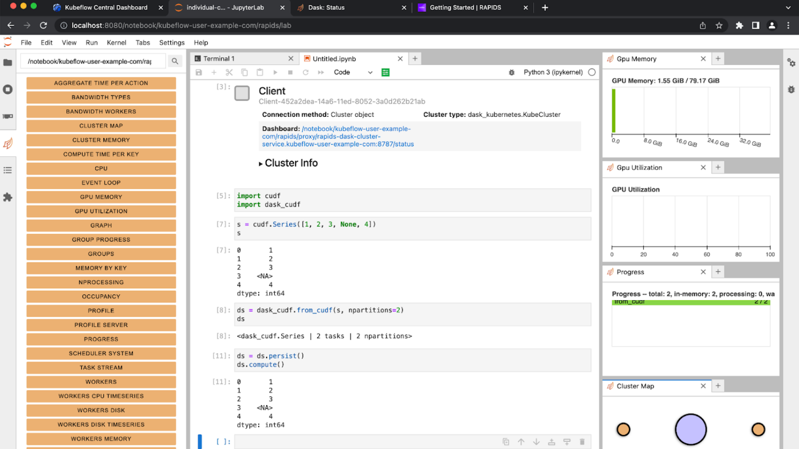

Happy Friday! Here are five things you might find interesting.

_Was this forwarded to you? [You can subscribe here!](https://jacobtomlinson.dev/newsletter)_

## 1. Blog: Accelerating ETL on KubeFlow with RAPIDS

[](https://developer.nvidia.com/blog/accelerating-etl-on-kubeflow-with-rapids/)

Last week a blog post I wrote about running RAPIDS on Kubeflow was [published on the NVIDIA Developer Blog](https://developer.nvidia.com/blog/accelerating-etl-on-kubeflow-with-rapids/).

This post was particularly exciting because it marks the culmination of months of engineering work. At the start of 2022 I set out to ensure that RAPIDS integrates seamlessly with KubeFlow and as a result ended up completely overhauling how Dask deployments work on Kubernetes.

It has taken many hours of engineering effort to even make this post possible, so a huge thank you to everyone both within RAPIDS and also in the Dask community who came together to make this happen.

## 2. My blog now uses the Dracula theme for syntax highlighting

I continually tweak how my blog looks, and the latest change I made this week was switching the syntax highlighter theme to [Dracula](https://draculatheme.com/).

I use Dracula day-to-day in VSCode and Iterm 2 for terminal colours and syntax highlighting.
I want my blog to be a representation of myself (the teal colour used throughout is the same as the wall in my office) so I thought why not use the same code theme.

```yaml
# https://github.com/dracula/visual-studio-code/blob/master/src/dracula.yml
$schema: vscode://schemas/color-theme
name: Dracula
semanticClass: theme.dracula
semanticHighlighting: true
dracula:
  base:
    - &BG        '#282A36'
    - &FG        '#F8F8F2'
    - &SELECTION '#44475A'
    - &COMMENT   '#6272A4'
    - &CYAN      '#8BE9FD'
    - &GREEN     '#50FA7B'
    - &ORANGE    '#FFB86C'
    - &PINK      '#FF79C6'
    - &PURPLE    '#BD93F9'
    - &RED       '#FF5555'
    - &YELLOW    '#F1FA8C'
```

## 3. Code snippet: Expanding environment variables in arbitrary strings Python

Sometimes I want to allow a user to configure a template for a string and then [populate it from various sources](https://github.com/dask/dask-kubernetes/blob/5718f1f7eaf1f5220dda6cc0dc4e7162a54751a3/dask_kubernetes/classic/kubecluster.py#L591-L593).
We may want to generate a uuid or substitute in environment variables.

I often do this by leveraging Python's [str.format()](https://docs.python.org/3/library/stdtypes.html#str.format).
While f-strings are my preferred way of templating strings these days the older format style is great for creating a template string in one place and populating it in another.

We can then populate user provided strings with a whole array of useful things like a generated uuid or even the whole set of environment variables. If a kwarg to format isn't used in the template it will quietly ignore it.

```python
import os
import uuid

# Imagine the user configured this string somewhere
user_string = "Hello {USER} your uuid is {uuid}"

# Now let's populate the user string with all sorts of useful optional variables
filled_string = user_string.format(uuid=str(uuid.uuid4())[:10], **os.environ)

print(filled_string)  # for me prints "Hello jacob your uuid is a27fcecd-1"
```

## 4. Podcast: Fake Doctors, Real Friends

Most of the podcasts I listen to are either work related, educational, informational or news.
But if I need to unplug my brain a little I always reach for the [Scrubs rewatch Podcast "Fake Doctors, Real Friends"](https://scrubs.fandom.com/wiki/Fake_Doctors,_Real_Friends_with_Zach_and_Donald).

I was a huge fan of Scrubs when it came out and it's awesome to see the cast and creators going on to make even more brilliant TV recently like [Ted Lasso](https://www.looper.com/494168/the-episode-of-ted-lasso-you-didnt-know-zach-braff-directed/). So it's really nice to listen to the cast chat about their time on the show and relive one of my favorite watches while I'm doing the dishes.

[](https://scrubs.fandom.com/wiki/Fake_Doctors,_Real_Friends_with_Zach_and_Donald)
## 5.

---

That's all folks! I hope you had a good week and I'll see you next Friday.
