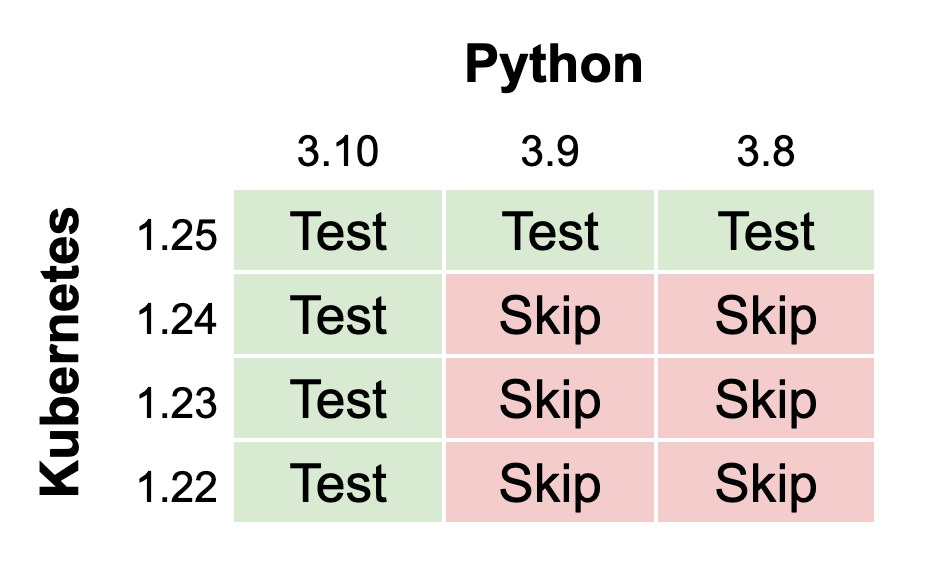

## 1. Testing multiple Kubernetes versions in `dask-kubernetes`

Recently [Kubernetes v1.25](https://kubernetes.io/blog/2022/08/23/kubernetes-v1-25-release/) was released which became the default Kubernetes created by `kind`.
In `dask-kubernetes` we use `kind` to create clusters to test against in CI. 
This change in default version caused the `dask-kubernetes` CI to fail unexpectedly.
To resolve this I spent some time this week increasing the test matrix to explicitly test against all Kubernetes versions that we support. Initially I was testing every Python version against every Kubernetes version, which resulted in a lot of uneccesary jobs. Instead we switched things up so that every Python version is tested against the latest Kubernetes, and every Kubernetes is tested against the latest Python. 

```yaml
matrix:
  python-version: ["3.8", "3.9", "3.10"]
  kubernetes-version: ["1.25.0"]
  include:
    - python-version: "3.10"
        kubernetes-version: "1.22.13"
    - python-version: "3.10"
        kubernetes-version: "1.23.10"
    - python-version: "3.10"
        kubernetes-version: "1.24.4"
```

This compromise gives good coverage of all supported versions with out spawning lots of uneccesary jobs.



## 2.

## 3.

## 4.

## 5.
