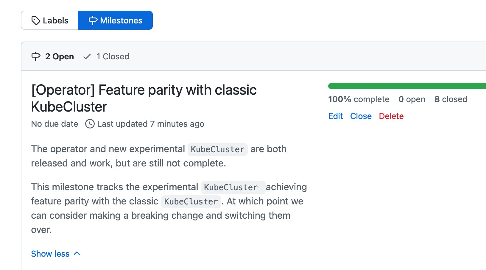

## 1. Dask overview for Stanford distributed computing group

This week I gave [a presentation to folks at Stanford on Dask](https://jacobtomlinson.dev/talks/2022-09-29-stanford-legion-dask-overview/). I mistakenly thought that my target audience would be students who were studying distributed computing and so I pulled together some Dask tutorial material and prepared to give a 101 level introduction to distributed computing in Python.

On the morning of the talk it came to light that I was actually presenting to the [Stanford Legion group](https://legion.stanford.edu/) which is a collaborative group of professionals from Stanford, NVIDIA and some national labs working on HPC distributed computing systems. I couldn't present an intro style talk to distributed computing professionals so I threw away my slide deck and rushed something new together at the last minute. Thankfully the talk was at 7pm for me so I had the rest of the day to put something new together.

I decided to pivot to a talk on the history of Dask, where it has grown from, why it is so popular and what we are thinking about next. This material seemed to go down well and resulted in some excellent discussion around centralised vs distributed schedulers and comparisons with other distributed frameworks in the Data Science space.

## 2. Writing talks quickly

This wouldn't be the first time I've had to throw together a talk at the last minute. Being able to pull content together quickly and present a talk without rehearsing it is a very useful skill, so here's a rough outline of how I approach writing a talk.

First I put together an [overall narrative](https://jacobtomlinson.dev/posts/2022/narrative-driven-development/). What story do I want to tell? I like to do this by writing three bullet points describing what I want the audience to learn from the talk. I usually do this on a first blank slide in the deck that I delete at the end of writing.

Then I make a bullet point list that describes the outline of the talk. Each bullet is a slide and I indent them into sections that make sense. Once I am happy that the outline will communicate the three takeaways I make blank slides for each bullet.

Then I scour decks that I've presented in the past for slides I can drop in and modify to save writing slides from scratch. Next I look through blog posts, GitHub issues and other existing material for things I can use to compose other slides. Finally I resort to creating brand new slides, but this should only be the minority of slides depending on whether I've talk/written on this topic much in the past.

For pacing I generally work on presenting one slide per minute. This has taken practice to get right both in terms of writing and delivery, but enforcing this limitation on myself in every talk I give means it has become second nature and I rarely have to worry about timings. If I'm asked to talk for 30 minutes I'll create 30 slides and it generally just works out.

If you're interested in improving your public speaking ability I highly recommend [speaking.io](https://speaking.io/) as a great resource.

## 3. Dask Kubernetes release

This week I released [`dask-kubernetes` `2022.9.0`](https://pypi.org/project/dask-kubernetes/2022.9.0/). I'm very excited about this release because it completes the milestone of having feature parity between the existing implementation of `KubeCluster` and the new operator based version [we started building at the start of 2022](https://github.com/dask/dask-kubernetes/issues/256).

This will be the last release with the classic `KubeCluster` implementation being the default and from `2022.10.0` onwards we will be deprecating the classic cluster manager and encouraging folks to migrate to the new implementation.

## 4. Deprecating Python packages

Since starting work on the new Dask Operator I've been thinking about how to go about deprecating the old cluster manager. The [primary reasons](https://github.com/dask/dask-kubernetes/issues/256) for rebuilding it was to make things more maintainable, composable, extensible and stable. These are excellent goals to have but have little to do with the surface level user experience. They will benefit maintainers and power-users more than the general community (although that will benefit everyone from a big picture perspective).

One challenge with the new approach is it adds a new up front dependency. In order to use the new implementation you must first [install the Dask operator CRDs and controller](https://kubernetes.dask.org/en/latest/operator_installation.html) on your Kubernetes cluster. This has to be done once for each cluster and is pretty common practice in the Kubernetes world, but it adds a new barrier to entry which will increase the learning curve for beginners. It's a shame to do this, but the tradeoff is definitely worth it.

This is a significant enough change that if the project was versioned with SemVer I would do a breaking major bump and just rip out the old implementation. But given that [Dask uses CalVer](https://github.com/dask/community/issues/100) across its projects I don't want to pull the rug out from everyone with such a hard break. Given that CalVer is becoming increasingly popular in the PyData community it's common to introduce shims and deprecation warnings and more gently lift folks over.

I really like how Kubernetes handles things and am somewhat inspired by this. They [support each version of Kubernetes for a year](https://kubernetes.io/releases/patch-releases/#support-period) and they only remove a deprecated feature once the oldest supported version has a deprecation warning for that feature. This way you never have supported versions that both include a feature and have it totally removed.

So my plan for `dask-kubernetes` is to deprecate the classic `KubeCluster`, hold folks hands while they migrate over but pick a time in the future for it to go away. If they still want it they can always pin to an older version, and if the new implementation is somehow worse in the long run we can always cherry-pick it back.

## 5. Self-hosted: Vault

In [last week's newsletter](https://jacobtomlinson.dev/newsletter/2022-09-23-how-much-ci-is-too-much-ci/) I mentioned that I use NGINX to reverse proxy all of the Docker container running on my NAS and use Lets Encrypt to generate wildcard TLS certs for my intranet domain.

This is great but I have a few other machines and VMs in my home lab that expose web services outside of this reverse proxy. There are occasions where I want those to also be TLS encrypted and so I have to somehow get certs for them. I could generate new certs and run certbot on all of my machines, or a better solution would be to generate them in one place and securely share them to all the web services that need them.

This week I've been experimenting with using [Hashicorp Vault](https://www.vaultproject.io/) to store these secrets. Vault is a password manager-like service for teams and applications to store secrets. You can check key/values in and out via an authentication or Vault generate short lived password for you. I'm nowhere near touching all of it's capabilities in my home setup but as a programmatic password manager it is doing a great job.

I've extended my certbot script to also check my TSL certs into Vault and then set up scheduled jobs on systems that want those certs to check them out and update their services.

---

That's a wrap, have a great weekend everyone!

