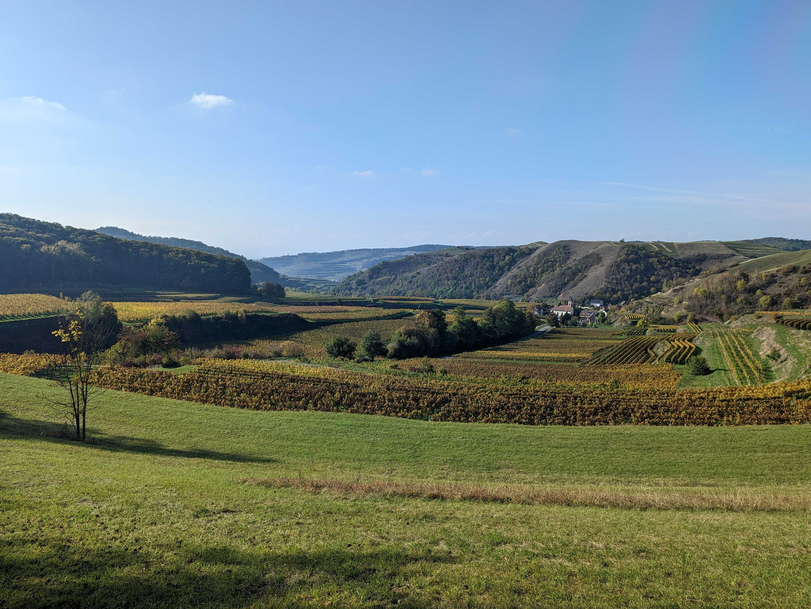
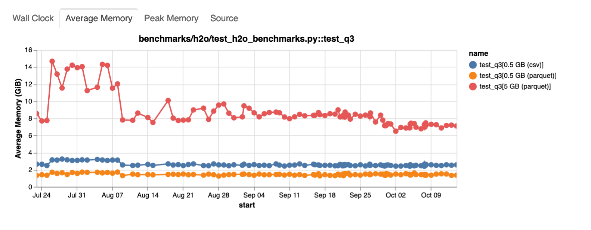
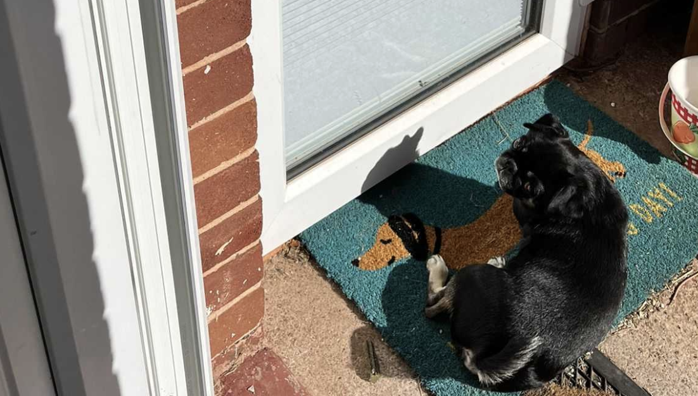

## 1. Offsites

This week I joined some colleagues from [Coiled](https://www.coiled.io/) at their team offsite in Germany to talk about [Dask Distributed](https://distributed.dask.org/en/stable/) maintenance.

The primary goals of their meeting were to socialise and build team bonds, prioritize their current backlog, gather around a whiteboard to hash out some technical designs and generally improve alignment with the rest of Coiled. My goals as an external partner gatecrashing their meeting were to build rapport with other Dask developers and to facilitate alignment between teams at Coiled and NVIDIA.

The offsite followed the structure laid out in [this blog post by Matt Rocklin](https://matthewrocklin.com/startups/offsites/) and I thoroughly enjoyed the format. If you're interested in running successful offsites I can definitely recommend this model.

## 2. Walking meetings

Much of the workday during the offsite was spent in an office with a large screen and a whiteboard which are key to having good quality technical discussions. But there were a long list of non-technical discussion topics that we also wanted to cover that just needed everyone alert and up for a bit of debate and discussion.

For this we drove into the countryside and spent a couple of hours taking a walk. Every now and then we would stop, catch our breath and discuss one of the topics from the list. Once the discussion reached an impasse or ran out of steam we continued walking for a bit longer. I really enjoyed this approach because we got through many topics in a reasonable amount of time, everyone was engaged in each discussion and we didn't get stuck talking in circles on any particular topic.

Before we started walking again we would read out the next topic. I think having a bit of time to think on it individually before discussing as a group helped folks form their thoughts better, and having an activity to do during that time avoided any awkward silences.

There were topics that didn't really come to a conclusion and that felt a little dissatisfying, but on reflection I'm not sure if more talking would've helped so perhaps this was a fine way to leave things.

## 3. Production readiness in PyData

A topic we discussed a lot while we were together was what does production readiness mean for open source projects in the PyData ecosystem.

In Dask we strive to ensure our users have a good time, that things don't break unexpectedly and folks can upgrade easily when they want newer features. But does that mean Dask is production ready?

Many people run Dask in production and they seem to be happy. Folks like [RAPIDS](https://rapids.ai/) are building tools on top of Dask and our customers also seem happy.

Other adjacent projects like Pandas are heavily used in production and we generally consider Dask to be of a similar level of maturity and stability as Pandas.

Putting all of this together gives me confidence when telling folks that Dask is production ready, but it was interesting to note that we were measuring this using anecdotes rather than data. Perhaps this is something we should continue to explore in the future.

## 4. Benchmarks

We also spent a lot of time this week talking about benchmarks. The Coiled team have put a lot of effort lately into setting up a suite of benchmarks that run on Dask every day and have produced [some nice dashboards](https://benchmarks.coiled.io/coiled-upstream-py3.9.html) that show how Dask's performance changes over time. This makes it possible to identify when a regression happens and allows us to track down the change that caused it. We identified this as a key area that we can to continue collaborating on and improving in the Dask community as it is a super useful tool.

This also got me thinking generally about testing in Python. Typically when we write tests they are pass/fail. Most projects ensure that all tests pass every time you merge a PR to have confidence that things are working. Benchmarks are more rare though. CI platforms like GitHub Actions don't have any clear way of tracking arbitrary measurements like wall time or average memory and so folks have to find their own infrastructure and run a tool like [ASV](https://asv.readthedocs.io/en/stable/).

Actioning benchmark data is also a little trickier than normal tests. Often you are trying to minimize a number such as how long something takes to run, but you need to decide what is good enough. Are you willing to sacrifice that number in exchange for some other change? It's less clear cut and down to use judgement.

Some projects may also care less about raw performance and instead favor things like user experience which is harder again to empirically measure. So I understand why fewer projects do this compared to unit testing, but I'd love to see more tools for benchmarking and see more projects invest in data driven development.

## 5. Podcast: Under the Radar

One of my favourite podcasts is [Under the Radar](https://www.relay.fm/radar) by David Smith and Marco Arment. They are both independent app developers who focus on Apple products. They always keep the show under 30 minutes and tend to dive into interesting developer topics. I especially enjoy the show because they talk about software engineering but not the same technologies, platforms, business models, etc that I work with day to day. This means when I notice similarities and patterns they stand out more. It also means I can switch off from work but still listen to something about the thing I do every day.

I enjoyed their [episode this week on motivation slumps](https://www.relay.fm/radar/253). I sympathise a lot with what they talked about. I find myself having insanely productive weeks one week and then beat myself up the next week for getting nothing done, it was kinda reassuring to hear that this happens to other folks.

---

That's a wrap, have a great weekend everyone!

