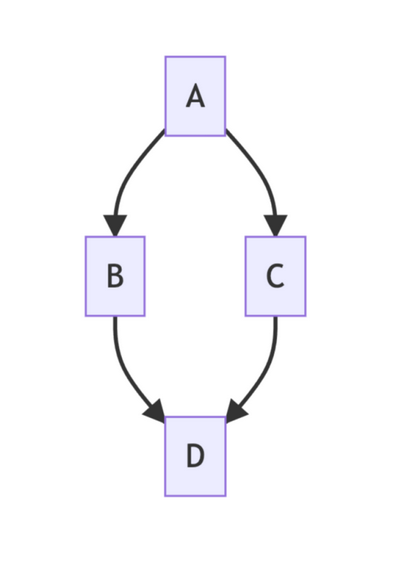
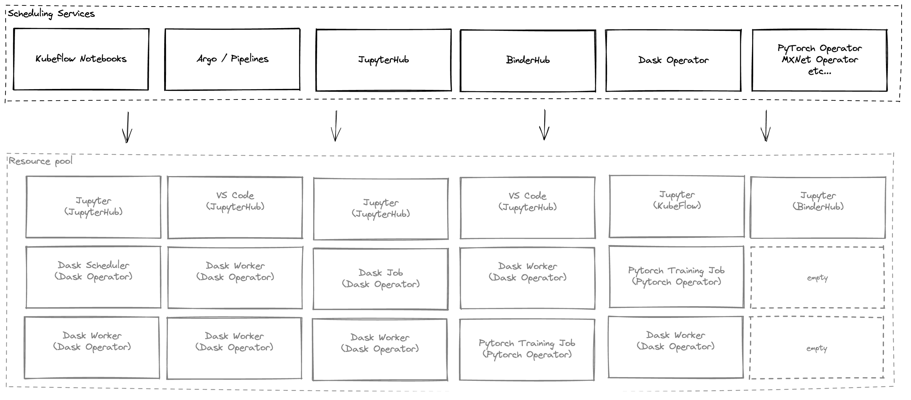
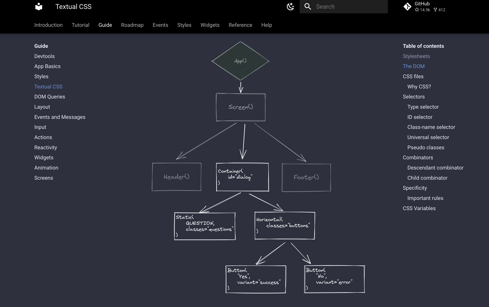

## 1. JSON Patch

If you want to install the [Dask Operator](https://kubernetes.dask.org/en/latest/operator.html) on a [Kubeflow](https://www.kubeflow.org/) cluster you need to patch the `kubeflow-kubernetes-edit` cluster role to give users permission to create Dask custom resources.

Our initial documentation for this provided the following patch command which updates the rules of the role with the one we need.

```console
$ kubectl patch clusterrole kubeflow-kubernetes-edit --patch '{"rules": [{"apiGroups": ["kubernetes.dask.org"],"resources": ["*"],"verbs": ["*"]}]}'
```

However we quickly noticed that this *replaces* the `rules` section rather than *appending* to it, effectively revoking any other permissions previously set on that role.
We resolved this by [updating the docs](https://github.com/dask/dask-kubernetes/pull/543) to suggest using `kubectl edit` instead and sharing the section that you should interactively insert into the rules list.

```console
$ kubectl edit clusterrole kubeflow-kubernetes-edit
…
rules:
…
- apiGroups:
    - "kubernetes.dask.org"
    verbs:
    - "*"
    resources:
    - "*"
…
```

This avoided breaking our users config but introducing an interactive step felt like a hack and hasn't sat right with me ever since.
This week I was reminded of the `{"op": "replace", "path": "/foo/1/bar", "value": "baz"}` style syntax and decided it was time to figure out how that works and fix our documentation properly.

I've always seen these around but never fully understood how to use them so I spent a little time this week learning about [JSON Patch](https://jsonpatch.com/).

If you call `kubectl patch --type="json" ...` this changes the behaviour from overlaying the patch payload onto the existing resource to executing a list of operations specified in the JSON Patch format. Here you provide a list of dictionaries that have an `op`, `path` and `value` describing how you want to modify something, what you want to modify and the value respectively.

So to add our Dask permissions to the list of `rules` we can use an `add` operation and specify that our value should go at the end of the rules with the path `/rules/-`.

```console
$ kubectl patch clusterrole kubeflow-kubernetes-edit --type="json" --patch '[{"op": "add", "path": "/rules/-", "value": {"apiGroups": ["kubernetes.dask.org"],"resources": ["*"],"verbs": ["*"]}}]'
clusterrole.rbac.authorization.k8s.io/kubeflow-kubernetes-edit patched
```

JSON Patch syntax comes up in various places in the Kubernetes ecosystem so it's a useful thing to know about.

## 2. Mermaid

While working on documentation recently I've also been enjoying [Mermaid](https://mermaid-js.github.io/mermaid/#/).
Mermaid is a markdown-like text syntax for drawing diagrams. If you've ever used [graphviz and the DOT syntax](https://graphviz.org/doc/info/lang.html) this will be a familiar concept.
I was drawn to Mermaid because it is rendered in JavaScript so easy to integrate into any webpage like my blog. It is supported on [GitHub in issues and PRs](https://github.blog/2022-02-14-include-diagrams-markdown-files-mermaid/) and has a [plugin for Sphinx](https://github.com/mgaitan/sphinxcontrib-mermaid).
So I can use it basically everywhere I write.

Typically you use Mermaid in the same way you would include a code snippet.

In markdown you use a code fence with a language annotation, but specify the language as `mermaid`.

````markdown

````

In RST you use a directive.

```rst
.. mermaid::

    graph TD;
        A-->B;
        A-->C;
        B-->D;
        C-->D;
```

Both of these put the raw mermaid syntax you provide inside a `<div class="mermaid">` element and then the JavaScript library renders that and replaces it with an image like this.



I like this because the raw language is pretty readable, the diagrams look very nice, it's easy to use and it seems to be everywhere.
One of my personal goals for the year is to be able to draw diagrams quickly without constantly looking up the documentation, and I'm making progress.

There is also a [live editor](https://mermaid.live/) where you can play around with diagrams with a preview before copying into your documentation.

## 3. Excalidraw

For other kinds of diagrams where I want to more flexibly throw shapes and words on a page to describe some kind of architecture I've been playing with [Excalidraw](https://excalidraw.com/).



It's nice because you can throw many different shapes and text onto the page, arrange them how you like and no matter how you do it the hand sketched styling just kinda makes it look nice. It also works in your browser and you don't have to sign up or download anything.

I was inspired by the Textual Docs which uses them heavily and looks really nice!



I also love that you can export the diagrams as a standalone PNG but it cleverly embeds the text representation into the file so you can open it up and edit it again in the future!

## 4. VHS: CLI GIFs

The awesome folks at [Charm](https://charm.sh/) released [vhs](https://github.com/charmbracelet/vhs) this week which allows you to script a series of keypresses and sleeps in the terminal and play it back all while recording the terminal and outputting a GIF.

This seems like a great way to record demos for CLI things but also reproduce them quickly and easily in the future when you have made changes and need to record an updated demo.


## 5. Helm tricks

I learned a few neat [helm](https://helm.sh/) tricks this week so let's finish up with those.

Installing a chart from a new repo usually involves three steps, add the repo, update your repos and install the chart.
In CI environments this feels a little unnecessary  but this week I discovered the `--url` flag where you can explicitly specify the repo in the install command.
You don't get any caching benefit but in automated environments where you are quickly installing a chart that doesn't matter.

For example here's a one-liner to install the NVIDIA GPU operator.

```console
$ helm install --url https://helm.ngc.nvidia.com/nvidia --wait --generate-name -n gpu-operator --create-namespace nvidia/gpu-operator
```

The other technique I found was when thinking about packaging for non-helm users.
In `dask-kubernetes` I [decided to only package with helm going forwards](https://github.com/dask/dask-kubernetes/pull/594) to reduce complexity and maintenance burden.
This does exclude folks who don't use `helm` like fans of [kustomize](https://kustomize.io/), so I wanted to be sure to document how to export a chart as a static manifest that can be used with `kubectl`.
Thanks to learning about the `--url` option this means you can throw together some nice one liners for generating a manifest from the helm chart and then applying it.

```console
$ helm template --include-crds --repo https://helm.dask.org release dask-kubernetes-operator | kubectl apply -f -
```

---

That's a wrap, have a great weekend everyone!


