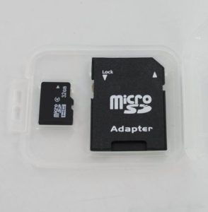

Short answer &#8211; ***No!***

Now I must admit I am one for buying rubbish on eBay and usually fancy myself as someone who can spot the difference between a bargain and a scam. However this time I almost got scammed.

I was looking for a 32GB micro SD card to go in my new android tablet, I had a look on Amazon and saw that they were somewhere around the &pound;15 mark. Then I went to eBay and saw that on there they were mostly the same except for a few which were around the &pound;6-8 mark. At this point I should&#8217;ve thought to myself &#8220;danger&#8221; but instead I simply though &#8220;wow they must be shipping straight out of China or something&#8221;, I wasn&#8217;t bothered about waiting for it to arrive as my tablet is on it&#8217;s way from Hong Kong and won&#8217;t be here any time soon.

To my delight it arrived just a few days later. I opened it up and had a look at it and it looked like the real deal, I didn&#8217;t have any devices with me at the time to test it out so just popped it in my bag. I then thought to myself that I&#8217;d have a look and see if there are other sizes for this great price. I went back onto eBay and searched for 64GB SDXC Micro SD card, knowing that the SDHC format is limited to 32GB and has now been superseded by the SDXC format to support larger sizes. However what I found was people claiming to sell 64GB SDHC cards at around the &pound;10 mark.

I thought this was a bit weird as it isn&#8217;t technically possible to have cards at that size in that format so wondered if it was a typo, however when looking down the list I saw more and more 64GB SDHC cards. I noticed that quite a few of them had things in the title like &#8220;upgraded&#8221; or &#8220;reformatted&#8221;. Not having heard of this before I did a bit of reading and came across <a title="eBay article on upgraded/reformatted SDHC cards" href="http://www.ebay.co.uk/gds/Cheap-microsd-cards-Reformatted-upgraded-any-good-/10000000177055047/g.html" target="_blank">this guide</a> on eBay&#8217;s forums themselves.

This is worth a read but basically states that these cards are in fact smaller cards (e.g 4GB) but have had their filesystem headers tampered with to show 32GB when connected to a PC or other device.

### So what would happen if I used one of these cards?

Well to understand this you first need to know how a filesystem works. Basically imagine your hard drive, SD Card or other storage device as a notebook or journal. You can write stuff in it, anywhere you like in it in fact. But if you wanted to find something you wouldn&#8217;t want to flip thought it every time, especially if it was massive, so you create an index page. This way you can quickly look up where something is in your notebook. This is what happens on a storage device, a file gets written somewhere on the device and an index called a *File Allocation Table* is updated with information about where that file is. Note &#8211; there are other index types but FAT is common on SD cards and pen drives.

Now on a normal storage device the index has information about how large the storage is and so if you tried to add a file that was bigger than the disk it would stop you. However these fake micro SD cards have had that value changed and so it will quite happily write data bigger than the available space to the index even though the data isn&#8217;t actually there.

So if you took one of these 32GB cards and copied 32GB of data to it the first 4GB (or however big the card originally was) would be fine and you would be able to access it again. However although the remaining 28GB would show up as being on the card when viewing on your computer, if you attempted to open the file you would receive and error stating it cannot be opened.

### How can people sell these and get away with it?

So apparently this has happened in the past with pen drives and it will probably happen again when the SDXC format reaches it&#8217;s limits. People selling these on eBay are putting things in the description like

> These cards are upgraded/reformatted and will provide between 4GB an 32GB varying from card to card

When in actual fact they are all limited to 4GB. This little disclaimer seems enough to allow them to contest giving refunds as they will just say you were unlucky and only got one which would support up to 4GB.

I am one of the lucky ones because when contacting the seller I purchased it from they offered me a refund immediately and so I&#8217;m only out of pocket for the stamp I used to send it back. But other sellers may not be so forgiving so make sure that the SD card you&#8217;re buying truly is the real deal.
