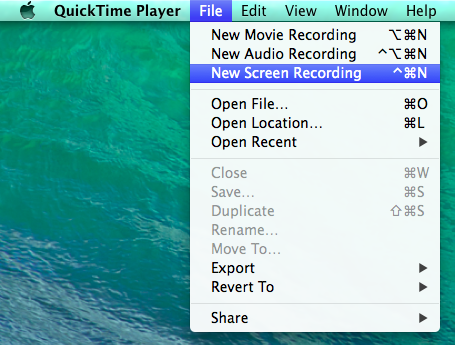
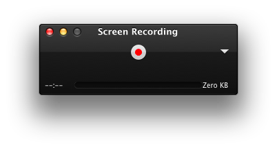
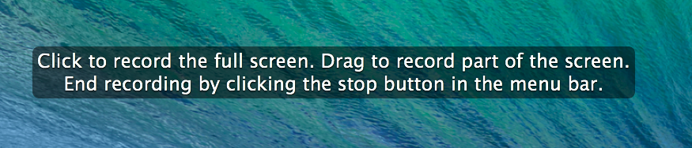
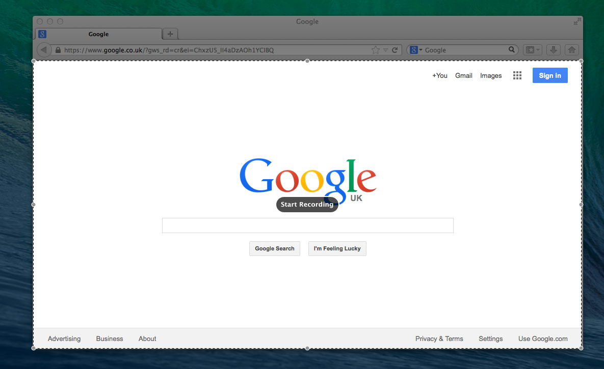

Did you know that you don't need any additional software to make high quality, watermark free screen recordings in OS X Mavericks 10.9? Well this feature exists and it's in a slightly unexpected place &#8230; QuickTime Player.

### How to make a screen recording with QuickTime Player

*   Launch QuickTime Player from your Applications.

*   Click "File" -> "New Screen Recording"

*   This will bring up the "Screen Recording" dialogue.

*   Click the red recording icon on the dialogue box.

*    You will then be given the option to click once to record the whole screen or to drag a box over the area you want to record.

*   So say for example you want to record the contents of your browser window but nothing else you can just drag a box over the window, and don't worry about not being perfectly accurate with your box as you will be able to modify it before you start recording.

*   You will see in the middle of the recording area a "Start Recording" button. Once you're happy with your recording area click that and away you go.

*   Then once you're done recording you just click the "Stop" icon on the toolbar next to the clock.

*   Your new screen recording will open in QuickTime player and you just need to press "&#8984; + S" to save it.
