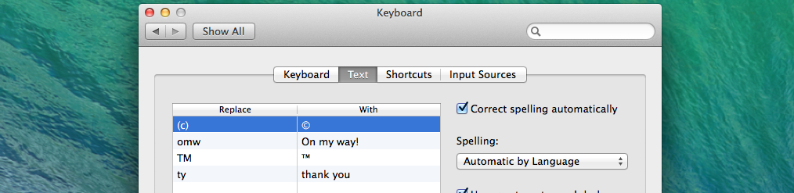
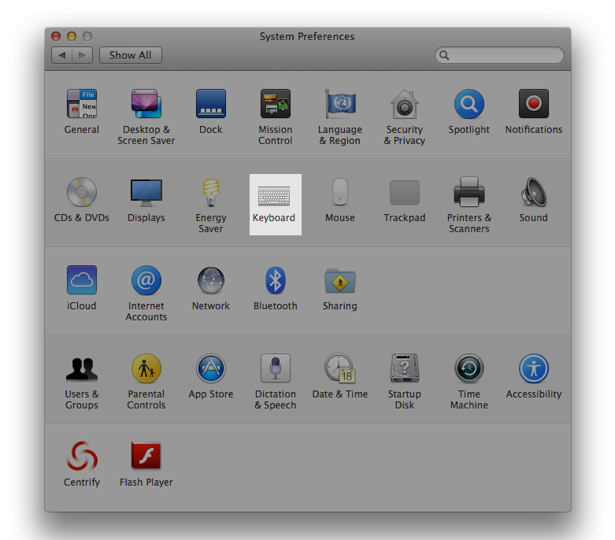
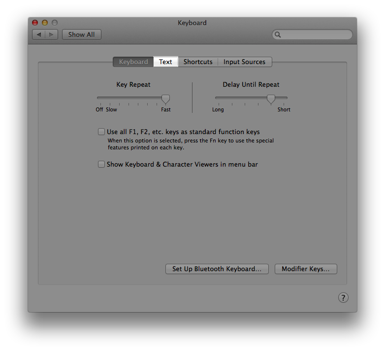
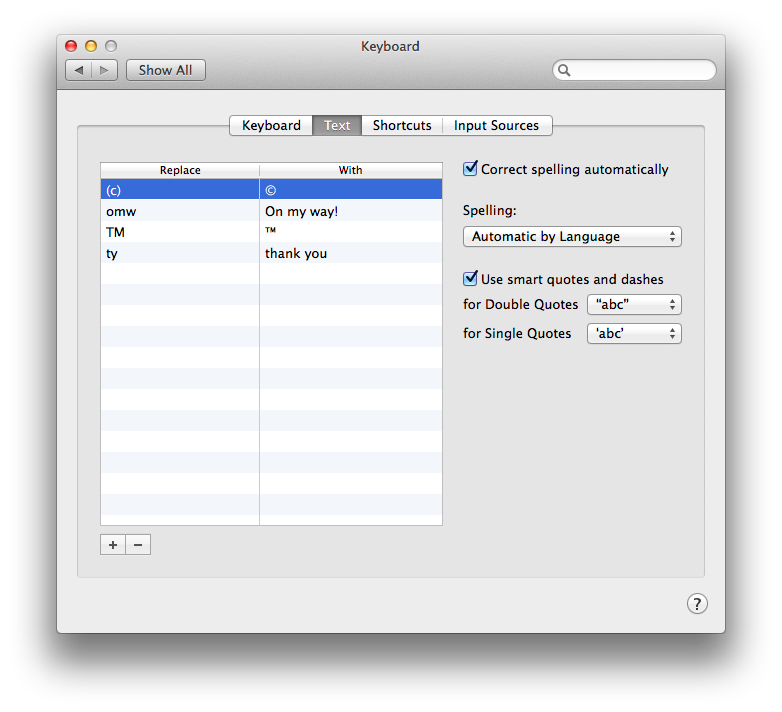

Since the upgrade to OS X 10.9 Mavericks and iOS 7 you may have noticed that your text expansion shortcuts from iOS have found their way onto your Mac. Thanks to iCloud all of your text shortcuts are now synchronised between your devices.

To create or edit these shortcuts on your Mac follow these steps.

*   Open up "System Preferences" and click "Keyboard"

*   Select the "Text" option from the menu

*   Once you're here you'll find all of your iOS text shortcuts. iOS automatically gives you a couple of examples so even if you've never set any before you should see some items listed here.

*   To add more just click the "+" symbol in the bottom left corner and then put in the shortcode you want to use, press enter, and then enter the text you want to replace it with.

Some symbols like &copy; or &trade; are not available on a standard keyboard so why not create shortcuts for these like (c) and TM respectively.
