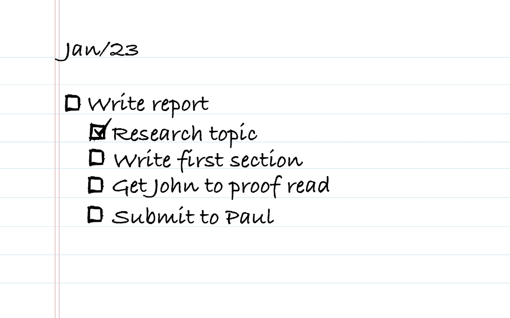
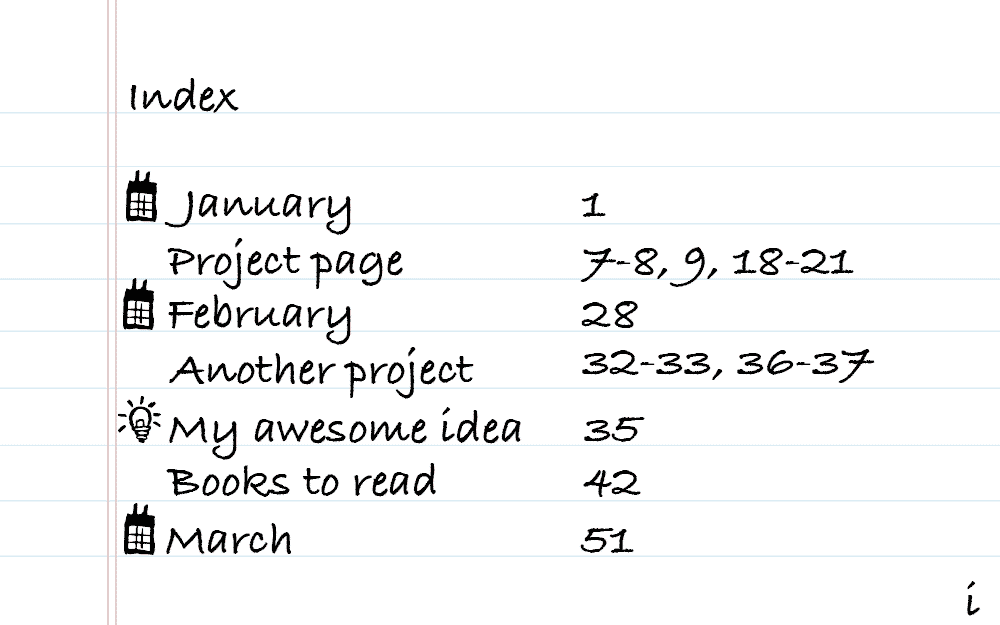
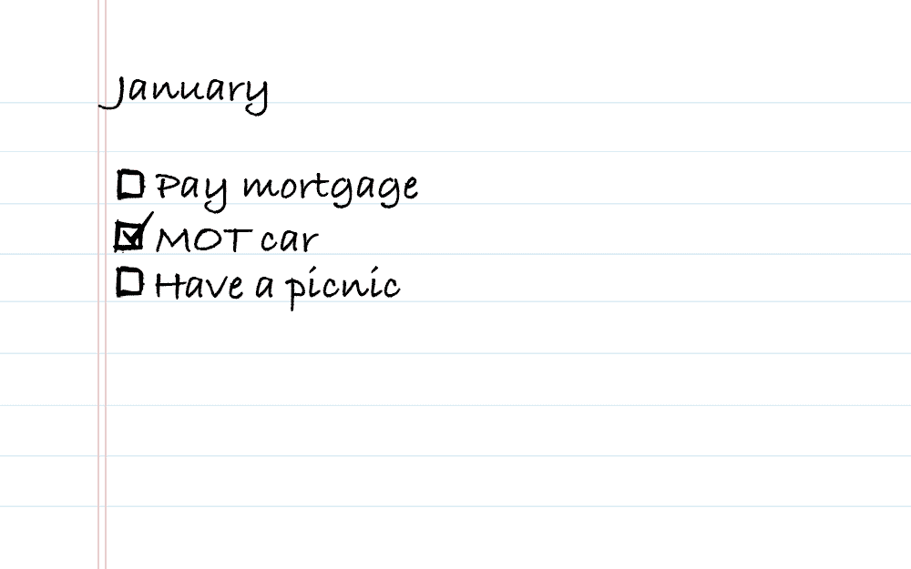

### Introduction

It is one month into 2015 and I am on page 31 of my latest bullet journal. I started using bullet journaling to organise myself in March last year and now I can't imagine my life without it.

Haven't heard of [bullet journaling][1]? It was created by Ryder Carroll and is a simple shorthand notation for use in notebooks and journals.

The main idea behind bullet journaling is providing a structure and framework in your journal to make it more useful and functional. The best part is that it is totally subjective. You can use as much or as little of the notations provided as you like and you can introduce your own if it doesn't do everything you need.

I've found a way to make bullet journal work for me and so I will detail it here.

_Bear in mind that my way will probably not work perfectly for you, I highly recommend reading as many write ups as you can and then create your own version which suits your needs._

## No calendar

I want to start by saying that I do not use any form of calendar in my journal. I much prefer using a digital calendar which will remind me when I need to be somewhere or do something and I can share it with others.

I use my journal to capture information and things I have to do. If those things need to be done at a specific time then they will be transferred into my calendar to make sure I do it when I'm meant to.

## Rapid logging

Ryder refers to rapid logging throughout the bullet journal instructions. Rapid logging is the concept of writing a short (one line max) piece of information preceded with a symbol to categorize its status.

You will certainly have come across this with a regular to do list. You start each line with a box symbol and a brief summary of the item. Once you have completed the item you put a tick in the box to signify that it is finished.

This is just one form of rapid logging, Ryder expands it with further symbols and I've added a couple of my own. Here are the symbols I use:

* Incomplete task - A task which needs to be done.
* Complete task - A task which has been completed.
* Migrated task - An incomplete task which has been moved to a later page.
* Info item - This represents a piece of information which does not need to be actioned.
* Event item - An event which happened.
* Meeting - A meeting which took place, generally always has sub-items.

### Sub items

Sometimes a task may need to be broken down into sub items. To signify this I indent the item below the parent item.

This is often useful for breaking up a task into small chucks, this would be represented by a tick box with indented tick boxes below for each chunk. The parent box would only be ticked once all child boxes have been ticked.

It is also useful for meetings. A meeting starts with a meeting symbol and one line description of the meeting topic, then indented underneath I use Info items to take general meeting noted and tick boxes for actions I must do after the meeting.

## Index

The index is the thing I love most about bullet journaling. It is so simple that I am amazed I have never done it before. It has revolutionised the way I use notebooks.

The first three pages of my bullet journal are numbered _i_ through _iii_ and are reserved for indexing, the rest are then numbered sequentially as I start each one. Whenever I start a new page in my journal, which isn't a continuation of the previous page, I add it to the index. This way I can quickly find something when I want to refer back to it.

I also add symbols to _month lists_ and _idea pages_.

## Page Types

There are a few general page types I use which may or may not end up in my index.

### Month lists

On the first day of each month I create a page titled with that month. This page is used as a general task list for the month. I first populate the list with every item I haven't managed to complete from the previous month, the items are added to the list and then changed to the _migrated task_ symbol on their original
page.

I then add to this page with task items throughout the month. Generally items added to this page are long term goals which wouldn't be suitable for _day lists_.

### Day lists

Day lists are generally not included in the index. Although I quite like the idea of using a calendex to record them, maybe next year.

A day list is my task list for the day. Every day I sit down at my desk, turn to a new page and title it with short month forward-slash date (e.g Jan/27).

I use this page throughout the day to add items I have to do, take meeting notes, and record information. The idea behind this page is that there are no unticked items on the page when I'm ready to call it a day. When I get to the end of the day incomplete items are either migrated to the _month list_ if I feel they will take longer than expected or migrated to the following day.

In my 2014 journal I would add multiple days on the same page if there was space. I found this problematic when looking back over old entries as it was hard to find a specific day. It also stopped me from prematurely adding "tomorrows" page if there was something I though "oh I'll do that tomorrow" as I wouldn't know how much space to leave for the rest of today. To remedy this I've decided to start a new
page for each day even if I've only written two lines on the previous page.

### Projects

When working on a project I turn to the next available double spread in the journal and title it with the name of the project. I then use this page for project specific task lists and planning. When I get to the end of a double spread I turn to the next available double spread, add the title, and continue, if the next double spread isn't immediately afterwards then I put a "goto" in the bottom corner to allow to me to quickly turn to the next page in that project.

Project pages are added to the index. If I attend a meeting relating to the project it is likely that I will take notes on a _day list_ so that is also added to the page numbers for that project.

### General lists

I may decide I want to create a list to keep track of a specific item which isn't time sensitive. This may be a list of books I want to read or films to watch.

These are just added to a single page in the journal, either the next available single page or a previously skipped over page (e.g a spare project page from a completed project).

### Event pages

These pages are not added to the index and are usually done in the form of a sketch, picture or sticker. I include these now and again when large milestones occur such as a promotion, moving house or attending an interesting conference. These are added where the next day list would occur.

I add these because one day I expect I will read back over my old journals and I am sure I'll find it interesting to see when these events happened. I also include smaller but still significant events in day lists for the same reason.

## Bookmark

The style of journal I buy comes with a bookmark tassel. I place this on the oldest page which still has unticked boxes. Usually this is the _month list_ for the current month. This allows me to be confident that I haven't missed any tasks.

## Conclusion

Without my bullet journal I'd either be staring blankly at a computer screen trying to remember what I'm meant to be doing or drowning in a sea of post-it notes with partial to-do lists all over them. This way I can at least attempt to stay
organised.

The fact that I regularly have to rewrite items and migrate them to later pages is pretty good at making me do things I've been putting off, or even removing things that aren't worth doing. Much better than having a stagnating list in a reminders app!

[1]: http://www.bulletjournal.com/
