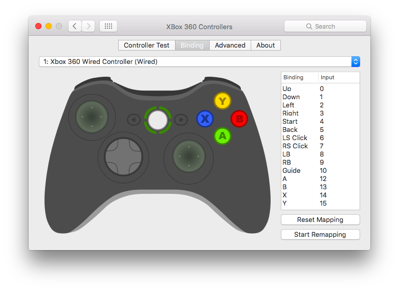

### Introduction

In order to use an Xbox 360 controller with OS X El Capitan you will need to install
a driver for it. This is an update to my article on using an [Xbox 360 controller with Yosemite][xbox-yosemite].

## Driver

Sadly there is no official driver for the controller like there is on Windows.
Luckily for us there is as an excellent third party driver that does the job!

To install the driver simply visit the [360Controller GitHub project][driver-github], download the latest release,
run through the installer and then reboot your Mac.

## Configuration

The installer will put a configuration pane in System Preferences.

From this menu you'll be able to test your controller is working as well as
make changes to the config.

[driver-github]: https://github.com/360Controller/360Controller/releases
[xbox-yosemite]: /2014/10/17/use-xbox-360-pad-with-yosemite/
