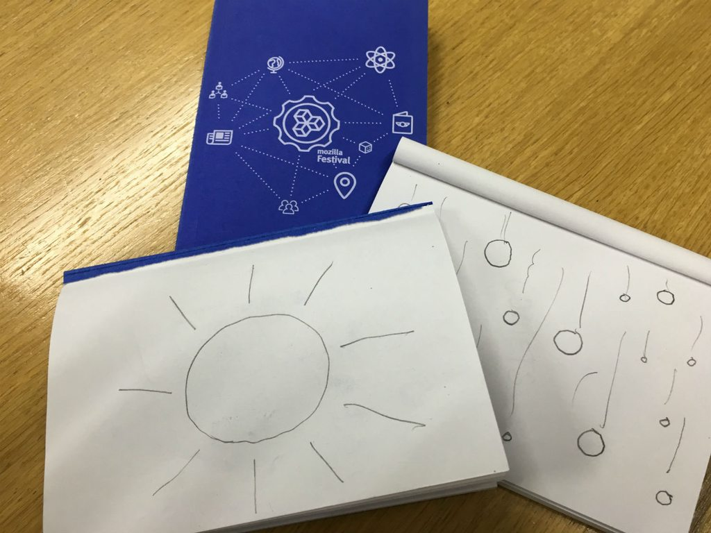

_Originally published on the [Met Office Informatics Lab blog](https://archived.informaticslab.co.uk/design/2016/06/24/perception-of-symbols.html) on June 24th, 2016._

---

With some friends look out the window and each choose a weather symbol which represents what you see. Do you all agree?

Representing something as complex as the weather in a single symbol is hard. At [Mozfest 2015][mozfest-2015] we played a simple game with attendees to demonstrate how people perceive symbols differently. With [Mozfest 2016][mozfest-2016] planning underway we thought this would be a nice time to share this with you.

## The rules

This game is similar to a written/drawn version of [Chinese whispers][telephone-game] (known as the telephone game in the US).

To play this game you need a group of people, a notepad and a pen or pencil.

You start by drawing a symbol on the first page of the notepad. You then hand the pad to the next person and ask them to look at the symbol. They turn the page and write the words they think the symbol represents.

Then they pass the notepad to the next person who reads the words, turns the page, and draws a symbol to represent them.

It is handed to the next person who writes a phrase, and so on, and so on.

The interesting part of the game is to watch how quickly the symbol changes and becomes something totally unrecognisable from the original intent.

## Mozfest 2015

Each of the following notepads started out with a Met Office weather symbol.

<iframe src="//www.slideshare.net/slideshow/embed_code/key/LenFTHyJcPwjpf" width="100%" height="100%" frameborder="0" marginwidth="0" marginheight="0" scrolling="no" style="border:1px solid #CCC; border-width:1px; margin-bottom:5px; max-width: 100%; min-height: 500px;" allowfullscreen> </iframe>

<iframe src="//www.slideshare.net/slideshow/embed_code/key/aMcwCo6kGruQg4" width="100%" height="100%" frameborder="0" marginwidth="0" marginheight="0" scrolling="no" style="border:1px solid #CCC; border-width:1px; margin-bottom:5px; max-width: 100%; min-height: 500px;" allowfullscreen> </iframe>

<iframe src="//www.slideshare.net/slideshow/embed_code/key/F9o4JKrPvzNG3a" width="100%" height="100%" frameborder="0" marginwidth="0" marginheight="0" scrolling="no" style="border:1px solid #CCC; border-width:1px; margin-bottom:5px; max-width: 100%; min-height: 500px;" allowfullscreen> </iframe>

## Lessons learned

This exercise, whilst being entertaining, has highlighted a few important things about symbol design:

 * Keep it simple - complex pictures lead to uncertainty and confusion
 * Keep focus - if a symbol has multiple elements usually people assume it is the larger one
 * Be clear with your message - don't use metaphors or abstract symbols

[mozfest-2015]: https://2015.mozillafestival.org/
[mozfest-2016]: https://mozillafestival.org/
[telephone-game]: https://en.wikipedia.org/wiki/Chinese_whispers
