## Introduction

I recently acquired an Apple Airport Express wireless hotspot which wouldn't power on. This was most likely down to a fault on the power supply board and so I decided to have a go at fixing it.

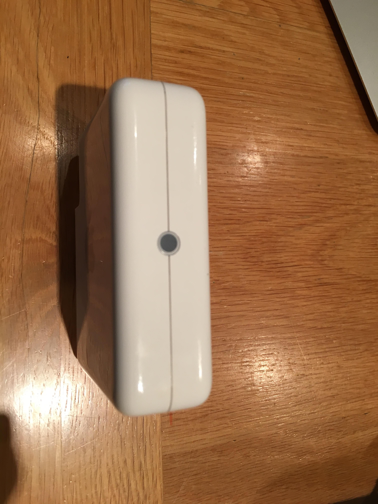

## Opening it up

These devices are notoriously difficult to open as they simply comprise of a two sided plastic shell which is bonded together at the factory. From reading online some people manage to pry them apart using metal spudgers but inevitably end up damaging the case anyway, therefore the most common way to open them is to cut into them with a dremel.

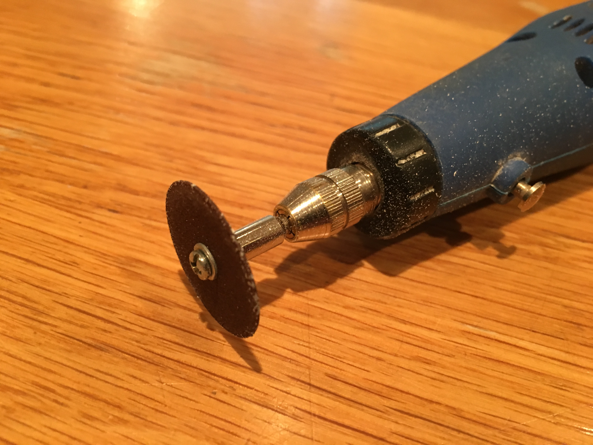

I attempted to carefully cut around the edges without damaging the components inside. You can see from the first image below that I nicked the wires that connect the logic board with the power supply board so I had to repair that later on.

Once I had cut through most of the seam around the edges I use a flat head screwdriver in a twisting motion to widen the gap at the top.

When I had widened it enough I was able to completely open it out without damaging the connectors.

## Power Supply

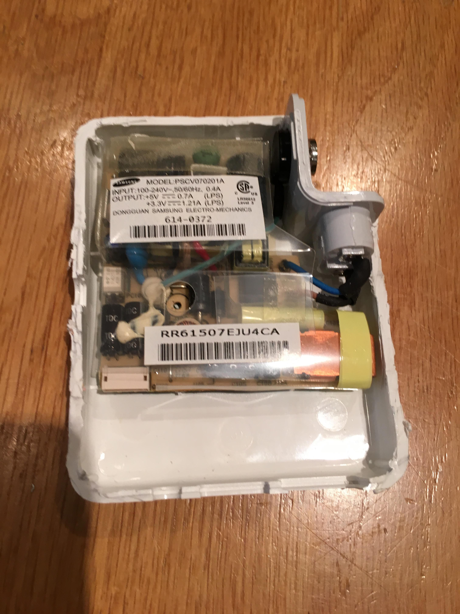

I disconnected the power supply board from the logic board and had a closer look. I couldn't determine which component had blown and despite being competent with electronics I draw the line at voltages which could kill me. Therefore instead of poking around with a multimeter and potentially blowing myself up I threw the old board away and set about making a new one at voltages I'm comfortable with. I made sure to keep the cable used to connect it to the logic board for use later.

As you can see from the sticker on the old power supply that the logic board requires a 5v and 3.3v connection at around 2 amps total. Therefore I decided to take an old usb cable connected to a 2A charger and add a 3.3v connection from that. To achieve this I bought an adjustable buck converter that was rated at 2A from ebay for just less than £2.

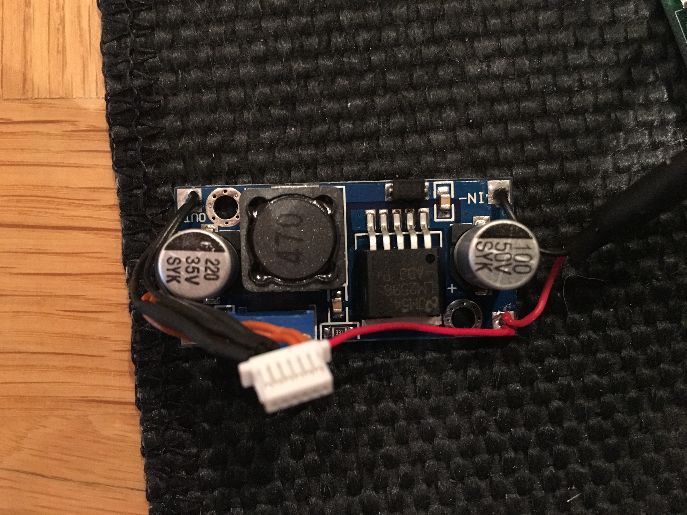

I cut the end off the USB cable, striped the wires inside (removing the two data lines) and neatened it up with some heat shrink. I then soldered it onto the input of the buck converter (along with the 5v line on the logic board connector) and used a multimeter and screwdriver to set the output voltage to 3.3v.

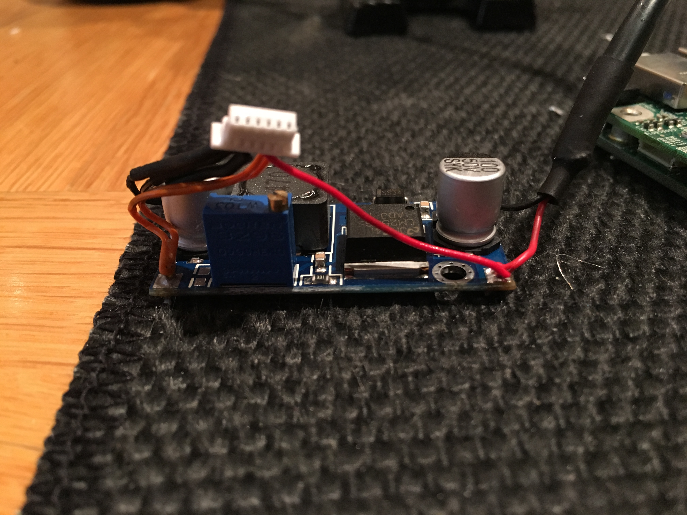

Once I had set the converter I soldered the 3.3v and ground lines of the connector onto the outputs of the converter. I was then able to plug the connector into the logic board, plug the USB into the charger and see the lights on the logic board turn on.

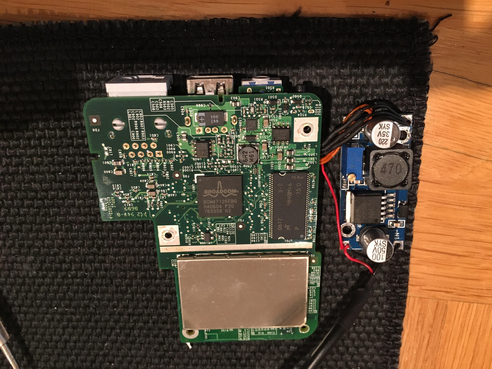
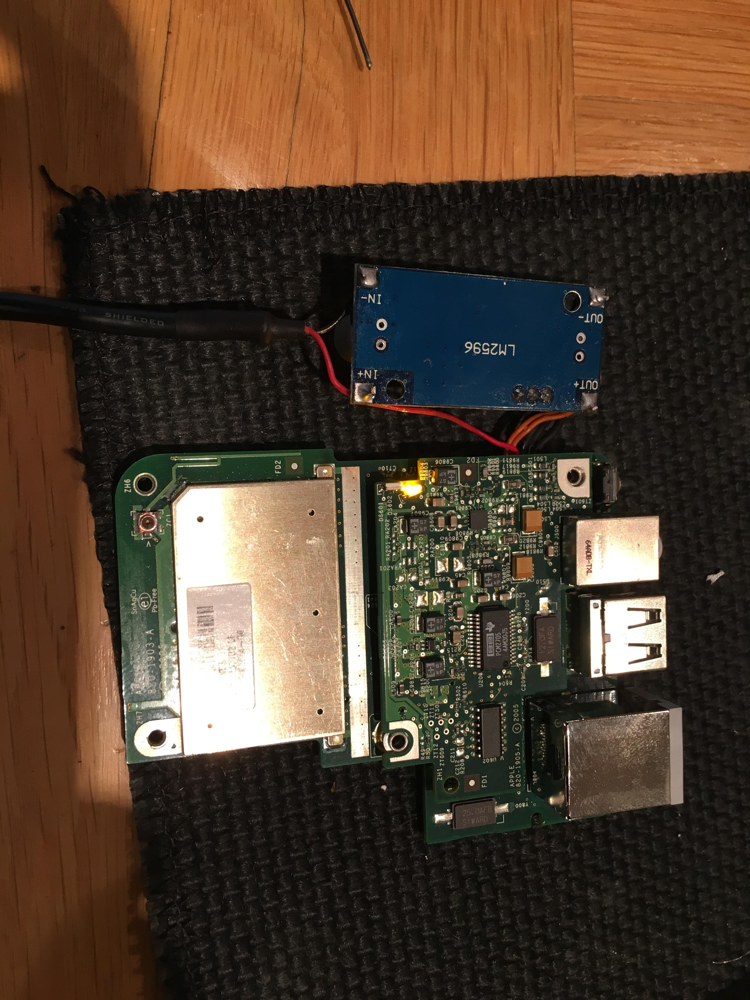

## Closing up

Once I was able to confirm that the logic board was getting enough power to boot up I attemped to put the device back together. I ended up desoldering the connector and extending the wires to allow me to put the buck converter into a conveient gap in the casing.

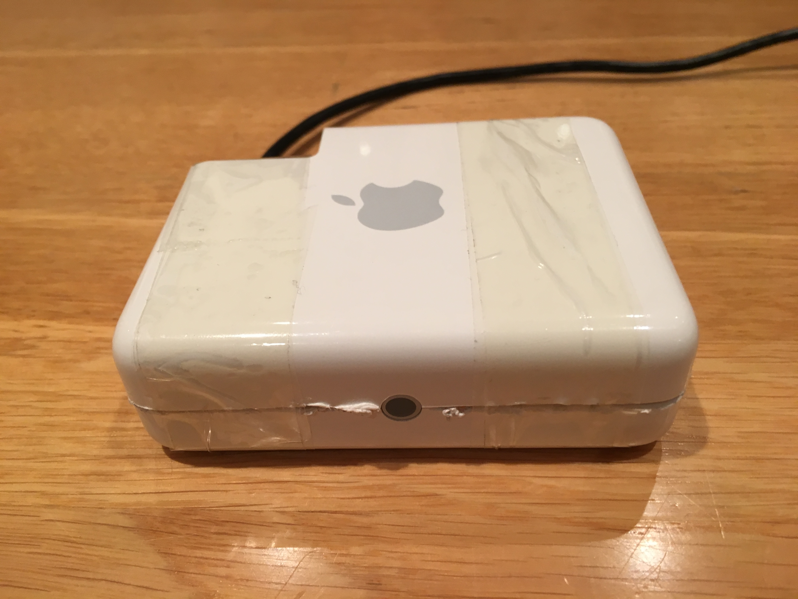
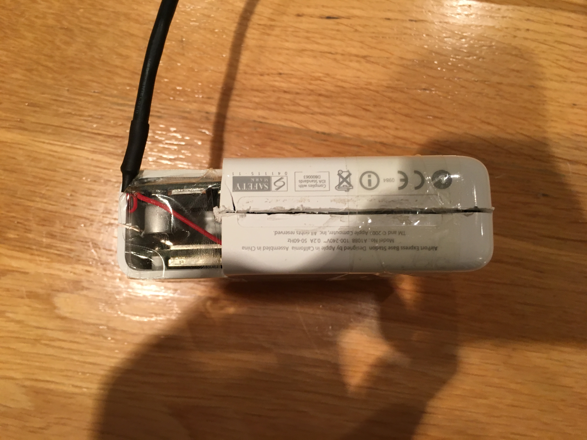

I didn't put a huge amount of effort into making it look nice as this is just going in the shed to boost my wifi signal in the garden. However if I really wanted to make it look decent I would consider designing a new case and getting it 3D printed. I would also think about adding a micro USB connector rather than soldering the cable straight on.

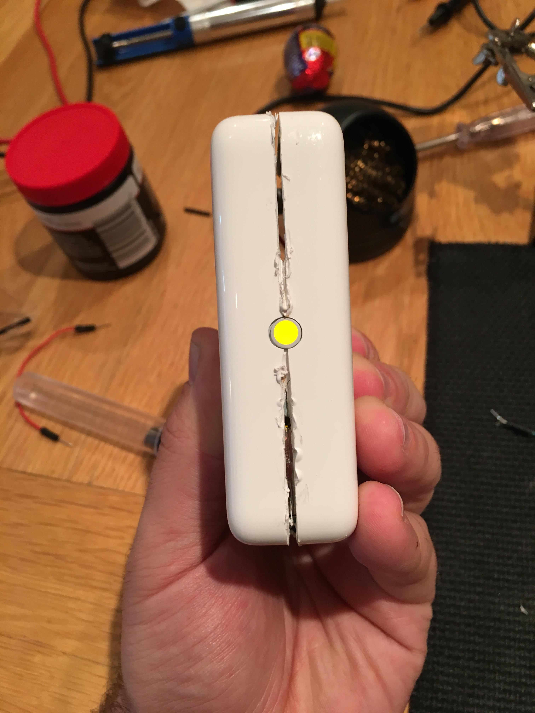

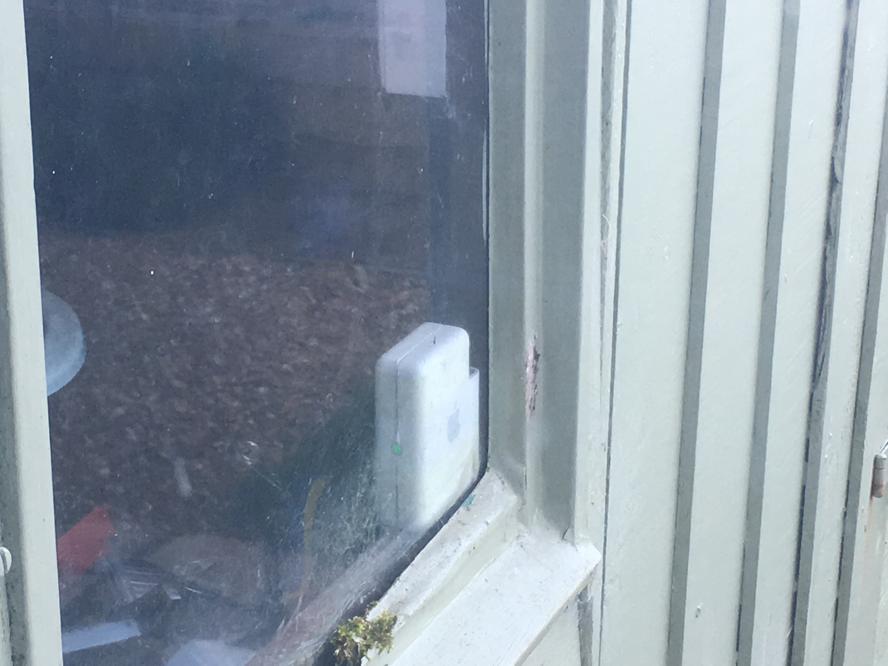

[See the full photo album here.](http://imgur.com/a/Yt1E7)
