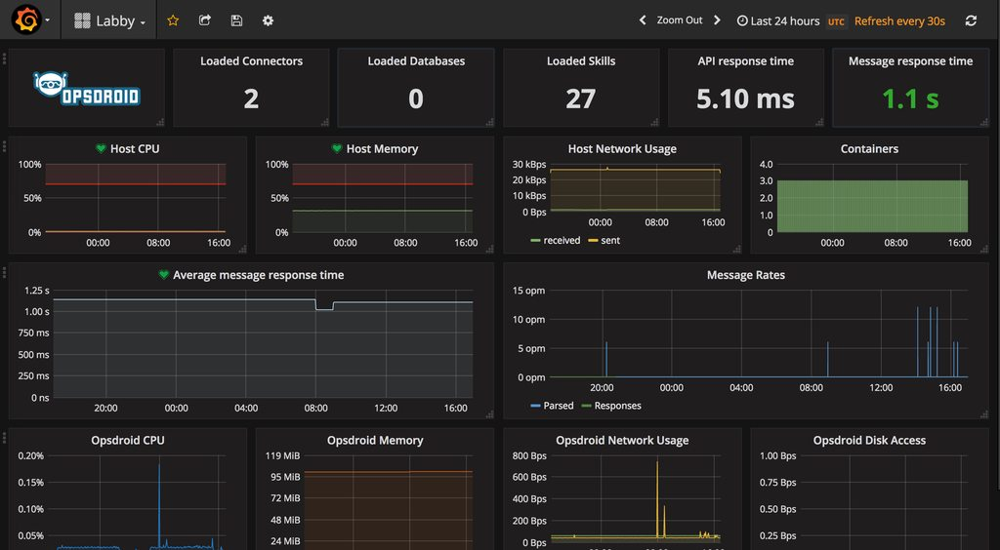

_Originally published on the [Met Office Informatics Lab blog](https://archived.informaticslab.co.uk/infrastructure/2017/05/08/monitoring-scalable-infrastructure.html) on May 8th, 2017._

---

Recently we've been thinking a lot about monitoring. In a world of ephemeral servers, auto-scaling, spot instances and infrastructure-as-code, monitoring has to be tackled differently.

To solve this problem it is simpler to think about the end result. What do you want to do with your monitoring? In most cases you want something to keep an eye on your services. You want it to notify you when there is an issue and then be able to review historical data to find the root cause of the problem.

To achieve this you need something to collect data, somewhere to store it, a way to visualise the data and finally something to alert you when it sees something unusual. This article will dig into these four components and suggest some suitable options.

## Collection

There are two main types of information which indicate how a system is performing: logs and telemetry. Logs are the lines of text that applications spit out either into a file or into the terminal. Telemetry are all the little metrics that describe your system, cpu usage, memory usage, network performance, disk space, etc.

When it comes to recording this information you can either do it by recording on every machine, or remotely by running the collection agent software somewhere else which has remote access to your machines. Both of which will retrieve the information and forward it to a central data store.

Our preferred telemetry collection agent is [telegraf](https://www.influxdata.com/time-series-platform/telegraf/). It's pretty flexible in terms of datastores it can write to, it comes with application support for many common services such as Apache and it comes packaged as a single binary file which can just be dropped onto a system. Other agents include [statsD](https://github.com/etsy/statsd), [colllectd](https://collectd.org/), [cAdvisor](https://github.com/google/cadvisor), and more.

For logs you'll either need to configure your applications to forward their logs to a central source, or use a collection agent like [filebeat](https://www.elastic.co/products/beats/filebeat), [winlogbeat](https://www.elastic.co/products/beats/winlogbeat) or [logstash](https://www.elastic.co/products/logstash). You will also want to parse and filter the logs before ingesting them into your data store to avoid filling up with garbage. Logstash has the capability to do this with [filters](https://www.elastic.co/guide/en/logstash/current/filter-plugins.html).

When it comes to scaling your data collection a local agent is preferable as that means you scale up the number of agents in line with the number of servers to collect data from. However it isn't always practical especially if the device you're monitoring is a appliance that you can't install software on. If this is a major factor for you then you might want to put some thought to how you would scale a collection machine.

## Storage

Once you have agents collecting your data you'll need somewhere to send it. For telemetry you'll want a time series database such as [InfluxDB](https://github.com/influxdata/influxdb), [Graphite](https://graphiteapp.org/), [OpenTSDB](http://opentsdb.net/) or [Prometheus](https://prometheus.io/). For your logs you need a highly indexed and searchable database like [Elasticsearch](https://www.elastic.co/products/elasticsearch) or [Graylog](https://www.graylog.org/).

These datastores usually have their own query language and the ability to set a retention time for the data that is ingested into them. If you only want data from development servers to be kept for 7 days but data from production servers to be kept for 12 months you can do that. This is also where a lot of the clever stuff happens with interpolation and downsampling to return the data as a series of numbers to make it more manageable and easier to plot for the visualisation later.

In terms of scaling these datastores, they have been designed to cluster and shard their data. This means you can increase the number of machines running the datastore and the data will distribute and replicate across them for speed and availability.

## Visualisation

When you have a datastore full of data you now need a way to view it. You probably want to create dashboards for specific projects or services and you might want to look at individual machines or groups of them when troubleshooting a problem.

Some of the datastores mentioned above come with graphing tools as part of their package, but there are also a few standalone packages like [Grafana](https://grafana.com/), [Kibana](https://www.elastic.co/products/kibana) and [Chronograf](https://github.com/influxdata/chronograf) which can do this for you.

These applications give you a web based graphing tool for creating reports and dashboards based on your data. Simply configure them to have access to your data and build up some graphs and dashboards using the query language for your datastore. The datastores don't even have to be your own, you can just as easily point these tools at [AWS CloudWatch](https://aws.amazon.com/cloudwatch/) or a similar service to include their data in your graphs (just watch our for usage charges).

As these applications are simply querying a datastore and rendering some graphs for you they are pretty stateless. This makes them trivial to scale as you can just create more servers running the application and put a load balancer in front. You will need somewhere to store the dashboard configuration but many of these solutions support storing their config in databases like PostgreSQL which can be configured in a scalable cluster. You can also set up federated authentication with an OAuth or LDAP service like Active Directory or Google auth.

## Alerting

The more data you put into your datastore the less likely you are to review it all. Therefore you need an application to watch the data going in and to notify you if something fishy is going on.

Some of the packages mentioned above have this built in. Grafana for example added monitoring capabilities to their dashboard recently. There are also standalone packages such as [Kapacitor](https://github.com/influxdata/kapacitor) which can watch your datastore and let you know when something's up.

You can either set your own rules to alert you when values go over a certain threshold. Or you can use more intelligent methods to notify you when something is "unusual", this is usually done by profiling your metrics over a period of time and then comparing new metrics to the profile.

To actually notify you of issues there are lots of different packages available including [PagerDuty](https://www.pagerduty.com/), [VictorOps](https://victorops.com) or [OpsGenie](https://www.opsgenie.com/). You can also just go for plain old email.

We have ours configured to notify our [chatbot assistant labby](http://www.informaticslab.co.uk/projects/labby.html) using the webhook functionality in [opsdroid](http://opsdroid.github.io/) which sends us notifications in Slack. This is great because we can respond to labby and ask for further information about the servers, get labby to reboot machines, scale clusters and more.

Scaling is less of a concern with alerting as you only want one process watching your data otherwise you will end up with duplicate notifications. Also the amount of work it has to do does not increase with the number of servers your have, just with the number of rules you set. The alerting service will continuously query the datastore and check the response against each rule, so adding more data doesn't increase the number of queries just the amount of work the datastore has to do to provide the answer.

## Legacy monitoring

If you're thinking "but you haven't mentioned nagios, sensu, monit, munin, RRDTool or other standard monitoring tools" then you're right. The reason I haven't mentioned these is because they either are only interested in alerting based on rules set in the agent (nagios) or are not designed to scale well (RRDTool).

You can of course still integrate these tools into your system. For instance Graphite supports reading data from RRD files and Kapacitor can query nagios for alarms.

## Conclusion

In the Lab we use a combination of Telegraf, Logstash, InfluxDB, Elasticsearch and Grafana along with opsdroid and Slack. Many of these components could easily be swapped out for a different one if we found something that had extra features that we wanted. All of these tools can scale up to the workloads we want to run and are ready for the future.

_When I started thinking about this work I gave a talk about it at the TechExeter conference. [Listen to it here](https://soundcloud.com/techexeter/2016-track-1-jacob-tomlinson-monitoring-in-a-scalable-world)._

