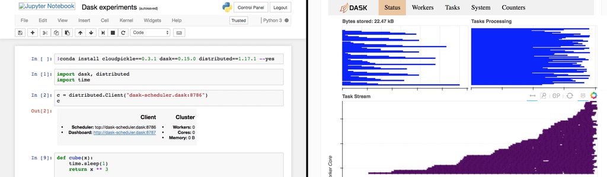

_Originally published on the [Met Office Informatics Lab blog](https://archived.informaticslab.co.uk/dask/2017/07/21/adaptive-dask-clusters-on-kubernetes-and-aws.html) on July 21st, 2017._

### Introduction

This article assumes a basic understanding of [Amazon Web Services (AWS)][aws], [Kubernetes][kubernetes], [Docker][docker] and [Dask][dask]. If you are unfamiliar with any of these you should do some preliminary research before continuing.

Running a dask cluster is a really powerful way to do interactive data analysis. However if nobody is using the cluster then it can take up a lot of resources. Our current workaround for this is to have a scalable cluster which can be manually scaled up before doing some work and is automatically scaled back down at the end of the day. This has worked well during testing but Dask supports something called [adaptive clusters][dask-adaptive] which allows it to manage its own resources.

## Adaptive clusters

An [adaptive Dask cluster][dask-adaptive] is a cluster which consists of a scheduler only, but has the ability to add and remove workers as needed. This means you can run Dask on a cluster along with other services and it will not hog resources when idle, it will only use what it needs and then release them again.

However the Dask developers do not want to have to support adding and removing workers on multiple platforms, so the feature has been implemented as a [Python class][dask-adaptive-class] that you can create and attach to a cluster at startup. The cluster will call a method of the class when it wants more workers and another method when it is happy to release them. It is then up to you write those methods so that they behave as expected.

## Kubernetes

We are in the habit of running our Dask schedulers and workers in Docker containers. This makes them portable and reproducable, which makes scaling them very straight forward.

One way we can empower Dask to add and remove workers is to allow it to create and delete Dask worker containers. We could of course manage the lifecycle of these containers ourself but there is an ever growing list of container orchestration tools on the market which makes this easy for you. Kubernetes is arguably the most popular and mature of these tools, so we are going to use it to add and remove worker containers in a cluster.

One of the nice things about Kubernetes is that instead of asking it to run five containers you tell it that five containers should be running. This subtle difference means that your application will be fault tolerant as Kubernetes regularly checks to see if the actual number of running containers matches the required number, if there is a discrepancy then it starts or stops containers to bring it in line. So if some containers stop due to hardware failure Kubernetes will notice and recreate those containers elsewhere in the cluster. Dask is clever enough to transfer any state required to the new workers and recalculate anything which was lost while still running the calculation allowing workers to come and go without causing major problems.

## AWS

In order to run Kubernetes we need some infrastructure so we [created a cluster][lab-tarraform-kops] on AWS using [Terraform][terraform] and [Kops][kops]. This cluster simply provides the servers and network configuration required to run Kubernetes, which in turn schedules containers and maintains network traffic between them and the internet.

The cluster also uses the [Kubernetes AWS autoscaler][kubernetes-autoscaler] which checks to see if there are any containers trying to run but are unable due to lack of resources on the cluster. If there are containers waiting it speaks to the AWS api and requests more servers to be added. After a few minutes the servers will have booted and joined the cluster which allows the containers to be created. It also checks for nodes which are being underutilised and removes them and migrates the containers to the remaining nodes.

## Benefits of an adaptive cluster

Having these multiple layers of abstraction allows the scaling to flow up and down the different layers. When a task is submitted to Dask it requests a single worker from Kubernetes and starts processing. Once it has processed a few parts of the task it decides whether adding more workers would speed up the task, which if the task is parallelised (like a map) then that should be true. Dask then asks Kubernetes for more workers.

Eventually Kubernetes will run out of resources on the cluster to run these worker containers and starts building up a queue of pending containers. The autoscaler notices this and begins adding AWS EC2 instances. Once these instances are ready the pending Dask workers are created and the job gets faster and faster.

Once the task has finished Dask tells Kubernetes that the workers are no longer required and the containers are stopped. After a while the autoscaler notices that the servers running the workers are no longer needed and starts to shut them down.

Each layer in this flow scales up as quickly as it can, but scales down with a specified delay. This helps optimise the use of the underlying AWS resources, which is ultimately what we are paying for. If another user of the cluster submits a task then the workers will start working on it once they have finished their current task. If all tasks finish and the worker containers are destroyed the servers will stick around for a while, so if another task is submitted to the scheduler it can very quickly scale the number of Dask workers back up without reprovisioning the servers. Eventually if no new workers are created the cluster begins scaling down, saving money.

## Running the adaptive cluster

The Kubernetes config for creating the adaptive cluster [lives here][lab-dask-k8s].

The Dask scheduler command line tool allows you to pass it a python file using the `--preload /path/tp/my/file.py` which it calls when starting up the server. It must contain a function called `dask_setup(cluster)` which gets a cluster object as an argument.

In our [preload file][lab-dask-adaptive-preload] we also define the adaptive cluster class which implements the `scale_up(n)` and `scale_down(workers)` methods and attached it to the cluster in the setup function. These methods call out to the Kubernetes API and modify the number of workers in the [worker replica set][lab-dask-k8s-workers].

In order to do this the scheduler must have permissions to access the Kubernetes API. This is done with a [Service account][lab-dask-k8s-svcacc] and [RBAC][kubernetes-rbac].

We are exposing the scheduler as a service within the Kubernetes cluster. So we can connect to it from our [Jupyter notebooks][lab-k8s-jupyter] also running on the cluster. We are also exposing the scheduler status page externally via an ingress so we can check the status of the cluster.

### Demo

Finally let's have a demo of this working in practice. The following video shows a Jupyter notebook which is connecting to our adaptive cluster. When it connects it shows zero workers, Kubernetes also shows zero workers and the AWS cluster is at the minimum size required to run Kubernetes.

When I submit a task to Dask (just a basic one which does some simple maths and sleeps a lot to simulate being busy) workers start provisioning and the job processes faster and faster as the workers are adding.

Once the job finishes all the workers are removed except the one which is holding the final answer causing the clauster to start scaling back down.

<iframe width="560" height="315" src="https://www.youtube.com/embed/R2xntfsDxtA" frameborder="0" allow="accelerometer; autoplay; encrypted-media; gyroscope; picture-in-picture" allowfullscreen></iframe>

## Conclusion

This demonstrates the ability to create a Dask cluster which scales automatically based on the amount of work it needs to do.

This is very useful when running Dask on a scalable cloud platform like AWS. It is also useful if you wish to run Dask on a non-scalable infrastructure that needs to share resources with other services. For example you may have an on-site cluster of machines running a scheduler like Mesos or Slurm. You can submit jobs directly to the batch scheduler, or with adaptive Dask the Dask scheduler could submit batch jobs which would start workers, which would then run the Dask task and then stop the batch job again. This would release resource for the batch scheduler to assign to someone else.

[aws]: https://aws.amazon.com
[dask]: https://dask.pydata.org/en/latest/
[dask-adaptive]: http://distributed.readthedocs.io/en/latest/adaptive.html
[dask-adaptive-class]: http://distributed.readthedocs.io/en/latest/adaptive.html#adaptive-class-interface
[docker]: https://www.docker.com/
[kops]: https://github.com/kubernetes/kops
[kubernetes]: https://kubernetes.io/
[kubernetes-autoscaler]: https://github.com/kubernetes/autoscaler/tree/master/cluster-autoscaler
[kubernetes-rbac]: https://kubernetes.io/docs/admin/authorization/rbac/
[lab-dask-adaptive-preload]: https://github.com/met-office-lab/jade-dask/blob/master/kubernetes/adaptive.py
[lab-dask-k8s]: https://github.com/met-office-lab/jade-dask/tree/master/kubernetes
[lab-dask-k8s-svcacc]: https://github.com/met-office-lab/jade-dask/blob/master/kubernetes/scheduler.yaml
[lab-dask-k8s-workers]: https://github.com/met-office-lab/jade-dask/blob/master/kubernetes/worker.yaml
[lab-k8s-kupyter]: https://github.com/met-office-lab/jade-jupyter/tree/master/kubernetes
[lab-terraform-kops]: https://github.com/met-office-lab/terraform-kubernetes
[terraform]: https://www.terraform.io/
