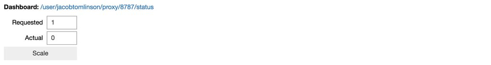

_Originally published on the [Met Office Informatics Lab blog](https://archived.informaticslab.co.uk/dask/2018/02/07/trying-out-daskernetes.html) on February 7th, 2018._

---

We are excited to announce that the work we've been doing with distributed Dask clusters running on Kubernetes has been absorbed into an awesome new tool called Daskernetes through our work on the [Pangeo project](http://matthewrocklin.com/blog/work/2018/01/22/pangeo-2).

The [Daskernetes](https://github.com/dask/daskernetes) python module allows you to create personal [distributed Dask](https://distributed.readthedocs.io/en/latest/) cluster when running your notebook on a Kubernetes cluster. This article will walk through getting started with Daskernetes.

This article is also a notebook which you can [download](https://gist.github.com/jacobtomlinson/f4365393463fc3247f494673de110263) and run on [pangeo.pydata.org](http://pangeo.pydata.org) or your own Kubernetes cluster. Pangeo is an awesome project we are involved in to provide a scalable scientific analysis environment!


## Installing

_This notebook assumes you are using Pangeo or you have [Kubernetes authentication](https://kubernetes.io/docs/admin/accessing-the-api/) set up, either with config in a `.kube` directory or via a service account._

First we need to install Daskernetes.

_If you're using Pangeo then you can skip this step as it is already available out of the box._


```python
pip install git+https://github.com/yuvipanda/daskernetes.git
```

## Create your cluster

We need to import some dependancies. We'll import `os` so that we can access some environment variables later. Then we'll import `dask` and `distrubuted` and then finally our `KubeCluster` constructor from `daskernetes.core`.

We can now go ahead and create a cluster. Creating this object will start a Dask distributed scheduler within your notebook session. You can also specify details such as a name to prepend your worker container names with.

We'll set the number of workers to one for now but we can use the HTML widget to update this later. Finally we'll set some boiler plate details such as the ip and port to run the service on and the number of Python threads to start in each worker.


```python
import os
import dask
import distributed
from daskernetes.core import KubeCluster

cluster = KubeCluster()
```

It is possible to replace the worker Docker image with our own [Informatics Lab docker image](https://github.com/met-office-lab/singleuser-notebook), if you're running your notebook in a Docker container we recommend using the same image as you can ensure that your Python library versions are the same. The only requirements for an image is Python 3, Dask and Distributed. You simply add a kwarg to list above, for example `worker_image='informaticslab/singleuser-notebook:latest'`.


```python
cluster
```



You can access the Dask dashboard using the address information printed in the table, on Pangeo you can simply click the link!


## Create a client for your cluster
Now that we have a cluster we can interact with it the usual Dask way. This is done by creating a dask distributed client, the cluster already contains the address information of the scheduler so we can pass that property into the client contructor.


```python
client = distributed.Client(cluster.scheduler_address)
client
```


You can now use the client within your dask distributed workflow and scale the number of workers dynamically using the widget above.

## Example distributed task
Let's take our cluster for a test drive. We'll create a very simple lambda function which takes a number and cubes it, then we'll use dask to map that function over every number between 0 and 999 in a distributed fashion. Then we'll use distributed to sum the results and print the answer back into our notebook.

Feel free to scale your cluster using the widget above and increase the range and see how quickly you can get it to run this over very large arrays of numbers.


```python
cube = lambda x: x**3

data = client.scatter(range(100000))

cubed_numbers = client.map(cube, data)

total = client.submit(sum, cubed_numbers)

print(total.result())
```

## Further topics

### Adaptive
You can switch you cluster to an adaptive strategy by calling the following method on your cluster. This results in the cluster not paying attention to the requested number of workers either from the cluster constructor or the widget above. Instead it will scale the workers dynamically as tasks are submitted to the scheduler and completed.


```python
cluster.adapt()
```

### Cleaning up
When you're done don't forget to close your cluster. Currently failing to call this will leave worker containers floating around in kubernetes after you close your notebook.


```python
cluster.close()
```

### Scaling down
If you are affected by issue [#27](https://github.com/dask/daskernetes/issues/27) and cannot get your workers to scale down you can clean them up in the following way.


```python
from daskernetes.core import cleanup_pods

cleanup_pods(cluster.namespace, cluster.worker_labels)
```

### Context managers
You can use daskernetes as a [context manager](https://docs.python.org/3/library/contextlib.html) which will create a cluster for the duration of some specific work. Let's run the example above but within the context of a cluster. This means a cluster will be created when the `with` statement is entered and it will be destroyed when the `with` statement exits. It avoids having to remember to close your cluster when you're done!

_Be sure to close your cluster first if you created one above as you can only have one cluster in existance in your notebook at a time._


```python
with KubeCluster() as cluster:
    client = distributed.Client(cluster.scheduler_address)

    cube = lambda x: x**3
    data = client.scatter(range(100000))
    cubed_numbers = client.map(cube, data)
    total = client.submit(sum, cubed_numbers)
    print(total.result())
```

### Logs
When debugging distributed applications it can be frustrating seeing what went wrong as errors and exceptions happen on the workers and don't always bubble back up to your notebook. You can retrieve the logs from your workers by getting the identity of the worker pod and then calling `cluster.logs()`.

Here's an example of getting the logs for the first worker pod in your cluster.


```python
pod = cluster.pods()[0]
cluster.logs(pod)
```

## Conclusion

While daskernetes and pangeo are still in early phases we already think this is going to be a vital tool in processing and analysing the vast quantities of data we are producing.
