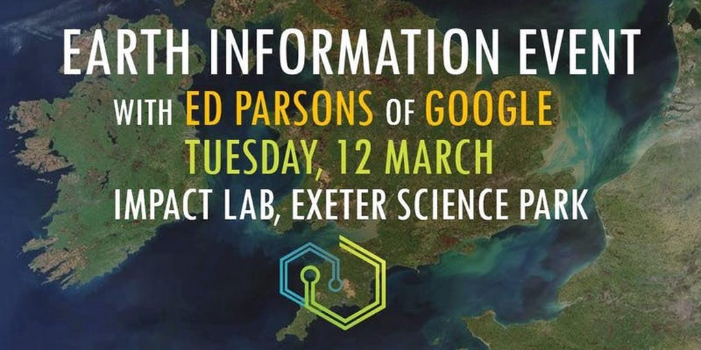
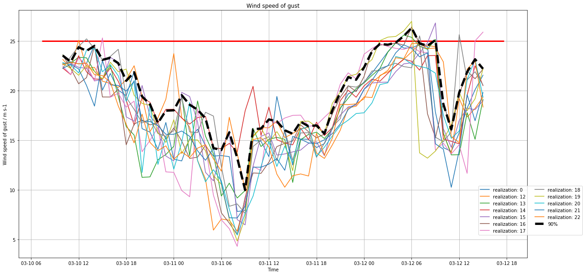

*This article was originally written for the the Met Office workshop run at the* [*Intro to Earth Information*](https://www.eventbrite.co.uk/e/intro-to-earth-information-with-googles-geographer-ed-parsons-tickets-53817586851) *event on the 12th of March 2019.*

## Introduction

At the Met Office we collect lots of data about the atmosphere. We use various types of instruments ranging from thermometers on the ground, to radars scanning the air to satellites passing above.

All of this data is assimilated into a gridded representation of the planet which we can then use to predict what is going to happen next. Using the laws of Physics and a supercomputer we wind the grid forward in time to forecast what will happen in the future.

These simulations produce many different datasets which are all useful for making business decisions in different ways. These can be broadly split into three categories:

-   [Snapshots](https://www.metoffice.gov.uk/public/weather/observation/map/) of the current state of the atmosphere
-   [Ensemble forecasts](https://www.metoffice.gov.uk/research/weather/ensemble-forecasting) of what the weather is going to do later
-   Predicted trends of what the [weather](https://www.metoffice.gov.uk/public/weather/long-range-forecast) and [climate](https://www.metoffice.gov.uk/climate-guide) will do in the long term

These simulations are vast and constantly updating. Therefore working with them can be tricky. This workshop will walk you through new tools being produced by the [Met Office Informatics Lab](https://www.informaticslab.co.uk/) in collaboration with the [wider scientific community](http://pangeo.io/collaborators.html) to allow people to explore and use this data in a business context.

## Last things first

In this workshop we will be working towards the goal of making important business decisions using probabilistic weather data. For the purpose of this session we are going to imagine a scenario where we are operating a local ferry company to move cars across a river. This business is affected by the weather and they cannot sail in high wind conditions. As the operator of this business we need to reduce the risk to our passengers and also the financial risk of missing crossings. Using the tools and data we have available we will produce a real time interactive report for the business' decision makers.

However to get to this point we will need to start at the beginning and explore the tools, the data and finally the analysis we will need to do in order to get to this useful information.

## Tasks

The following tasks will walk you through the different aspects of our tools, data and some example analysis. You can work through these on your own or in groups. Each task will consist of some information and then a set of interactive examples to allow you to explore and experiment at your own pace.

### 1. Pangeo

The first task we are going to work through is going to be using a stack of tools called Pangeo. Pangeo is a suite of open source tools which can be run on a cloud computing or HPC environment to empower scientific data analysis.

There are many different technologies which have been pulled together to create Pangeo. The most visible one is [Jupyter Lab](https://jupyterlab.readthedocs.io/en/stable/). This is a browser based tool for working on scientific data analysis workflows in [Jupyter Notebooks](https://jupyter.org/). In this task you will log into Pangeo and work through the example notebooks.

1.  Visit our example Pangeo at <https://hackathon.informaticslab.co.uk/>
2.  Log in with your GitHub account (if you do not already have a free GitHub account you will need to [register](https://github.com/join))
3.  Choose a scientific environment (please choose the *recommended* notebook)
4.  Wait for your server to start (this may take a few minutes)
5.  On the left hand side you have a file browser. Select the examples directory and work though the "Introduction" and "Tools" sections

### 2. AWS Earth

Every day the Met Office supercomputer produces multiple terrabytes of data. A subset of this data is sent to the cloud and made accessible to the public via [Amazon Web Services](https://aws.amazon.com) as part of a program called [AWS Earth](https://aws.amazon.com/earth/).

There are four datasets being made available through this program. Two cover the whole globe at a low resolution and two cover just the UK at a higher resolution. The difference between the two types is that one is a deterministic model which is the most likely scenario to happen, the other is an ensemble model which is a range of different possibilities that can be used to calculate the probability of an event.

In this task we will work through the first example notebook for AWS Earth which shows you what an example file from these datasets looks like.

1.  In your Jupyter Lab workspace [open a new terminal](https://jupyterlab.readthedocs.io/en/stable/user/terminal.html)
2.  Run the command `wget <https://raw.githubusercontent.com/MetOffice/aws-earth-examples/master/examples/1.%20Getting%20Started.ipynb>`
3.  A new notebook should appear in the file explorer on the left (you may have to click the little house icon to return to the top of the file structure)
4.  Open the notebook and work through it. (You can skip the `conda install iris` step as it is already installed)

### 3. Torpoint Analysis

Our last task is to take these tools and data and use them together to perform some actual useful data analysis.

To access the data you generally need to subscribe to a Met Office feed. You will be notified of newly created files as they arrive on AWS. For ease during the workshop we have taken some files from the feed and made them accessible in a new example. *For more information on how to access this data yourselves see the* [*official example notebooks*](https://github.com/MetOffice/aws-earth-examples)*.*

Let's start with our example scenario. We will imagine that we operate the [Torpoint ferry](http://www.tamarcrossings.org.uk) in Plymouth. Let's work through an example notebook allows us to take ensemble weather forecast data and calculate the risk that we will not be able to operate the ferry tomorrow.

1.  In your Jupyter Lab workspace [open a new terminal](https://jupyterlab.readthedocs.io/en/stable/user/terminal.html)
2.  Run the command `cp /scratch/jacobtomlinson/Torpoint\ Example.ipynb ~/.`
3.  A new notebook should appear in the file explorer on the left (you may have to click the little house icon to return to the top of the file structure)
4.  Open the notebook and work through it

## Wrap up

This workshop has given you an overview of tools and data that allow you to make critical business decisions using complex weather forecast data.

If you are part of a small/medium enterprise in Devon and think that your business could benefit from this kind of additional data and tooling then we may be able to provide you some free support through the [The Environmental Futures & Big Data Impact Lab](https://www.impactlab.org.uk/). Please don't hesitate to get in touch to find out if your business is eligible.
