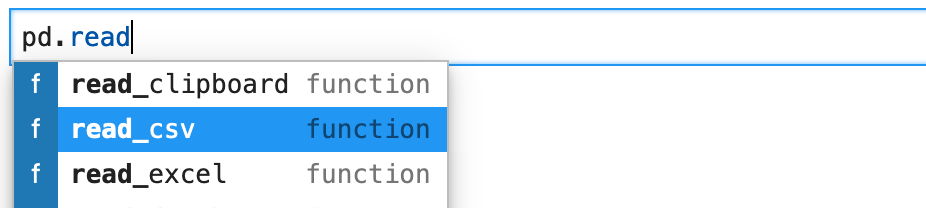
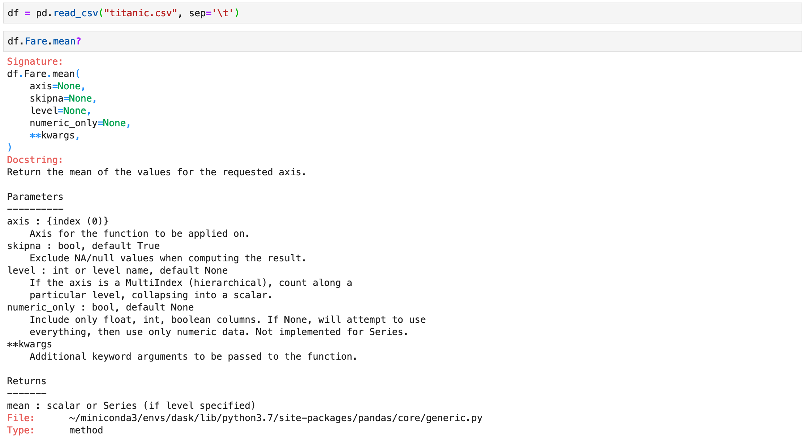
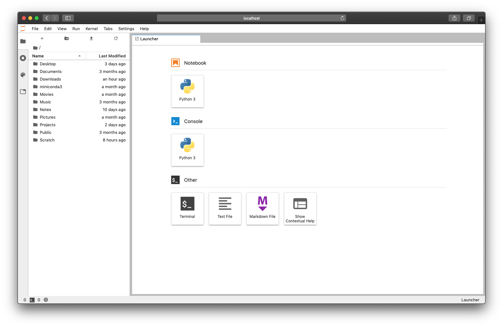
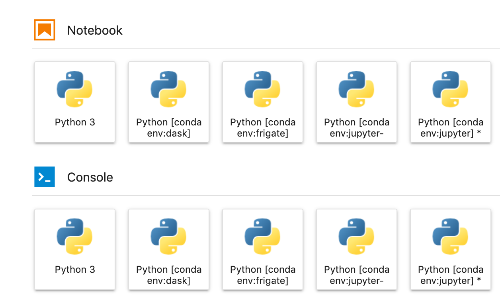

In my day to day work I generally access a variety of [Jupyter](https://jupyter.org/) installations. Sometimes these are short lived installations in conda environments on my laptop, sometimes they are running on a remote server, and sometimes I use a managed service like [JupyterHub](https://jupyter.org/hub) or [Binder](https://mybinder.org/).

However, I find it really useful to keep a simple minimal installation always running on my laptop. Jupyter notebooks are my preferred Python REPL to quickly testing out a bit of syntax. I also find them useful for exploring Python objects with tab completion and viewing docstrings.





In this post I'm going to walk through my Jupyter Lab setup on my MacBook and how I have it set to run automatically on startup.

## Installation

I use [conda](https://docs.conda.io/projects/conda/en/latest/) to manage my local Python environments and install packages. You can set up conda on your own machine quickly and easily using the [miniconda installers](https://docs.conda.io/en/latest/miniconda.html).

I tend to avoid the `base` environment in conda as I often end up accidentally installing things here. I generally create new conda environments for each project or task I am working on. These can be short lived (minutes or hours) or hang around forever.

For my persistent Jupyter Lab installation I'm going to create a new conda environment called `jupyter`, which will probably hang around forever.

```console
$ conda create -n jupyter python ipython jupyterlab nodejs

$ conda activate jupyter
```

In this environment I've installed Python, IPython, Jupyter Lab and NodeJS.

```info
NodeJS is an optional requirement of Jupyter Lab which you need to install frontend extensions, so we may as well install it now as we probably want to install some extensions later.
```

## Running Jupyter Lab

Let's test our Jupyter Lab installation by running it for the first time.

```console
$ jupyter lab
```



Great we have our Jupyter Lab successfully running. In theory I could stop here and every time I start my computer I could open a shell and run a couple of commands to get Jupyter Lab up and running.

```console
$ conda activate jupyter
$ jupyter lab
```

But I'm lazy, I don't want to have to remember to do that every time I reboot. I just want it to start automatically.

## LaunchAgents

On macOS there is a directory called `~/Library/LaunchAgents/`. In this directory you can place Apple `.plist` files which will be parsed when you login.

You can configure many things in here but the one we are interested in today is running a Jupyter server automatically when we log in. Let's place our own `.plist` file in this directory called `jupyter.plist`.

We will configure this file to run Jupyter on startup.

```xml
<?xml version="1.0" encoding="UTF-8"?>
<!DOCTYPE plist PUBLIC "-//Apple Computer//DTD PLIST 1.0//EN" "http://www.apple.com/DTDs/PropertyList-1.0.dtd">
<plist version="1.0">
<dict>
   <key>Label</key>
   <string>jupyter-startup</string>
   <key>ProgramArguments</key>
   <array>
      <string>/Users/<username>/conda/envs/jupyter/bin/jupyter</string>
      <string>lab</string>
      <string>--no-browser</string
   </array>
   <key>WorkingDirectory</key>
   <string>/Users/<username></string>
   <key>RunAtLoad</key>
   <true/>
   <key>StandardOutPath</key>
   <string>/Users/<username>/Library/Logs/jupyter.log</string>
   <key>StandardErrorPath</key>
   <string>/Users/<username>/Library/Logs/jupyter.log</string>
</dict>
</plist>
```

In this config file we have specified that we want `/Users/<username>/conda/envs/jupyter/bin/jupyter lab --no-browser` to run whenever we log in and the stdout and stderr from that script should go to `/Users/<username>/Library/Logs/jupyter.log`.

These locations are different on my laptop to yours and you will want to point them to somewhere sensible on yours.

```warning
A previous version of this post advised to make a startup bash script that in turn launches `jupyter`. With that setup however, it is not possible to allow Jupyter to access files in e.g. Documents, Desktop and network locations. By launching Jupyter directly, you now get a popup (on recent Mac systems) asking you whether you trust `python` to access those locations.
```

## Testing

To test your LaunchAgent and script without logging out and back in you can run `launchctl` directly.

```console
$ launchctl load ~/Library/LaunchAgents/jupyter.plist
```

You should now be able to visit `https://localhost:8888` in your browser and access your Jupyter Lab installation.

```info
If you have any trouble with this have a look in the log files you specified in your `.plist` file or in `/var/log/system.log`.
```

You can stop your Jupyter Lab session again also using `launchctl`.

```console
$ launchctl unload ~/Library/LaunchAgents/jupyter.plist
```

Finally once you are happy that things are working you should restart your laptop and then visit the Jupyter Lab URL in your browser to ensure everything started correctly.

```info
You might also want to bookmark this or pin the tab so that it is quick and easy to access in the future.
```

## Jupyter Lab extensions

Now that we have our persistent Jupyter Lab environment we may want to augment it with a few extensions.

### nb_conda_kernels

The most important extension I install when setting up my persistent environment is [nb_conda_kernels](https://github.com/Anaconda-Platform/nb_conda_kernels).

```console
$ conda install -n jupyter nb_conda_kernels
```

I want to keep the `jupyter` conda environment that we created as clean and minimal as possible. It's just for Jupyter and I don't want to use it for doing any Python work. Therefore you can install `nb_conda_kernels` which automatically makes any local conda environment available as a kernel in Jupyter Lab. This way I can continue to create task and project specific environments and easily access them from Jupyter Lab.



```warning
Environments only show up in the list if they have the `ipykernel` package installed.
```

### Other extensions

Other than that you can tailor your Jupyter Lab environment however you like. I recommend checking out this [Awesome Jupyter list](https://github.com/markusschanta/awesome-jupyter).

## Wrap up

That's it! We now have Jupyter Lab installed in it's own conda environment, it will start automatically when you log in and you can access all your other conda environments from it.

I find this a very useful thing to have on my laptop and use it every day.
