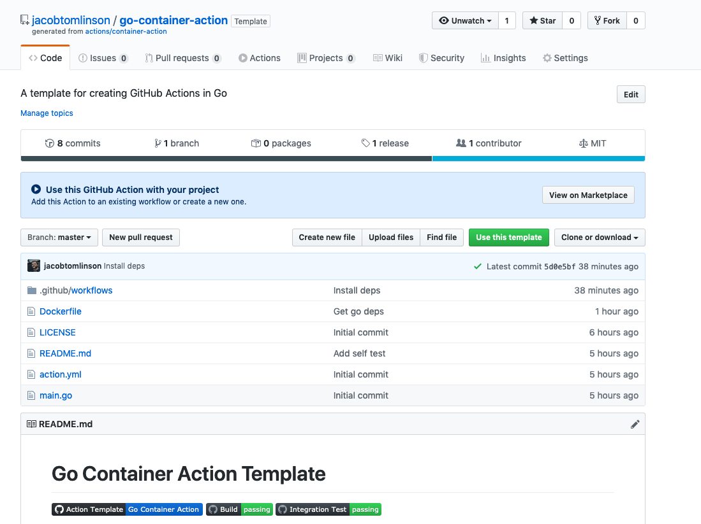
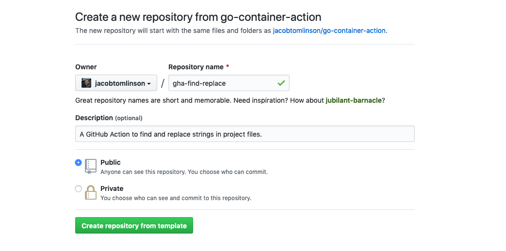
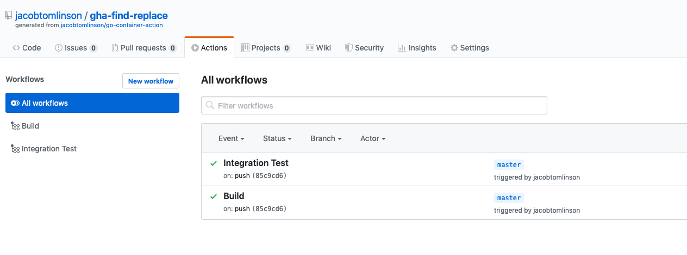
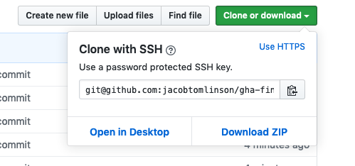
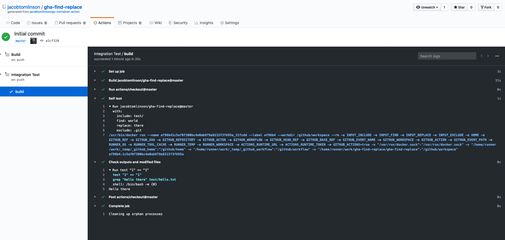
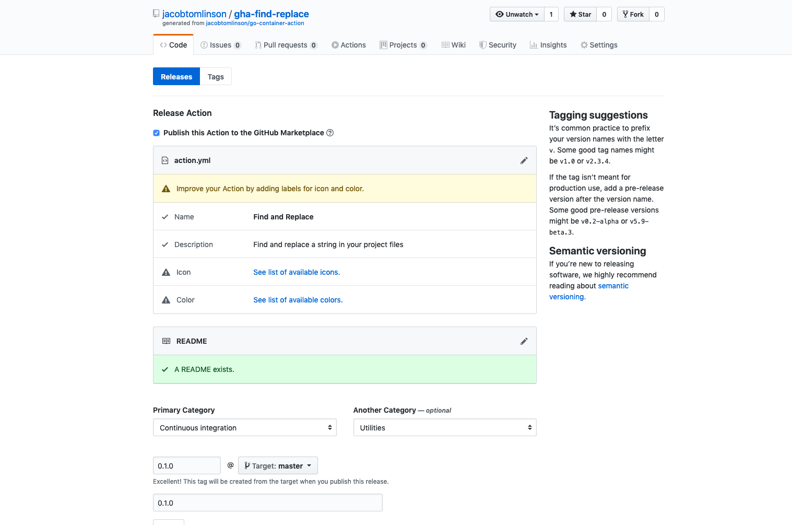
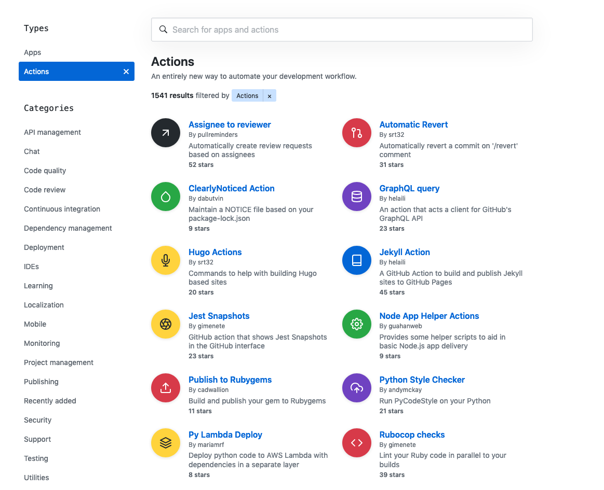
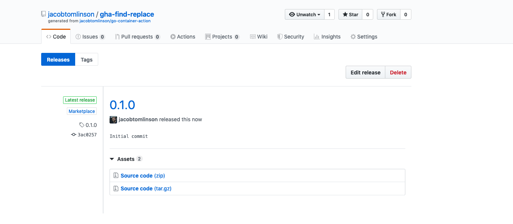
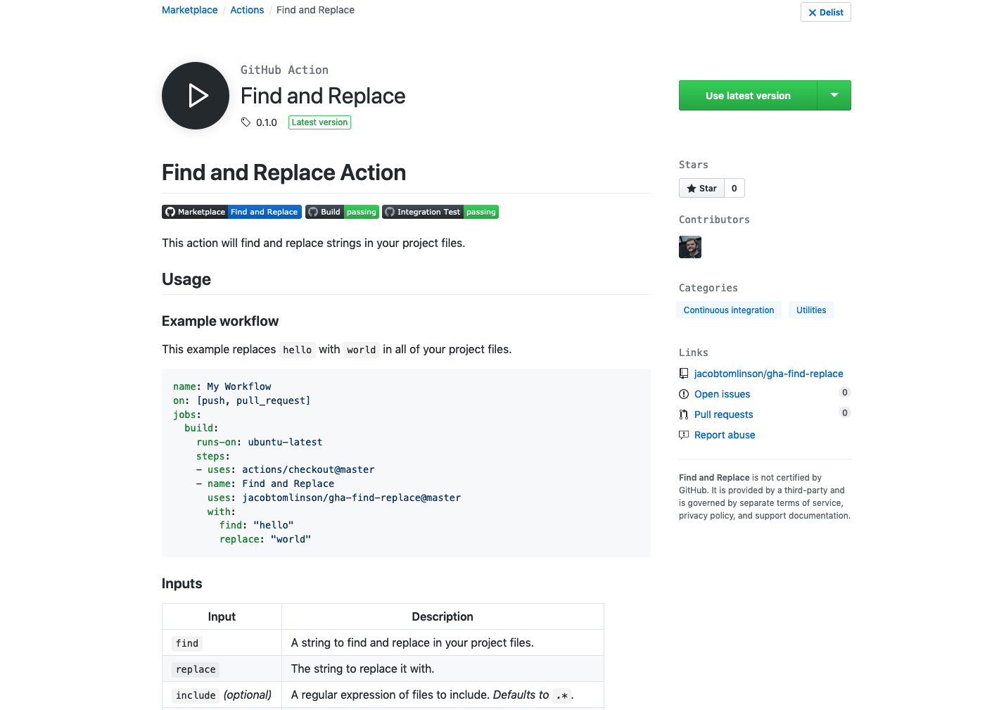

_Note: This post is also [available in Python flavour](/posts/2019/creating-github-actions-in-python/)._

[GitHub Actions](https://github.com/features/actions) provide a way to automate your software development workflows on GitHub. This includes traditional CI/CD tasks on all three major operating systems such as running test suites, building applications and publishing packages. But it also includes [automated greetings](https://github.com/actions/starter-workflows/blob/master/automation/greetings.yml) for new contributors, [labelling pull requests based on the files changed](https://github.com/actions/starter-workflows/blob/master/automation/label.yml), or even [creating cron jobs to perform scheduled tasks](https://help.github.com/en/actions/automating-your-workflow-with-github-actions/workflow-syntax-for-github-actions#onschedule).

Also GitHub Actions is **free for open source projects** 🎉!

In GitHub Actions you create [Workflows](https://help.github.com/en/actions/automating-your-workflow-with-github-actions/configuring-a-workflow), these workflows are made up of [Jobs](https://help.github.com/en/actions/automating-your-workflow-with-github-actions/workflow-syntax-for-github-actions#jobs), and these Jobs are made up of [Steps](https://help.github.com/en/actions/automating-your-workflow-with-github-actions/workflow-syntax-for-github-actions#jobsjob_idsteps).

> Steps can run commands, run setup tasks, or run an action in your repository, a public repository, or an action published in a Docker registry. Not all steps run actions, but all actions run as a step.

In this case an [Action](https://help.github.com/en/actions/automating-your-workflow-with-github-actions/about-actions) is a piece of code which will be run on the GitHub Actions infrastructure. It will have access to the workspace containing your project and can perform any task you wish. It can take inputs, provide outputs and access environment variables. This allows you to chain Actions together for endless possibilities. You can use prebuilt Actions from the [GitHub Marketplace](https://github.com/marketplace?type=actions) or write your own.

In this post we are going to walk through creating your own [Container Action](https://help.github.com/en/actions/automating-your-workflow-with-github-actions/creating-a-docker-container-action) in Go and publishing it to the GitHub Marketplace for others to use.

To give ourselves a head start we are going to use [this `go-container-action` template](https://github.com/jacobtomlinson/go-container-action) that I've published on GitHub. We will talk through each file we need to create so you don't strictly need to use it, but it will make our lives a little easier.

## Clone the template

To get started head to the [template on GitHub](https://github.com/jacobtomlinson/go-container-action) and press the big green "Use this template" button.



Give your new Action a repo name and optionally a description. In this example we are going to make an Action which does find and replace of two strings in our project files, so I'm going to name it `gha-find-replace`.



This will give us a new repository that is essentially a fork of the template.


Also our template has a couple of GitHub Actions configured to test the Action (woo GitHub Action recursion). We can visit the "Actions" tab and hopefully see both tests have passed.



We will come back to these tests later.

Lastly on the GitHub side for now let's clone our repository locally.

```console
$ git clone <your repo clone url>
```



## Writing our Action code

If you look in the project you will find a few files. The two we are going to focus on now are the `Dockerfile` and `main.go`.

### Dockerfile

The `Dockerfile` here is a pretty standard and minimal Go Docker build.

```docker
FROM golang:1.13 as builder

WORKDIR /app
COPY . /app

RUN go get -d -v

# Statically compile our app for use in a distroless container
RUN CGO_ENABLED=0 go build -ldflags="-w -s" -v -o app .

# A distroless container image with some basics like SSL certificates
# https://github.com/GoogleContainerTools/distroless
FROM gcr.io/distroless/static

COPY --from=builder /app/app /app

ENTRYPOINT ["/app"]
```

We start with a `builder` container based on `golang:1.13`. We copy in our code, run `go get` to install our dependancies and run `go build` to build a static binary of our application.

We then use a [multistage build](https://docs.docker.com/develop/develop-images/multistage-build/) step to move to a very [minimal distroless container](https://github.com/GoogleContainerTools/distroless). This container image has no operating system and just contains a couple of things like SSL certificates to ensure our application can function correctly when speaking to web services securely.

We copy our binary over from the `builder` container and set it as our entrypoint.

The result of this is an extremely small container image. The example we have here should build to around 4MB.

```console
$ docker build -t jacobtomlinson/gha-find-replace:latest .
...
$ docker images | grep gha-find-replace
jacobtomlinson/gha-find-replace                         latest              5db89820f2e1        8 seconds ago       4.03MB
```

Of course this will grow a little as we add more code, but it'll still be tiny compared to a container with a full linux distro in it. It also is a very secure way to build containers as we have hugely reduced our attack surface if a bad actor were to exploit our application, they wouldn't even have a shell to get into in the container.

### main.go

Let's also take a minute to explore the example `main.go` file that we have here before we replace it with our find and replace code.

```go
package main

import (
	"fmt"
	"os"
)

func main() {
	myInput := os.Getenv("INPUT_MYINPUT")

	output := fmt.Sprintf("Hello %s", myInput)

	fmt.Println(fmt.Sprintf(`::set-output name=myOutput::%s`, output))
}
```

This is a little longer than a [standard Go hello world example](https://gobyexample.com/hello-world).

The first line in our `main()` function is getting a GitHub Action input from an environment variable. GitHub actions can take arguments using a `with` statement and these get exposed via environment variables named `INPUT_` followed by the argument name in all caps.

```yaml
name: My Workflow
on: [push, pull_request]
jobs:
  build:
    runs-on: ubuntu-latest
    steps:
    - uses: jacobtomlinson/go-container-action@master
      with:
        myInput: world
```

In the above configuration the variable `INPUT_MYINPUT` would be created with the value `world`. We can then grab this within our code.

The next line of Go code is formatting this variable into an output string, nothing fancy here. This means our output string will now be `Hello world` in our little example workflow.

Then lastly it is printing to the stdout using some specific GitHub Actions syntax. You can pass information back to the GitHub Actions workflow with [certain control phrases](https://help.github.com/en/actions/automating-your-workflow-with-github-actions/development-tools-for-github-actions). This is an example of setting an Action's output by printing `::set-output name=<output name>::<output value>`.

This means we can access our output value within other GitHub Actions later in the workflow.

### Writing our find and replace

This article isn't intended to be a Go tutorial, so we won't go into the detail of the code here. But here is a general outline.

Our application is going to take some inputs:

- A regular expression of files to `include` in the replacement
- A regular expression of files to `exclude` from the replacement
- The string we want to `find` replace
- The string we want to `replace` with

We will then recursively list all of the files relative to our current working directory, check those files against our include/exclude lists, perform our replacement on the matching files and then write them back to disk.

Our action will finally print an output reporting the number of files that have been modified.

```go
package main

import (
	"fmt"
	"io/ioutil"
	"log"
	"os"
	"path/filepath"
	"regexp"
	"strings"
)

func check(e error) {
	if e != nil {
		log.Fatalf("error: %v", e)
	}
}

func listFiles(include string, exclude string) ([]string, error) {
	fileList := []string{}
	err := filepath.Walk(".", func(path string, f os.FileInfo, err error) error {
		if doesFileMatch(path, include, exclude) {
			fileList = append(fileList, path)
		}
		return nil
	})
	return fileList, err
}

func doesFileMatch(path string, include string, exclude string) bool {
	if fi, err := os.Stat(path); err == nil && !fi.IsDir() {
		includeRe := regexp.MustCompile(include)
		excludeRe := regexp.MustCompile(exclude)
		return includeRe.Match([]byte(path)) && !excludeRe.Match([]byte(path))
	}
	return false
}

func findAndReplace(path string, find string, replace string) (bool, error) {
	if find != replace {
		read, readErr := ioutil.ReadFile(path)
		check(readErr)

		newContents := strings.Replace(string(read), find, replace, -1)

		if newContents != string(read) {
			writeErr := ioutil.WriteFile(path, []byte(newContents), 0)
			check(writeErr)
			return true, nil
		}
	}

	return false, nil
}

func main() {
	include := os.Getenv("INPUT_INCLUDE")
	exclude := os.Getenv("INPUT_EXCLUDE")
	find := os.Getenv("INPUT_FIND")
	replace := os.Getenv("INPUT_REPLACE")

	files, filesErr := listFiles(include, exclude)
	check(filesErr)

	modifiedCount := 0

	for _, path := range files {
		modified, findAndReplaceErr := findAndReplace(path, find, replace)
		check(findAndReplaceErr)

		if modified {
			modifiedCount++
		}
	}

	fmt.Println(fmt.Sprintf(`::set-output name=modifiedFiles::%d`, modifiedCount))
}
```

_I'm by no means an experienced Gopher so if you can improve this code then don't hesitate to [make Pull Request](https://github.com/jacobtomlinson/gha-find-replace/blob/master/main.go)._

## Update action.yml

Now that we have some code we need to update our `action.yml` file to let GitHub Actions how to run our code and what inputs and outputs to expect.

```yaml
name: "Find and Replace"
description: "Find and replace a string in your project files"
author: "Jacob Tomlinson"
inputs:
  include:
    description: "A regular expression of files to include in our find and replace"
    default: ".*" # Include everything by default
    required: false
  exclude:
    description: "A regular expression of files to exclude in our find and replace"
    default: ".git" # Ignore the `.git` directory by default
    required: false
  find:
    description: "The string we want to replace"
    required: true
  replace:
    description: "The new string to replace with"
    required: true
outputs:
  modifiedFiles:
    description: "The number of files which have been modified"
runs:
  using: "docker"
  image: "Dockerfile"
```

We start here by setting some metadata to describe the Action, what it does and who wrote it.

We then list our inputs and outputs, give them a description, set any default values and whether they are optional or not. For our find and replace Action we have given our `include` input a default value of `.*` so that it matches everything and marked it as not required so that user's can leave this default value if they wish. We've then set our `exclude` to be just `.git` as we don't really want to modify our hidden git repo state directory. We then marked our `find` and `replace` inputs as required as folks will have to set these values when they use the skill. Then we let GitHub Actions know to expect an output of `modifiedFiles` from our code.

Lastly we tell GitHub how to run our Action. In this case we are using `docker` and we can either specify an image by name, or set it to `Dockerfile` which will cause GitHub Actions to build our image itself when running the Action.

_A nice future enhancement could be to set up Continuous Deployment to build and push our image to Docker Hub. This would allow us to reference our image by name here and it will already be built, saving us time whenever our Action is used. Currently our image takes around 6 seconds to build which isn't terrible, but if our Action was more complex this would be longer._

## Update README

We should also update our `README.md` file to reflect this configuration to help folks understand how to use our Action.

I'm not going to include this file here as it is a bit long but you can [check it out on GitHub](https://github.com/jacobtomlinson/gha-find-replace/blob/master/README.md).

I recommend you include the following sections:

- Badges showing that it is a Marketplace Action
- An overview of what the Action does
- A table of inputs and outputs
- Examples of different ways to use your Action

## Write tests

Now that we have the code, configuration and documentation for our Action we should test it out.

### Local testing

While writing the code I did some local testing. I created a new file in a directory called `test` named `hello.txt` with the contents `Hello world`.

Then I ran my Action code with my environment variables set inline to test the change.

```console
$ INPUT_INCLUDE="test/" INPUT_EXCLUDE=".git/" INPUT_FIND="world" INPUT_REPLACE="there" go run main.go
::set-output name=modifiedFiles::1
```

Running this replaced `world` with `there` in my `test/hello.txt` file and reported `1` file was modified. Great!

Now let's set up some Continuous Integration to test out code every time we push up changes or someone opens a Pull Request. We can set this up using GitHub Actions!

### Testing the build

The simplest thing we can do is to test that our Go code compiles. As we used the `go-container-action` template we already have a Workflow configured in `.github/workflows/go.yml` which should work just fine for our new code.

```yaml
name: Build
on: [push, pull_request]
jobs:
  build:
    name: Build
    runs-on: ubuntu-latest
    steps:
      - name: Set up Go 1.13
        uses: actions/setup-go@v1
        with:
          go-version: 1.13
        id: go

      - uses: actions/checkout@v1

      - name: Build
        run: |
          go get -d -v
          go build -v .
```

This Workflow runs three Steps. We get a working Go build environment with [`actions/setup-go@v1`](https://github.com/actions/setup-go) and then we check out our code with [`actions/checkout@v1`](https://github.com/actions/checkout). These are both official Actions provided by GitHub and you can find the source for both of them on GitHub too.

We then have a `run` step where we have provided a short shell script to install our Go dependencies with `go get` and run `go build`.

We don't need to change anything here as this should be enough for most simple Go applications.

### Integration testing

Now that we have tested our code builds we can also test that our Action runs correctly on the GitHub Actions infrastructure. We can do this by having our Action run itself on push and pull requests.

_This Action inception is one of my favorite features of GitHub Actions as we can do full end-to-end integration testing without any complex setup._

There is an example in `.github/workflows/integration.yml` which we will modify to look like this.

```yaml
name: Integration Test
on: [push]
jobs:
  build:
    runs-on: ubuntu-latest
    steps:
      - uses: actions/checkout@master
      - name: Self test
        id: selftest
        uses: jacobtomlinson/gha-find-replace@master
        with:
          include: "test/"
          find: "world"
          replace: "there"
      - name: Check outputs and modified files
        run: |
          test "${{ steps.selftest.outputs.modifiedFiles }}" == "1"
          grep "Hello there" test/hello.txt
```

In this workflow we start by checking out our Actions code. Then we run our own Action on itself and set our inputs to be the same as we were doing locally (note we have omitted the `exclude` input as it is optional and the default value is fine).

This Action should replace `Hello world` with `Hello there` in our `test/hello.txt` file.

Then we have a `run` Action which checks whether our Action behaved as we would expect. We test that the `modifiedFiles` output correctly shows `1` and then we check that our test file contains our new string.

## Push to GitHub

Next we can push our Action to GitHub and let our checks run to ensure everything works as expected.

```console
$ git add -A

$ git commit -m "Initial commit"

$ git push origin master
```

We can head to the Actions tab on our repository and watch our `Build` and `Integration Test` workflows run.


Our build step has passed, so we have definitely pushed valid Go code that compiles.



Hooray our integration test has also passed. We can have a look at the outputs from our Action and the checks to see that things have been changed as we expected them to. Note that is shows the default `exclude` value was filled in for us too.

## Publishing to the Marketplace

Now that we have created our Action and verified that it works as expected we can publish it to the Marketplace so other folks can find it.

Technically anyone could use our Action right now, we have already used it ourselves in our integration test. But the `master` branch is a moving target and we want to make it a little easier for folks to find it.

To publish it we need to do a GitHub release. We can do this the usual way through the releases page, but GitHub may have already detected that we have written an Action and  included a prompt to on our repo. Click the "Draft a release" button on the "Publish this Action to Marketplace" dialog or head to the releases page and click it from there.


Because we followed the publish dialog the "Publish this Action to the GitHub Marketplace" checkbox will already be checked. If you went in through the releases page you will need to check this box yourself.



GitHub has already picked up some information from our `action.yml` file including the name and description. It is also warning us that we haven't set a logo or color for our Action. This is how you set the icon you will see next to your Action in the Marketplace.



We will leave ours out for now which will just use the defaults but you can go back to your `action.yml` and set yours however you like.

You also need to choose which categories your Action belongs in. For our find and replace Action I've gone for "Continuous Integration" and "Utilities".

You also need to set a version tag. My preference is to use SemVer and start at `0.1.0`.

Once you click "Publish Release" you will be taken to the release page. You should notice that on the left hand side it has a little blue "Marketplace" badge which means this release is available on the Marketplace.



If you click that link you will be taken to the Marketplace page for your newly published action.



The Marketplace listing will use your `README.md` from your repository and provide some quick links for people to get started with your Action.

## Conclusion

That's it! We have successfully published our Action on the GitHub Marketplace for others to use. They can specify a tagged version so that they can ensure their workflows are deterministic and use it in any project they like.

So to quickly recap:

- We cloned the [`go-container-action` template](https://github.com/jacobtomlinson/go-container-action).
- We wrote a small utility application in Go to find and replace strings in files.
- We updated our `action.yml` file to describe the inputs and outputs of our application.
- We updated our `README.md` with documentation to help people get started with our Action.
- We wrote some tests to make sure our Action works as expected when run in a GitHub Actions Workflow.
- Finally we published it to the GitHub Marketplace by making a release.

You can have a look at the [Find and Replace Action here](https://github.com/jacobtomlinson/gha-find-replace) and even use it in your own workflows.

If you find this tutorial useful or even end up publishing your own GitHub Action on the Marketplace let me know in the comments below or on [social media](https://twitter.com/_JacobTomlinson)!
