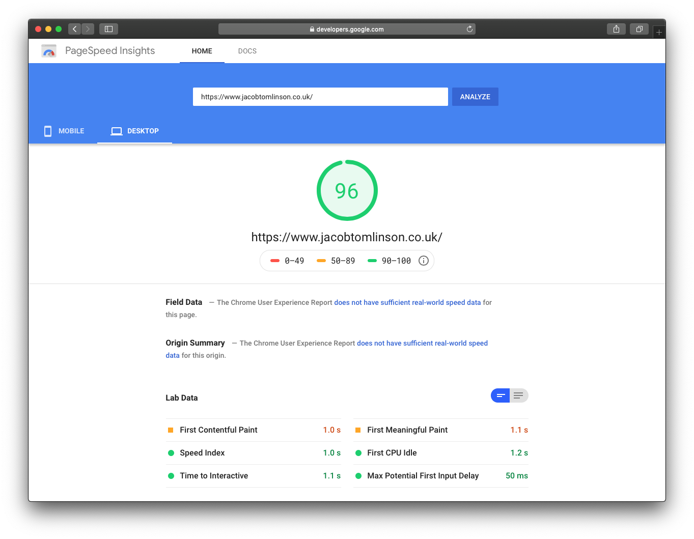
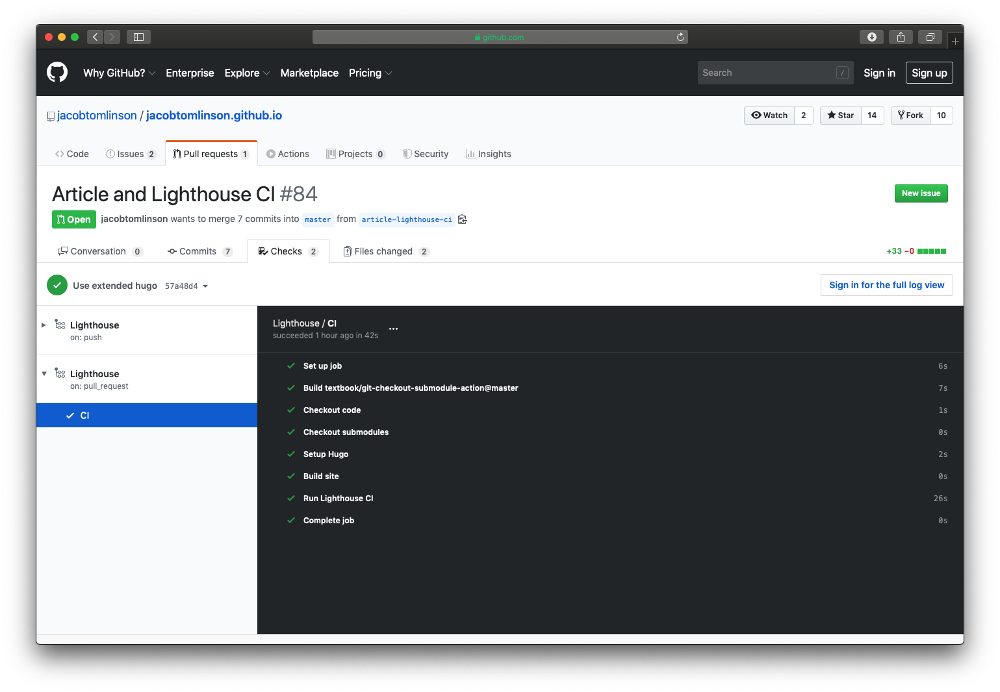
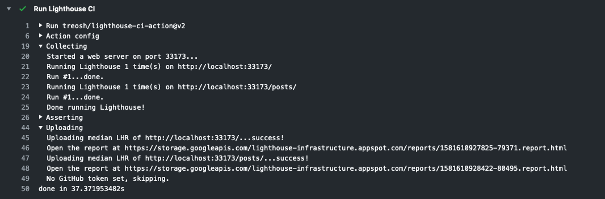
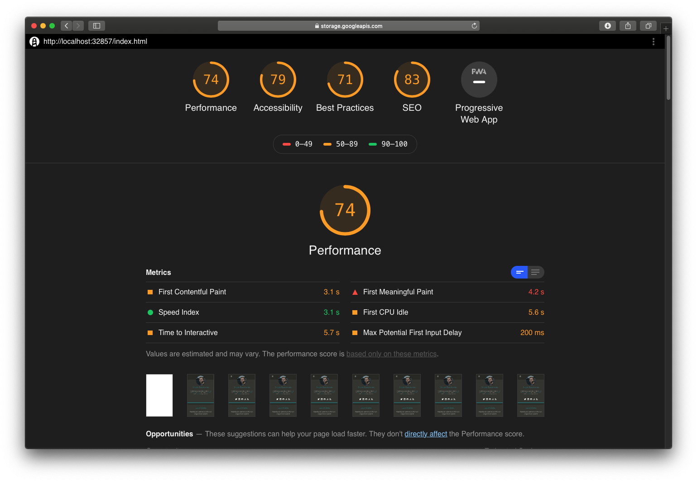
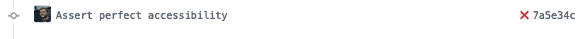
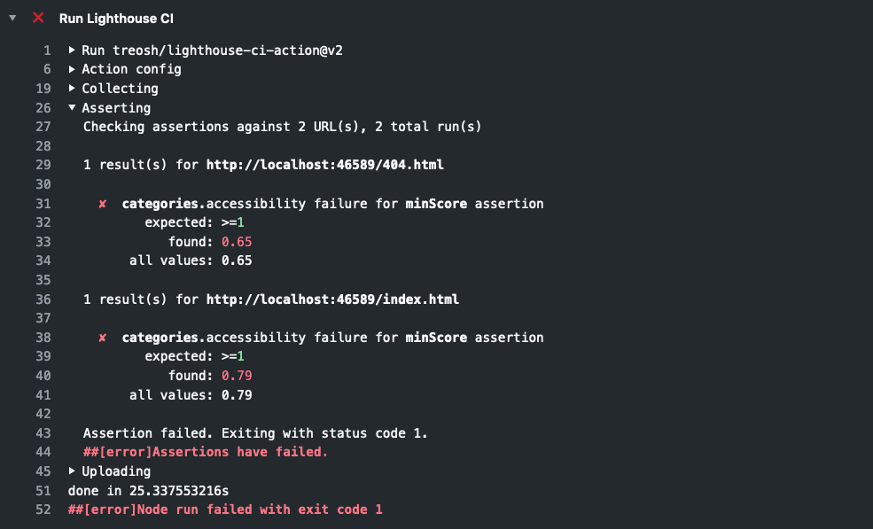

When you build a website you want pages to load as quickly as possible for users. Google has a tool called [PageSpeed Insights](https://developers.google.com/speed/pagespeed/insights/) which you can run on your website to see various metrics about the page. I've used it in the past while working on my blog and other sites.



This service is powered by an open-source tool that Google maintains called [Lighthouse](https://developers.google.com/web/tools/lighthouse). Lighthouse uses Chrome's rendering engine to test a URL and report metrics around performance, accessibility, progressive web apps, SEO and more.

Lighthouse has also been bundled up into a NodeJS package called [Lighthouse CI](https://github.com/GoogleChrome/lighthouse-ci) to enable you to run Lighthouse on your websites from the command line with a headless version of Chrome. You can set up Lighthouse CI in your existing CI solution and you can even run a Lighthouse server to collect and aggregate metrics.

But if you don't want all the fuss of hosting a Lighthouse server and running a complex CI pipeline you can get started quickly and easily using the [Lighthouse CI GitHub Action](https://github.com/treosh/lighthouse-ci-action).

In this post, we will cover setting up Lighthouse CI in [GitHub Actions](https://github.com/features/actions) to run performance tests on your static website. This could be a blog built with [Jekyll](https://jekyllrb.com/), [Hugo](https://gohugo.io/), [Pelican](https://blog.getpelican.com/), [Gatsby](https://www.gatsbyjs.org/) or perhaps a documentation site built with [Sphinx](https://www.sphinx-doc.org/en/master/) or [MkDocs](https://www.mkdocs.org/). Any project which outputs a static set of HTML/JS/CSS files into a build directory.

I'm going to focus on adding Lighthouse CI to [this blog](https://github.com/jacobtomlinson/jacobtomlinson.github.io), the one you're reading right now.

## Configuring our GitHub Action

First, we need to create a new directory in the root of our repository called `.github/workflows` if it doesn't already exist.

```bash
mkdir -p .github/workflows
```

Then we need to create a YAML file for our Lighthouse CI workflow configuration. This can be named anything you like as long as it ends in `.yml`. I'm going to call mine `lighthouse.yml`.

Let's start with a basic config.

```yaml
# .github/workflows/lighthouse.yml

name: Lighthouse
on: [push, pull_request]
jobs:
  CI:
    runs-on: ubuntu-latest
    steps:
      - name: Checkout code
        uses: actions/checkout@v1

      - name: Checkout submodules
        uses: textbook/git-checkout-submodule-action@master
```

This config creates a new workflow called `Lighthouse`. It runs one job called `CI` which uses a Ubuntu worker and has a step which checks out our git repository and another to check out any submodules. Hugo uses submodules for themes so we need to ensure our theme is checked out here.

The next thing we want to do is to build our static website. This will vary depending on your chosen tool, so refer to the documentation. You may well find there is an existing GitHub Action in the Marketplace for installing your chosen tool.

For my Hugo website, I'll add an install step using a [Hugo Action](https://github.com/peaceiris/actions-hugo) and then a build step.

```yaml
- name: Setup Hugo
  uses: peaceiris/actions-hugo@v2
  with:
    hugo-version: "0.55.6"
    extended: true

- name: Build site
  run: hugo
```

Running `hugo` will build my static website and output it into the folder `./public/` by default. This is important to note as we will need to tell Lighthouse where to find the files in a minute. These steps will differ depending on which static site generator tool you are using. The thing you want to achieve here is to build your static site into a local directory.

The last thing we want to add to our workflow is the Lighthouse CI Action.

```yaml
- name: Run Lighthouse CI
  uses: treosh/lighthouse-ci-action@v2
  with:
    configPath: "./lighthouserc.json"
    temporaryPublicStorage: true
```

In this last step, we have instructed Lighthouse CI to run using a configuration file called `./lighthouserc.json`. We've also set `temporaryPublicStorage` to `true` which means the final report will be uploaded to Google Cloud Storage for a while so we can look at the results in a nice web page.

Here is our completed workflow file.

```yaml
name: Lighthouse
on: [push, pull_request]
jobs:
  CI:
    runs-on: ubuntu-latest
    steps:
      - name: Checkout code
        uses: actions/checkout@v1

      - name: Checkout submodules
        uses: textbook/git-checkout-submodule-action@master

      - name: Setup Hugo
        uses: peaceiris/actions-hugo@v2
        with:
          hugo-version: "0.55.6"
          extended: true

      - name: Build site
        run: hugo

      - name: Run Lighthouse CI
        uses: treosh/lighthouse-ci-action@v2
        with:
          configPath: "./lighthouserc.json"
          temporaryPublicStorage: true
```

## Configuring Lighthouse CI

Next, we need to create the `lighthouserc.json` file in the root of our project and add some configuration so Lighthouse CI knows what to do.

```json
{
  "ci": {
    "url": ["http://localhost/", "http://localhost/posts/"],
    "collect": {
      "staticDistDir": "./public"
    }
  }
}
```

This is a basic config file which tells Lighthouse CI that we have some static files in `./public` and Lighthouse CI should serve them on a local webserver. By default Lighthouse CI will run tests against every HTML file in that folder so we are also specifying that we just want to test the root index page of the website and the blog post list page. Lighthouse CI will run the local web server on a random high port but it will correct your URLs automatically do you can just assume they will serve on `http://localhost`.

## Testing our Action

Next, we will commit these two files and push them up to GitHub and open a new PR. This will allow us to test our Actions and ensure they run as expected.

```bash
git checkout -b add-lighthouse-ci

git add .github/workflows/lighthouse.yml
git add lighthouserc.json

git commit -m "Add lighthouse CI"

git push --set-upstream origin add-lighthouse-ci

gh pr create  # Hooray for the GitHub CLI https://cli.github.com/
```

We can then look at the output of our GitHub Action in the Checks section of our PR.



If we expand the Lighthouse CI step and have a look we can see that it ran Lighthouse once on each of the specified URLs and uploaded the reports to Google Cloud Storage.



If we open up the report for the website root we see something similar to the PageSpeed Insights report above.



As you can see this report is worse than the report above, this is because Lighthouse CI will profile for mobile by default and my website performs worse on mobile than desktop. I should probably fix that.

The GitHub Action should also soon have the ability to [share the report URL back to the PR as a comment](https://github.com/treosh/lighthouse-ci-action/pull/22), rather than making you dig into the Action output.

## Testing our website

Now that we have our Action configured the CI should always pass if the site successfully builds and Lighthouse successfully runs on the pages. But what if we want to fail our build based on the results of the report?

To do this we can use [Lighthouse CI assertions](https://github.com/GoogleChrome/lighthouse-ci/blob/master/docs/assertions.md). There are many things you can check here, but for example, we could assert that our pages should always get a perfect score for accessibility. To do this let's update our `lighthouserc.json` config.

```json
{
  "ci": {
    "assert": {
      "assertions": {
        "categories:accessibility": ["error", { "minScore": 1 }]
      }
    },
    "collect": {
      "staticDistDir": "./public"
    }
  }
}
```

Here we are adding an assertion that the `accessibility` category should have a minimums score of `1` (this is on a scale of `0` to `1` and so is equivalent to `100%`). If it does not meet that score it should `"error"`, you can also set this to `"warn"` if you want the build to pass but have it highlighted in the Action output.

Now if we commit this change and push to our PR we will trigger Lighthouse CI again.

```bash
git add lighthouserc.json
git commit -m "Assert perfect accessibility"
git push
```

The report we saw before have an accessibility score of 79 to the home page (this is actually `0.79` in terms of the configuration threshold) so we are expecting our build to fail this time as we haven't made any changes to the site which will improve the accessibility.



If we check the GitHub Actions log we can see our assertions here are failing.



Great! We can have our CI pass/fail our Pull Requests based on information from the Lighthouse report. We can assert things like ["Does the page use responsive images?"](https://github.com/GoogleChrome/lighthouse-ci/blob/master/docs/assertions.md#audits_), ["Do our categories get a specific score"](https://github.com/GoogleChrome/lighthouse-ci/blob/master/docs/assertions.md#categories) or even ["Does my page download less than 200KB of CSS?"](https://github.com/GoogleChrome/lighthouse-ci/blob/master/docs/assertions.md#budgets).

## Next steps

In this post we covered:

- What is Lighthouse
- Adding Lighthouse CI to your project with GitHub Actions
- Checking your builds with Lighthouse CI assertions

Moving forwards we should set our assertions however we like and get our PR merged in so that we are testing our website with Lighthouse. It would also be a good idea to update the list of URLs with at least one of each type of page in the site to ensure good test coverage. For a blog this would probably be the home page, one or more posts and any error pages.

I certainly have a few things to fix on my site and once I do I'll use Lighthouse CI to ensure it stays that way.
