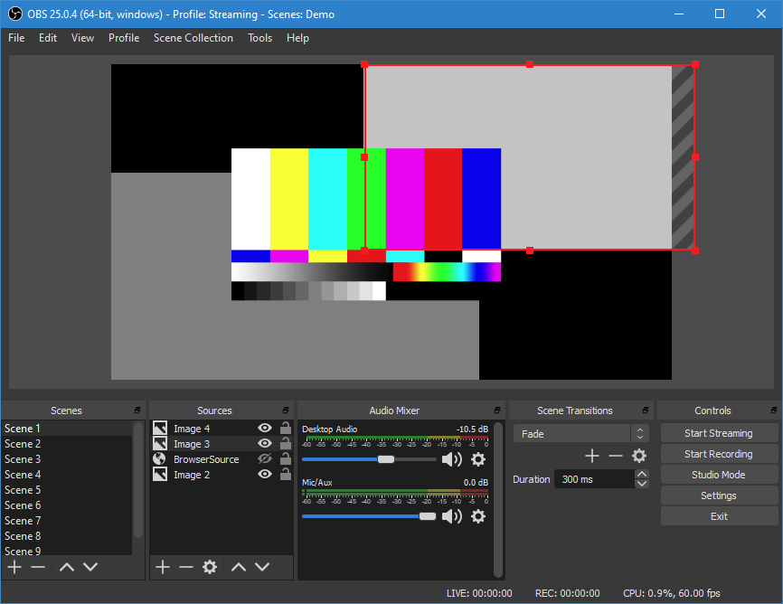

A popular tool with streamers and YouTubers is [Open Broadcaster Software®️ Studio](https://obsproject.com/) or OBS for short. It allows you to compose scenes with cameras, desktop sharing, video snippets, images, web pages and more and then stream that video to services like Twitch or Mixer. You can also save recordings locally if you want to upload them to YouTube.



While OBS Studio supports streaming via the [RTMP protocol](https://en.wikipedia.org/wiki/Real-Time_Messaging_Protocol) and has a bunch of presets for services like [Twitch](https://www.twitch.tv/) you may also want to use your OBS scenes in video meeting applications like [Zoom](https://zoom.us/), [Hangouts](https://hangouts.google.com/) or [Teams](https://www.microsoft.com/en-gb/microsoft-365/microsoft-teams/group-chat-software).

In this post we will talk through setting up OBS Studio for use in these tools. Before we begin you should already ensure you have OBS Studio and your favorite video meeting software installed.

## Virtual camera

Video meeting/chat software works by streaming your webcam feed and computer microphone audio. In order to get our OBS Studio output into these services it needs to expose it as a webcam on your computer.

To do this you can download and install the [OBS (macOS) Virtual Camera plugin](https://github.com/johnboiles/obs-mac-virtualcam).

Head to the [releases page](https://github.com/johnboiles/obs-mac-virtualcam/releases) and download the latest `.pkg` file. Open the installer and follow the instructions.


Once it is installed restart OBS Studio and any other application that you want to access your video stream.

Then in OBS Studio click `Tools > Start Virtual Camera`. You'll need to do this every time you open OBS.


## Setting up your OBS scene

If you've used OBS before and are happy setting up your scene you can skip this section.

If you're new to OBS Studio you will just see a black screen and will have a single scene called `Scene`.


You will at least want to add a `Video Capture Device` with your webcam. Click the `+` under sources and select `Video Capture Device`, give it a name and then choose the camera input you want to use.


You can then move this source around on your scene, scale it, crop it, etc. I'm going to leave mine up in the top left corner so you can see that it is working in the video meeting software.


## Chat / Meeting software

Now let's look at using our OBS scene in some popular chat software.

### Google Hangouts

If you open Google Hangouts and start a new meeting you should immediately see your OBS scene selected as the video input.


If you don't see this click the three dots in the corner of your video and head to `Settings > Video`. Then ensure you have selected `OBS Virtual Camera`.


If you see a blue screen with the OBS logo in your camera output this means you forgot to click `Start Virtual Camera` in OBS.


You may have noticed that your video feed is flipped, and in the OBS test card it says `Mirrored`. This is because many video meeting tools will show you a mirrored version of yourself, because this is what you are used to seeing in the mirror. Seeing a regular version of yourself can feel weird. But don't worry, just because you see a mirrored version doesn't mean that others in the meeting will. So don't try and "fix" it by flipping your camera in OBS.

### Microsoft Teams

When you join a call on Teams it will likely not select the OBS video source by default. You will probably see a black screen and an error saying it couldn't use your video input. This is because OBS is already using your webcam, so Teams can't use it at the same time.

Open the menu with the three dots and open `Show device settings`.


Then change camera to `OBS Virtual Camera`.


You should then see your OBS scene, but again it will be flipped.


_There is also a tiny switch camera icon in the bottom right, which you could use instead of opening the settings._

### Zoom

It is possible to get this working in Zoom too, however currently Zoom will not detect your virtual camera by default and you will need to implement a quick workaround.

Hopefully Zoom will get this fixed soon and you will not need this step.

Before you open Zoom create a new text file somewhere on your computer called `entitlements.xml` with the following contents.

```xml
<?xml version="1.0" encoding="UTF-8"?>
<!DOCTYPE plist PUBLIC "-//Apple//DTD PLIST 1.0//EN" "http://www.apple.com/DTDs/PropertyList-1.0.dtd">
<plist version="1.0">
<dict>
	<key>com.apple.security.cs.disable-library-validation</key>
	<true/>
</dict>
</plist>
```

Then open your terminal and run the following command.

```bash
# Change directory to the location of your entitlements.xml
cd /path/to/file/

# Codesign Zoom to disable library validation
sudo codesign --entitlements entitlements.xml -f -s - /Applications/zoom.us.app
```

This is because Zoom themselves need to approve all virtual camera tools, and they haven't approved this plugin yet.

Now when you open Zoom you'll be prompted to enter your password and approve these new entitlements and you'll also have to re-allow access to your microphone and camera.

You should then be able to choose the `OBS Virtual Camera` when you are in a meeting.


_You can also head to `Video Settings...` and uncheck `Mirror my video` to see what everyone else sees._

## Wrap up

There you have it, your OBS Studio scene in your video meeting software. This should also work for any other program that uses your webcam, but some may work better than others. I regularly use [Whereby](https://whereby.com/) for meetings and it works well there too.
