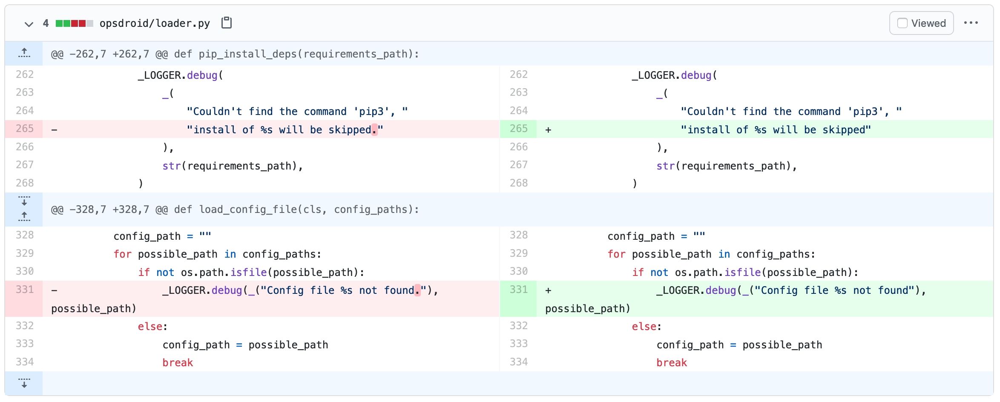
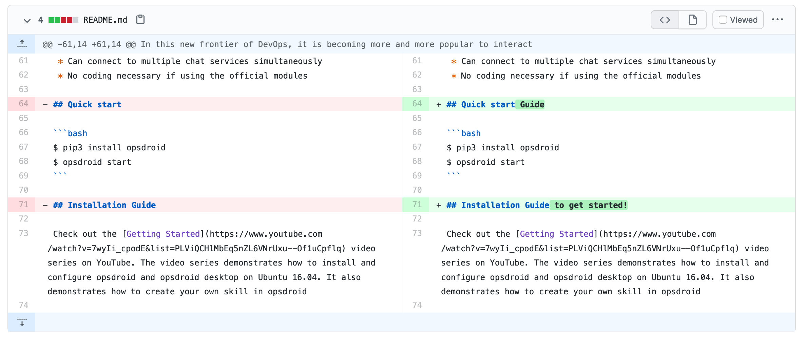
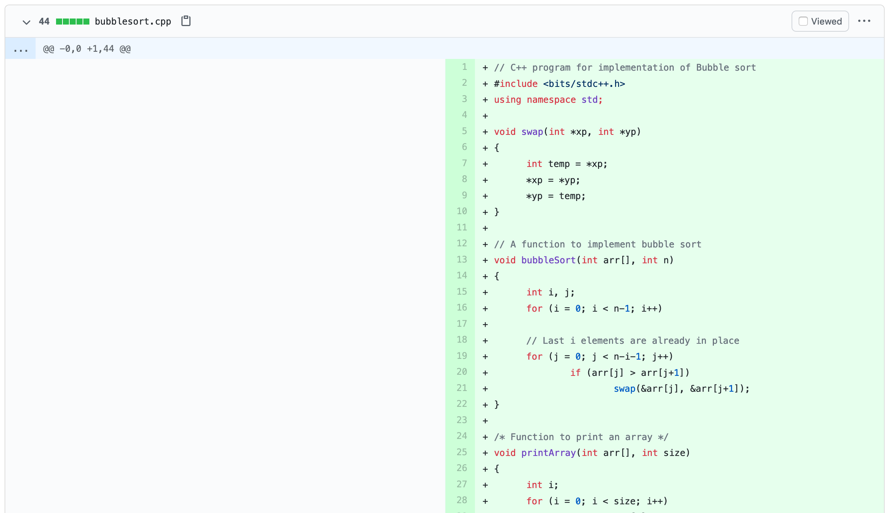
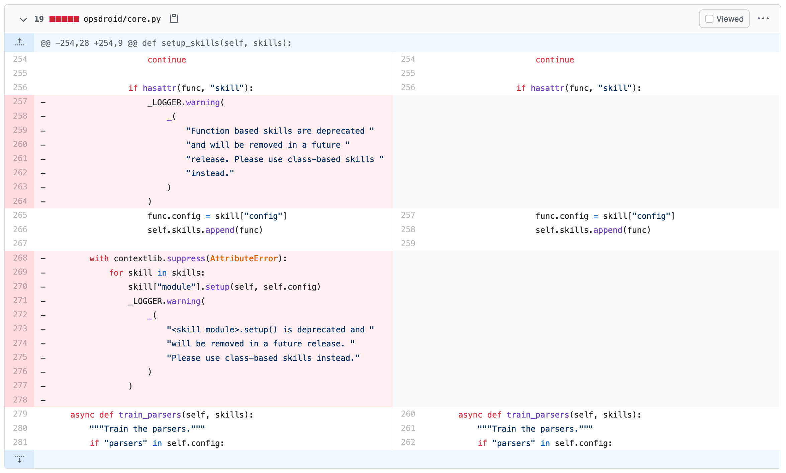
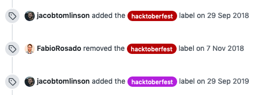
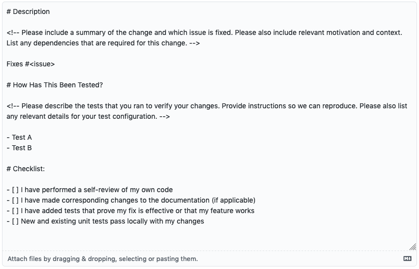

[Hacktoberfest](https://hacktoberfest.digitalocean.com/) is approaching once again. In previous years I have both participated and contributed to open source, and also tried to leverage the community in the open source projects I maintain by curating and labeling issues.

Hacktoberfest is a noble endeavor. At its core it is a group of large well funded companies who are incentivising developers around the world to contribute to open source by offering them free t-shirts and stickers. Open source projects who want to make use of this resource just need to label issues with `hacktoberfest` for some free development time to be sent their way.

Sadly the reality isn't quite this simple. The event is plagued with low quality contributions where the majority of participants are trying to do the minimum amount possible to qualify for their t-shirts. Someone once told me

> If you give me a metric I will hit it, but that does not guarantee I will give you value along the way.

This is especially true for Hacktoberfest. The organisers of the event simply state that if you raise four "quality" contributions then they will send you a t-shirt, but they leave the policing of what qualifies as "quality" down to the individual project maintainers. The Hacktoberfest team will not count PRs marked with the `invalid` label, but it is down to each project to review contributions and apply the label.

## Low quality contributions

In my experience the majority of Hacktoberfest contributions are low quality and they take a disproportionate amount of maintainer time. Arguably this is enough time that it undoes the value that Hacktoberfest intends to provide. Let's discuss a few examples and then move on to talk about how this can be avoided.

### Typo fixes

Every project with documentation will have spelling and grammatical errors. This is an easy thing for a contributor to fix; they read the documentation, they find a mistake and they raise a PR to fix it.

In an ideal scenario a contributor will take a whole documentation file or multiple files and check the whole thing for mistakes and errors, then raise a PR to fix it.

However in my experience many contributors, in an attempt to hit the t-shirt metric quickly, will raise one PR per mistake they find. They also often stop once they have raised four PRs.

Another problem is that most open source projects have their documentation written in english, but the majority of the world does not speak/write english as their first language. This means that often a PR to fix language can accidentally make it worse. Being fluent in english is absolutely not a requirement to be a software developer, but writing good documentation is a skill and to improve existing documentation it helps greatly to be proficient in the language that it is written in.

Another common type of contribution is adding/removing words which do not change the meaning of a sentence. Sometimes this makes things harder to read, sometimes it just has no effect at all.

Lastly many contributors will make changes to documentation in order to improve grammar, but without understanding the context of the project they are working on. This often results in changes which improve readability making the content incorrect or invalid.

### Code style and linting

Another low effort task that many contributors will take is to "improve" the code style of a piece of code. For projects which do not enforce linting or have a style guide this may be helpful, however for many languages code style is a matter of taste and it is not something which can be added piecemeal by various contributors.

I spend the majority of my time contributing to and maintaining Python codebases. Python is lucky in that the core language has style rules (see [PEP8](https://www.python.org/dev/peps/pep-0008/)) and a general principal that there should only be one way to do something. There are great tools like [pylint](https://www.pylint.org/) and [flake8](https://flake8.pycqa.org/en/latest/) which assess whether the code meets this standard and we also have [black](https://github.com/psf/black) which formats code automatically in a consistent way.

I am a big fan of automatic code formatting, it removes the human side of the equation. I don't always agree with the way that `black` formats code, but I know it will be consistent and means that I can stop caring about the problem all together. Other languages have similar tools, JavaScript and other web languages have [Prettier](https://prettier.io/), Go has [gofmt](https://golang.org/cmd/gofmt/), etc. These tools make it easy to consistently format a codebase and can be included in CI and testing to ensure new contributions are compliant.

When a contributor comes in to "fix" code style problems they will likely break the tests, either by changing the logic of the code or by changing the style so that the auto formatter would want to change it back. They may also do some light touch refactoring such as changing variable names, reordering sections of code, etc. These refactors do not improve the code, just stir it around a little.

### Unrequested features

Sometimes a contributor will raise a PR which adds a feature to a project which is totally unrelated. Often this is a small feature that a novice user has learned to implement in a tutorial and now they are trying to find a home for it. I have seen users in the past copy and paste the same contribution to many projects in the hope that someone will incorporate it. In worst case scenarios this has been a standalone Python script which they've dumped somewhere random in the codebase.

### Bizarre miscellaneous contributions

I have also seen a whole range of bizarre contributions. Having folks PR in an unrelated Python script is definitely a bit strange, here's another one where someone contributed a C++ bubble sort script to a Python project.

I've also seen folks randomly delete chunks of code.

Or just duplicate an existing file with a new name.

## How to guide your new contributors

If you engage in Hacktoberfest by using the `hacktoberfest` label you will attract many new contributors. But it is important to remember that many of these folks will be new to open source and possibly programming in general. In order to get value from this new crowd you must also give value in return.

### Avoid simply labelling open issues

It is tempting to just go through the backlog of open issues and liberally apply the `hacktoberfest` label. But if an issue has been open for a long time and nobody has picked it up it is likely that the instructions are unclear or their is not much motivation to resolve it. Pointing novice contributors at issues like this will probably not result in anyone picking them up.

It is much better to create new issues targeted at Hacktoberfest contributors, we go into this in depth in a minute.

### Have clear contribution guidelines

This is good advice for all open source projects, but especially when you are experience a flood of new contributors. Have a page of documentation which explains how to contribute to the project. Answer questions like:

- How is the project structured?
- How to you run the tests?
- How do you write new tests?
- Is there a code style guide?
- What needs to be done for a PR to be accepted (tests, docs, linting, etc)?

Write this file like it is a tutorial on how to contribute to your project.

### Have a PR template

You can create [pull request templates](https://docs.github.com/en/github/building-a-strong-community/creating-a-pull-request-template-for-your-repository) for your project by creating a file called `.github/pull_request_template.md`. When new users open a PR the form will be auto populated with this template. This is useful for pointing users to your contributing docs and providing them with a checklist of the things you expect from them.

Keep it short. Ask contributors to justify the change, link to the issue it is related to, describe how they tested it and check off any requirements you may have.

### Have a Hacktoberfest policy

It is likely that your rules for accepting Hacktoberfest contributions may be stricter than normal. I personally add a few rules to my review process and am pretty harsh if these rules are not followed. This includes things like:

- Does the PR address an open issue?
- Does the PR improve the codebase?
- Has the contributor filled in the PR template?

If the answer is no to any of these I close the PR. This may seem a little harsh, but given the amount of low effort contributions I review every October I have to draw a line in order to not sink all of my time into this.

GitHub has a [saved replies](https://docs.github.com/en/github/writing-on-github/using-saved-replies) feature which allows you to create some template reply snippets and very quickly use them when reviewing a PR. I have templates for thanking contributors for a quality contribution, pointing folks to the contribution docs and rejecting a low effort Hacktoberfest PR. This saves me a lot of time writing individual responses and allows me to give off a consistent, upbeat, positive tone even if this is the hundredth low effort PR that I have closed that day.

> Thanks for taking the time to raise this PR! I'm afraid it does not meet our guidelines for contributing to the project, Hacktoberfest is a busy time for project maintainers and sadly we are going to have to close this now.
>
> Please have a look at our contributing guidelines. We often close issues for the following reasons:
>
> - Your PR does not solve an open issue.
> - Your PR does not make a meaningful change to the codebase.
> - You didn't fill out all the information in the Pull Request template above.
>
> If you would like to take another crack at it we would love to review your next PR, just be sure to run through the contribution guide!

### Craft issues for the Hacktoberfest community

Once you have a decent workflow for filtering out the low effort PRs from folks who just want a t-shirt you can give your attention to the folks who are contributing in the spirit of Hacktoberfest. There are many people out there who have a desire to make meaningful contributions to open source projects, but lack the experience or time to do so. This is where you can provide guidance and leadership and perhaps even mentoring. It does require a time investment from you as a maintainer, but it allows you to amplify the effort you put in.

Many open source projects have repetitive well defined tasks which need doing, but the core maintainers do not have the time or inclination to do so. These can be great tasks for Hacktoberfest contributors.

One example of this is an issue we have in Opsdroid which covers [converting the existing test suite](https://github.com/opsdroid/opsdroid/issues/1502) from `unittest` to `pytest`. In a previous maintainer meeting we decided to migrate to a new test framework in order to make things more maintainable. The tests have also grown organically and many are not very high quality.

We took the time to craft an issue which described what we are trying to achieve and the process you must go through to convert tests to the new framework. We included an example of converting one file and explained that there are many files which need converting, so the issue doesn't need one person to fix it, it needs many.

That last part is important because for a long time GitHub's "Getting started" guide advised new contributors to "claim" an issue by making a comment asking if they could work on it. I've found this not to be helpful for a few reasons.

Many contributors are drive-by contributors. They find an issue they think they can solve and they solve it, by advising them to ask permission first means they have to wait for a maintainer to respond which may not happen for a few hours. In which time they may have moved on to something else.

By having folks claim issues it also means that others will not pick it up because they think someone else is working on it. In my experience only about 10% of folks who claim an issue actually follow up with a PR. So I'm definitely happy for multiple people to start working on it, and if we are fortunate enough to have multiple PRs raised they can often be combined by a maintainer into a joint contribution.

Having an issue where you expect multiple PRs to be raised avoids this problem all together.

Crafting issues like this also allows you to teach people. For many folks writing good tests is a skill which comes later, so providing a well structured issue which describes how to run the existing tests, how to convert them to a new format and how to run those means that the contributor can spend their time understanding what the test does. They have a foundation to build on, but because they are converting it they have to re-write the whole thing. When they raise their PR they will have learned something about testing, and you will have gained a newly reviewed and updated test. It's a win-win.

Another thing to consider is that newcomers to your project come without assumptions and baggage. As a maintainer of a project you can easily overlook user experience things because you already have so much context. So a good task for fresh eyes is giving them a specific task to do with your project. Write an issue which says "Document how to use this tool to do X". Give them links to the documentation, the website and other entrypoints. Describe the outcome but not the journey, the example should be able to do X. Make sure X is something you expect folks will want to do with your project, but not necessarily something you've done yourself or done recently. But having people write instructions like this they will effectively become users and testers of your project. They will read the general documentation to try and figure out how to do it while writing specific instructions on how it can be done. They will run into bugs that you have overlooked, find documentation they do not understand and more. In the issue encourage them to raise new issues if they get stuck. You can then add instructions to those issues on how to fix them for other Hacktoberfest participants to pick up and solve.

## Conclusion

It is a common mistake to assume that Hacktoberfest is a means to getting some free labour for your open source project. Similar assumptions are often made about Hackathons where companies have a problem and try to crowd source a solution by providing folks with a catered event.

Leveraging a group of enthusiasts, such as the kind who take part in Hacktoberfest, is similar to leading a team of developers in an organization. You must give them direction, leadership and learning opportunities in order for them to feel engaged. Pointing people at a firehose of support tickets without context or supervision is not going to result in a satisfactory outcome.

In summary:

- Write quality contribution guidelines and PR acceptance rules. Treat this like you are onboarding new employees.
- Automate and simplify your process for rejecting low quality contributions. Be friendly and welcoming but strict to avoid wasting your time.
- Write issues targeted at Hacktoberfest contributors and structure them like a tutorial. It may take more effort than it would to solve the issue yourself, but you are giving them skills and context that they will hopefully use in repeat contributions.
- Find repetitive tasks which can be done many times, each time adding value. This may be writing docstrings, refactoring tests, testing documentation, writing examples, etc.
- Take the time to teach people and you may convert them into long time contributors.
