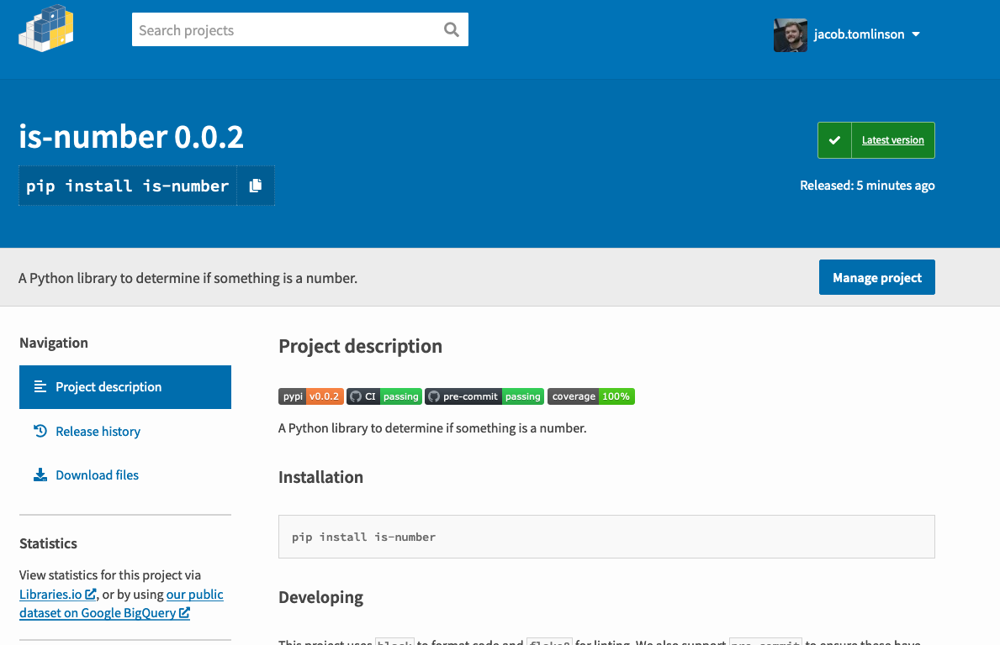

In this post we will cover automatically packaging and releasing our project when a new git tag is pushed to GitHub.

# Continuous Delivery

Continuous delivery (CD) is an automated process where software is packaged and delivered to the end user. In many open source projects new code is added to a `main` branch via Pull Requests. At some point the maintainers of the project will decide to release a new version. This is typically done by creating a tag on a specific commit in git and then packaging up the code at that commit and releasing it to the world.

In parts [two](https://jacobtomlinson.dev/posts/2020/versioning-and-formatting-your-python-code/) and [three](https://jacobtomlinson.dev/posts/2020/publishing-open-source-python-packages-on-github-pypi-and-conda-forge/) of this series we tagged version `0.0.1` of our `is-number` package and manually distributed it to PyPI and Conda Forge.

In this post we are going to automate these steps so when we create our tag and push to GitHub everything else is done for us.

## Releasing automatically

To automate our releases we are going to use GitHub Actions to build and publish our package to PyPI. Conda Forge will then automatically detect this new version and update our feedstock over there, so we don't need to worry about that.

### Authenticating with PyPI

The first thing we are going to need to do is allow GitHub Actions to publish packages to PyPI on our behalf. In part 3 we used `twine` to upload our package which prompted us for our username and password. We could do the same thing in our GitHub Actions workflow, however it is better practice to use a more constrained API key instead. API keys have limited access to PyPI and can only push new versions to one specific project, this means if the key were to get out someone can only do limited damage with it.

If we log into PyPI and head to our "Account Settings" page we will find an "API Tokens" section part way down the page.


If you click "Add API Token" you will be able to give your token a name and select the scope. Let's create one called `is-number-publish` for our `is-number` package.


The next page will show us our token. This is the only time we will see this token so we need to make note if it now.

We are going to add this token to our `is-number` repo as a secret. If we head to our repo on GitHub and then the Settings > Secrets page we should see a "New Repository Secret" button.


We will give our secret a name of `PYPI_PASSWORD` and paste in the token that PyPI provided us.


Now our token is available for use in our GitHub Actions workflows.

### Creating our workflow

Next in our `is-number` project directory we want to make a new branch based off `master` which adds a new GitHub Actions workflow file.

Now that we have CI set up in our project from our last post it is good practice to switch to [GitHub Flow](https://guides.github.com/introduction/flow/) where we work on branches and raise pull requests to merge into `master`. This allows us to see our CI checks running before we merge.

```console
$ git checkout master
$ git checkout -b add-cd
```

Now let's create `.github/workflows/release.yml`.

```yaml
name: Build distribution

on: [push, pull_request]

jobs:
  test:
    runs-on: "ubuntu-latest"

    steps:
      - name: Checkout source
        uses: actions/checkout@v2

      - name: Set up Python 3.8
        uses: actions/setup-python@v1
        with:
          python-version: 3.8

      - name: Install build dependencies
        run: python -m pip install build wheel

      - name: Build distributions
        shell: bash -l {0}
        run: python setup.py sdist bdist_wheel

      - name: Publish package to PyPI
        if: github.repository == 'jacobtomlinson/is-number' && github.event_name == 'push' && startsWith(github.ref, 'refs/tags')
        uses: pypa/gh-action-pypi-publish@master
        with:
          user: __token__
          password: ${{ secrets.pypi_password }}
```

We start by configuring our workflow to run on `push` and `pull_request` events. This is because we want our packaging steps to run every time to ensure our package is always in a packageable state.

We then set up Python. We aren't going to go to the effort of trying multiple versions like we did for our tests, we just need one version for packaging.

Next we install `build` and `wheel`, these are the two packages we used to package our project in part 2.

Then we run `python setup.py sdist bdist_wheel` which will build a package for our project.

Lastly we have our publishing step. Notice this step has an `if` section which restricts this step to only run on our `is-number` repository (not forks), only on `push` events and only when the GitHub ref contains `refs/tags`. The first two constraints are there because our `PYPI_PASSWORD` secret will only be available during `push` events on our main repo, so there is not point even attempting this on forks. The final constraint is because we only want to publish our package when we create a new tag.

This last step uses the official `pypa/gh-action-pypi-publish` action which is maintained by the `PyPI` folks and wraps up everything we were doing with `twine`.

This step takes a username and password for PyPI. Because we are using an API key stored in a secret we set the user to `__token__` and template in our secret.

### Documentation

Next we should add a little section to the bottom of our `README.rst` file to describe to folks how releasing works.

```rst
Releasing
---------

Releases are published automatically when a tag is pushed to GitHub.

.. code-block:: bash

   # Set next version number
   export RELEASE=x.x.x

   # Create tags
   git commit --allow-empty -m "Release $RELEASE"
   git tag -a $RELEASE -m "Version $RELEASE"

   # Push
   git push upstream --tags
```

Here we explain that we automatically publish on tags and give a little example workflow on creating tags.

We set out version number as an environment variable, create an empty commit with the version number in, tag that commit with the version and push upstream. Pushing upstream here assumes we are working from a fork, if we are not doing that it would be `git push origin --tags`.

### Pull request

Next let's stage these two files, commit them and raise a pull request.

```console
$ git add -A
$ git commit -m "Add automated releases on tags"
$ git push --set-upstream origin add-cd
```


We should see our new `Build Distribution` check in the list and if we look at the steps the `publish` step will be skipped because this wasn't a tagged push.


### Merging and releasing

Once things have passed we should merge our PR on GitHub.


When we have done that let's switch back to our `master` branch, pull down the changes and tag a `0.0.2` release.

```console
$ git checkout master
$ git pull
$ export RELEASE=0.0.2
$ git commit --allow-empty -m "Release $RELEASE"
$ git tag -a $RELEASE -m "Version $RELEASE"
$ git push --tags  # We aren't on a fork so we can omit the upstream
```

Now if we head to the `Actions` tab of our repository we should see a `Build Distribution` workflow running for our `0.0.2` tag.


If we head into this workflow we should see the "Publish Package to PyPI" step ran this time and shows our new version being uploaded.


And if we head over to PyPI we should see our new version available.



In the next few hours Conda Forge will notice this new version, raise a Pull Request on our feedstock, run the checks and auto merge if everything is ok. Then this version will also be available via `conda`. We don't need to do anything here unless we update our package dependencies, in which case the PR will fail and we would need to update it.

## Summary

In this post we have covered:

- Switching to GitHub Flow
- Creating a API token on PyPI
- Creating a secret on GitHub
- Adding a GitHub Actions workflow to publish to PyPI on tags
- Tagged `0.0.2` of `is-number` and tested out our workflow

In future posts we will cover:

- Generating documentation and hosting it
- Creating a community
- Handling future maintenance
