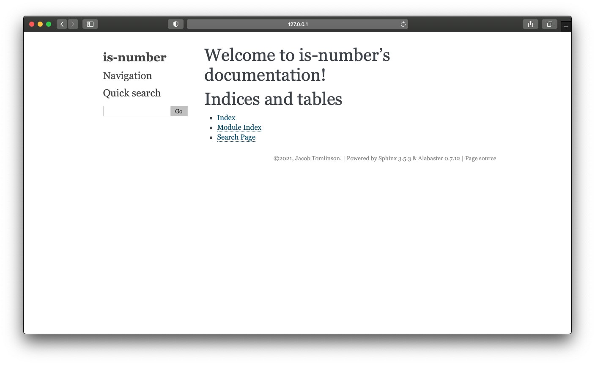
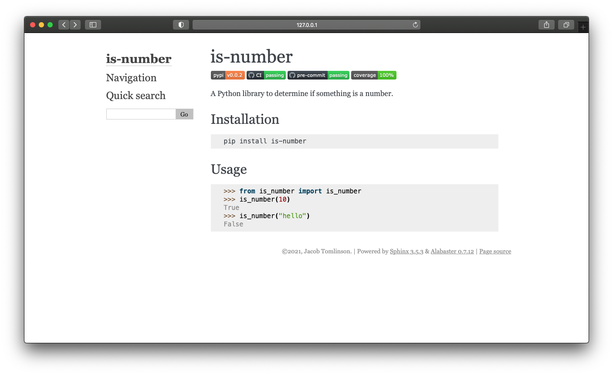
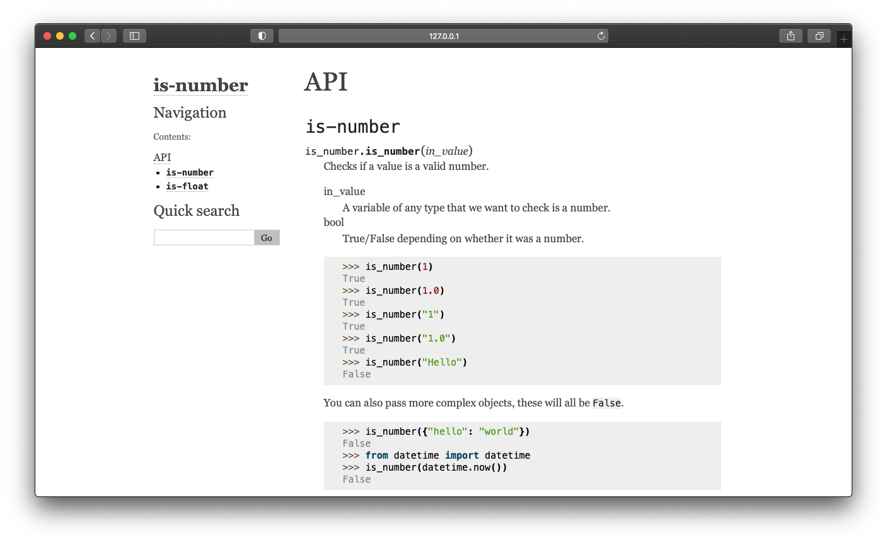
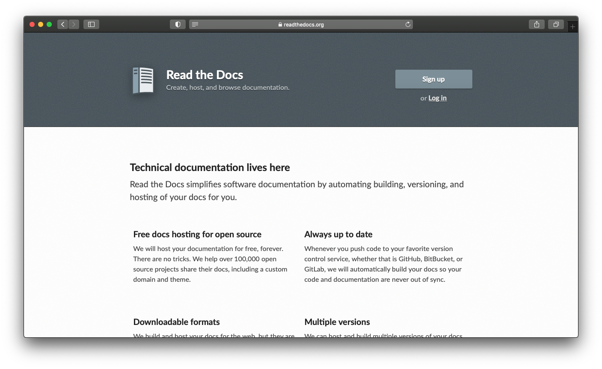
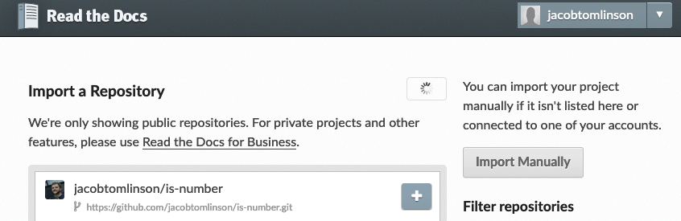
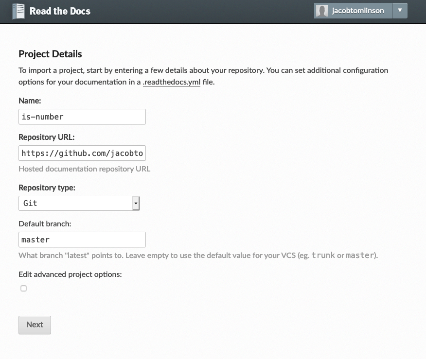
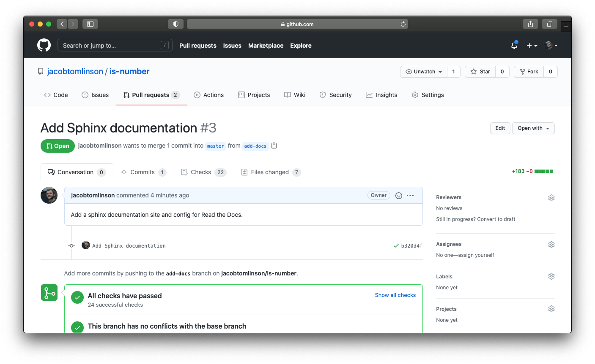
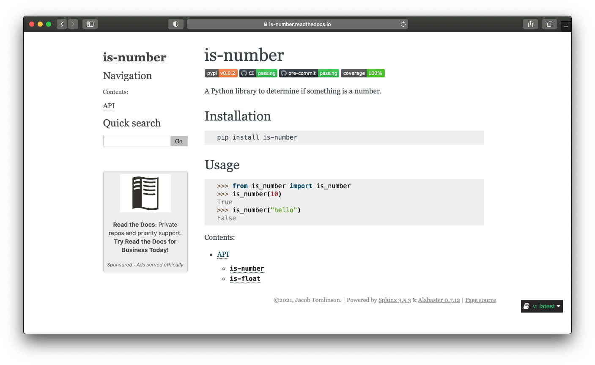

In [part four of this series](https://jacobtomlinson.dev/posts/2021/documenting-your-python-code/) we discussed documenting our code as we went along by adding docstrings throughout out project. In this post we will see that effort pay off by building a documentation site using [Sphinx](https://www.sphinx-doc.org/en/master/) which will leverage all of our existing docstrings.

## Sphinx

Sphinx is a documentation generation tool which takes in [reStructuredText](https://docutils.sourceforge.io/rst.html) files along with docstrings from within your code and builds a static HTML/CSS documentation website for you.

Let's get started by installing Sphinx.

```console
$ pip install sphinx
```

Now we can use the `sphinx-quickstart` command to create some scaffolding for us.

```console
$ mkdir docs
$ cd docs
$ sphinx-quickstart
$ cd ../
```

We will be prompted to answer a few questions about the name of the project, authors names, etc. Fill in the required fields and leave the rest as defaults. You should now see a few files have been created for you in the `docs` directory, let's talk through each of these:

- `Makefile`/`make.bat` - two makefile have been created which allow you to run `make html` from the `docs` directory to build your documentation.
- `index.rst` - our first documentation file. This will be the index page of our documentation site.
- `conf.py` - our Sphinx configuration. This is where things like the website theme and sphinx plugins are configured.
- `_templates/` - a directory to store templates to override theme templates.
- `_static_/` - a directory to store static assets such as images.
- `_build_/` - the output directory for your built documentation site. We don't want to commit this and it is already included in the default `.gitignore` we used earlier in this series.

One thing I also like to do at this point is to create a `requirements_docs.txt` file in our `docs` directory to capture all of our documentation dependencies. We've already installed `sphinx` so we should include that, but lets also install [sphinx-autobuild](https://github.com/executablebooks/sphinx-autobuild) to simplify building and testing out our documentation instead of having to use the make files.

```
# docs/requirements_docs.txt
sphinx
sphinx-autobuild
```

```console
$ pip install -r docs/requirements_docs.txt
```

Now we can build and serve our documentation.

```console
$ sphinx-autobuild docs docs/_build/html

+--------- manually triggered build ---------------------------------------------
| Running Sphinx v3.5.3
| building [mo]: targets for 0 po files that are out of date
| building [html]: targets for 1 source files that are out of date
| updating environment: [new config] 1 added, 0 changed, 0 removed
| reading sources... [100%] index
|
| looking for now-outdated files... none found
| pickling environment... done
| checking consistency... done
| preparing documents... done
| writing output... [100%] index
|
| generating indices... genindex done
| writing additional pages... search done
| copying static files... done
| copying extra files... done
| dumping search index in English (code: en)... done
| dumping object inventory... done
| build succeeded.
|
| The HTML pages are in docs/_build/html.
+--------------------------------------------------------------------------------

[I 210331 16:06:29 server:296] Serving on http://127.0.0.1:8000
[I 210331 16:06:29 handlers:62] Start watching changes
[I 210331 16:06:29 handlers:64] Start detecting changes
```

Now if we navigate to `http://127.0.0.1:8000` in our browser we should be able to see our documentation.



## Content

With `sphinx-autobuild` running it will be watching our `docs` directory for changes and will rebuild out site automatically. It will also refresh the page for us in our browser. So let's start adding some content.

We are going to look at two types of documentation here; **narrative** and **autodoc**.

### Narrative

Narrative documentation is prose written out to communicate high level concepts about your project. What is it? What does it do? Who made it? When should you use it?

To get started I'm going to open up `docs/index.rst` and copy in the badges, description and installation instructions from our `README.rst` file and throw in a single usage example. I'm also going to tidy up some of the boilerplate that was generated for me, just leaving the `toctree` section which lays our our table of contents in the sidebar.

```rst
is-number
=========

.. image:: https://img.shields.io/pypi/v/is-number
   :target: https://pypi.org/project/is-number/
   :alt: PyPI
.. image:: https://github.com/jacobtomlinson/is-number/workflows/CI/badge.svg
   :target: https://github.com/jacobtomlinson/is-number/actions?query=workflow%3ACI
   :alt: GitHub Actions - CI
.. image:: https://github.com/jacobtomlinson/is-number/workflows/pre-commit/badge.svg
   :target: https://github.com/jacobtomlinson/is-number/actions?query=workflow%3Apre-commit
   :alt: GitHub Actions - pre-commit
.. image:: https://img.shields.io/codecov/c/gh/jacobtomlinson/is-number
   :target: https://app.codecov.io/gh/jacobtomlinson/is-number
   :alt: Codecov

A Python library to determine if something is a number.

Installation
------------

.. code-block:: bash

   pip install is-number


Usage
-----

.. code-block:: python

   >>> from is_number import is_number
   >>> is_number(10)
   True
   >>> is_number("hello")
   False


.. toctree::
   :maxdepth: 2
   :caption: Contents:
```

What I'm trying to do here is strike a balance between giving the user enough information to decide they want to use my package, but balance that with overwhelming them with too much text.



One small thing to note here is that I've included two code examples here in my narrative documentation, so these will not be covered by my doctests. If I change the API then it may invalidate the documentation page by making the information incorrect.

I personally like to keep code examples short on the landing page to hopefully minimise this, but I think it is important to show some code to users when they first arrive.

At the end of the day your narrative documentation is a large part of your project's marketing.

### Autodoc documentation

Now that we have a basic landing page let's make use of those docstrings we wrote earlier in the series. Using doctrings with examples that are tested is great because it ensures your documentation pages will not get out of date with out code as you make changes to the project.

In order for sphinx to include our docstrings will be making use of the [sphinx.ext.autodoc](https://www.sphinx-doc.org/en/master/usage/extensions/autodoc.html) plugin.

To enable autodoc we need to add it to our list of loaded extensions in our `docs/conf.py`. Find the empty `extensions` list and add it.

```python
extensions = [
    "sphinx.ext.autodoc",
]
```

Now let's create a new file called `docs/api.rst` to store our autogenerated documentation on the `is_number` API.

```rst
API
===

``is-number``
-------------

.. autofunction:: is_number.is_number

``is-float``
-------------

.. autofunction:: is_number.is_float
```

Here we have created titles to set the layout for the page but for the actual content we've used the ``autofunction`` directive which will include the doctring from that function.

Lastly we need to update the `toctree` in our `index.rst` file to include this new page.

```rst
.. toctree::
   :maxdepth: 2
   :caption: Contents:

   api
```

Now if we head back to our browser we should be able to click the new `API` link on the sidebar and see our auto generated page.



Given our `is-number` project is pretty simple that's probably enough here. For your project you may want to add more pages and sections, perhaps your install is more complex and deserves it's own page.

## Read the Docs

Now that we have successfully created our documentation site we will want to host it somewhere on the internet for our users to view.

A great service for this is [Read the Docs](https://readthedocs.org).



Head to that website and sign up for an account (I just log in with my GitHub account).

Then head to the [import a project](https://readthedocs.org/dashboard/import/) page so we can import our GitHub repo.



The project information will be populated for us so we can just go ahead and continue.



Now that we have our project set up let's also add a `.readthedocs.yml` config file to our project.

```yaml
version: 2

sphinx:
  configuration: docs/conf.py

formats: all

python:
  version: 3.7
  install:
    - method: pip
      path: .
      extra_requirements:
        - all
    - requirements: docs/requirements_docs.txt

submodules:
  include: all
```

Now that we have everything configured let's commit everything to a new branch and make a pull request.

```console
$ git checkout -b add-docs
$ git add -A
$ git commit -m "Add Sphinx documentation"  # Our pre-commit checks may not be happy with the sphinx conf.py and format it and you'll need to add and commit again
$ git push --set-upstream origin add-docs
```



Now if we merge our PR Read the Docs will build our documentation for us and make it available at [https://is-number.readthedocs.io/](https://is-number.readthedocs.io/).



In exchange for a small advert displayed on our documentation we now have free hosting for our documentation website.

## Summary

In this post we have covered:

- Installing and configuring Sphinx
- Writing some narrative documentation
- Using autodoc to include our docstrings
- Publishing our documentation to Read the Docs

In future posts we will cover:

- Creating a community
- Handling future maintenance
