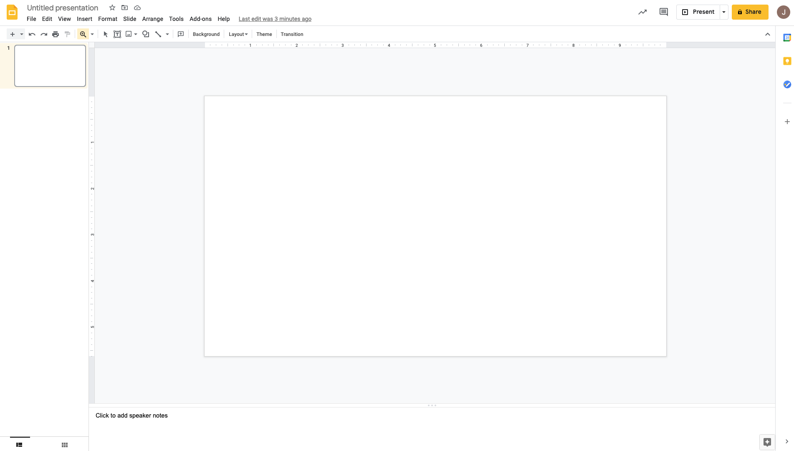
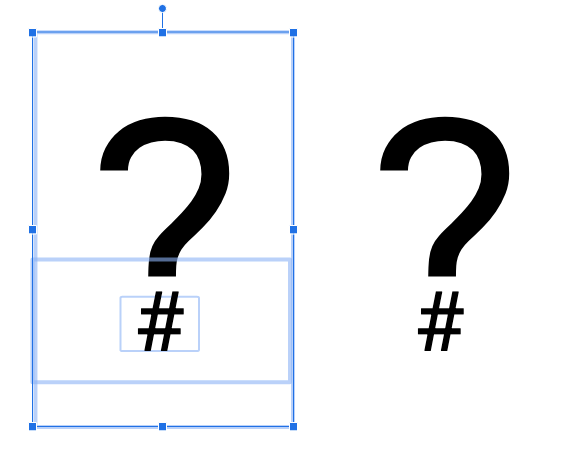

Having a brand can help give your open source project some legitimacy, and you don't need to be a designer to see these benefits.
However it is important to understand that you do not need to add branding to your project in order for it to be successful, and adding branding can even harm your project.

## Branding should be driven by your goals

Branding is a broad subject and not something that I would consider myself an expert on, but I have worked on open source projects with and without branding and seen some of the effects that it can have. Before we dive into how to add branding to a project let's talk about that it means to add branding and the pros and cons.

### Identity and incorporation

Businesses, companies and organisations use branding to give themselves an identity to help their customers recognise them in the world.

As a human, other humans recognise you by things including your face, your hair, your glasses, your frame and perhaps your clothing style. This is because you have a physical identity that others can see. And they see it every time they interact with you.

Businesses want the same thing, so it is common for them to choose a logo but to also dig deeper and choose colours, fonts, document layouts and [even sounds](https://www.youtube.com/watch?v=-ihRPi4wcBY) which they use consistently across their products, marketing and materials. This is their equivalent of a physical identity.

The word [incorporate](https://www.merriam-webster.com/dictionary/incorporate) has a literal meaning of "to give material form to" or "to cause to become a body or part of a body" and businesses incorporate to form corporations both from a legal standpoint but also a branding one.

As a customer when you interact with large companies who have strong branding you will make certain assumptions:

- They are professional
- They are legitimate
- Other folks will have heard of them
- They will respect your consumer rights
- They will provide you with customer service

By adding branding to your open source project you can transform its appearance into something which more closely resembles a company. This can have benefits including giving your project legitimacy, increase people's trust in the project and help folks recognise it out in the world.

It can also have negative impacts such as giving expectations around customer support that you may not wish to meet. Folks may start to interact with you (a lone open source developer) in the same way they would interact with a customer service rep in a large organisation.

### Goals

Before deciding to brand your project I recommend you consider what you are trying to achieve.

Goals where branding may be useful:

- The project is a side hustle that you may try to monetize or build a company around one day.
- You are trying to grow your user base by increasing trust and confidence in the project.
- You are trying to encourage large organisations to use the project and want it to appear more legitimate.
- You want your project to stand out compared to alternatives.
- You want the project to appear larger (more maintainers).

Goals where branding may work against you:

- The project is useful in your work and you want to give it away to others. But you want to offer limited or no support.
- You want your users to understand that the developer team is small (maybe just you).
- You may have employment conflicts where open source is acceptable but having another job is not.

Now that we've gone into depth about *why* you might want to brand you project let's dive into *how*.

## Branding for non-designers

I do not consider myself a designer. I can tell the difference between something that looks good and bad, but do not have the expertise to create something from scratch. Luckily there are some shortcuts you can take to get something which is "good enough" with reasonably low effort. Then perhaps one day as your project grows you may have the resources to hire a professional designer to give everything a makeover.

To get started with a brand we need to consider where people see our project. Right now that will be on GitHub and in the documentation site we built with Sphinx. We may also consider creating some social media channels as the project grows. It is pretty common for projects to have a Twitter account which tweets about new releases and perhaps shares blog posts and content about the project.

The goal of our branding is to make all of these things tie together in a consistent way. In order to do that we will want a logo, but we also might want to customise colours, fonts, layouts, etc.

### Building a style guide

My first recommendation is that we put together a style guide. This will be a place to store information on what our branding is and will be a resource that we can refer back to in the future. If one day you decide to create a project page on some new social media site it will be great to be able to dip into the style guide and copy any logos, pictures, etc.

For some projects that I've worked on I've created [a whole repo](https://github.com/opsdroid/style-guidelines) for storing branding assets. In others we [have documentation pages](https://docs.dask.org/en/latest/logos.html) for it.

For our `is-number` project that we've been building throughout this series let's create a documentation page.

```bash
$ touch docs/branding.rst
```

```rst
Branding Guidelines
===================

The following guidelines are intended to help create a consistent design for ``is-number`` accross:

 * Project pages
 * Websites
 * Social media

Logo
----

TODO

Colours
-------

TODO

Fonts
-----

TODO

```

Don't forget to update your TOC in `docs/index.rst` too!

```rst
.. toctree::
   :maxdepth: 2
   :caption: Developer

   contributing
   maintaining
   branding
```

### Logo

Let's start populating our guidelines by creating a logo. There are millions of articles out there on good logo design, and if you are particularly interested in this topic then I recommend you go and do some research. For the purposes of this article I am going to assume you have little experience or interest in the subject and just want something that looks good and is functional so you can stop thinking about it again.

Remember that just because we are throwing together a quick logo now doesn't mean this can't be changed later. The important thing is consistency, if you do change it later be sure to change it everywhere and to stop using the old logo entirely. So let's dive in and have a go.

I am also going to keep things as simple as possible when it comes to design tools. Personally I have fallen in love with [Figma](https://www.figma.com) lately which is a free online drawing and design tool. But to draw our `is-number` logo let's use [Google Slides](https://www.google.co.uk/slides/about/), which I expect most readers will have used before. You could also use Microsoft Powerpoint or any other tool you are familiar with. As long as it can draw simple shapes and text then you're all good.



Before we start drawing we want to consider where our logo will be used. On most social media it will be cropped into a small circle. On our documentation and GitHub pages we may want it to be larger and take the place of the page title. Therefore it's common for most logos to be made up of a word and a symbol. These can be related like the `N` logo used by Netflix alongside their full `Netflix` logo.


Or this can be an image or icon alongside the company name which can also be used independently. Like the Dropbox logo.


For `is-number` let's start by just writing the name of the project in a font we like. We will get onto fonts later but I've chosen `Roboto Mono` here because it is both available in Google Slides and also for use in other places via [Google Fonts](https://fonts.google.com/specimen/Roboto+Mono).


I think for this design I am going to include a logo that is separate from the name of the project, but to keep things simple I'm still going to make it out of text. Thinking about what our project is and what it does will help choose something appropriate. Our project tells you if something is a number or not, it answers a question, so a question mark is probably a good symbol to use. And the thing you are asking about is numbers, so a hashtag (also known as an octothorpe) is a common symbol for representing numbers.

I could go with something simple like the two symbols together.


I could also experiment with making the question mark bigger and placing a white box over the dot. Then taking a small octothorpe and placing that over the top to make a hybrid of the two.



Either of these options should work well in isolation and also as part of the full name.


I think my preference here is the custom question mark with the octothorpe instead of the dot, so let's go with that.

The next thing to think about is colours.

### Colour palettes

Professional designers often come up with a palette of colours to use which all complement each other. This is to ensure consistency and to give us something to dip into when designing websites, slides, etc. We recently hired a designer in the Dask Community to [create a colour palette for us](https://github.com/dask/community/issues/135) and to create some example diagrams.

Colour palettes tend to have primary and secondary colours. Primary are used for logos and titles, secondary are used for diagrams, maybe links on a web page, that kind of thing.

To get us started on our small open source project we can use a resource like [coolors.co](https://coolors.co) to generate a palette for us. You can keep hitting the space bar and generating colours until you find some you are happy with. For now I've just kept going until I have a palette with a couple of variations on two different colours. I want multiple because I don't want everything to just be a single colour.


It can also be helpful to use a contrast checker like [this one from WebAIM](https://webaim.org/resources/contrastchecker/) if you intend to use the colours for text. The tool will show you whether it will be readable by most people at different sizes on different backgrounds.


The palette I've generated has a couple of reds that I can use for primary and a few blues for secondary.

Let's update our style guide with these colours for reference later.

```rst
Colours
-------

- Primary

  - Crimson (``#D62839``)
  - Bright Maroon (``#BA324F``)

- Secondary

  - Blye Sapphire (``#175676``)
  - Maximum Blue (``#4BA3C3``)
  - Colombia Blue (``#CCE6F4``)
  - Black (``#242424``)
```

I've also included an off black instead of full black in the list because this can be more readable on a white background for many people.

Now that we have some colours let's apply them to our logo.


This is definitely not the best logo in the world, but that's ok. It was easy to make, it is recognisable and it is something I can use when working on `is-number`.

The last thing we need to do is export our logo. Google Sheets has the ability to export slides as scalable vector graphics (SVGs). This is a great format because it can be scaled up or down with no loss in image quality. It exports the whole slide though so you'll need to move your logo up into the top left hand corner beforte you export it.


Then once you've downloaded it open it up in your favorite text editor (something like [VSCode](https://code.visualstudio.com/) has a preview for SVGs which is helpful). The very first line will include a `viewBox` property which we need to edit.

```svg
<svg version="1.1" viewBox="0.0 0.0 960.0 540.0"
```

This describes the size of the canvas that the SVG is drawn on, which is the size of the slide from Google Sheets. Reduce these numbers until your logo is centered in the frame.


Repeat the process for just the logo on its own too for use in social media profile pictures.


Then copy these files into somewhere in your docs directory.

```
is_number
└────── docs
         └── images
             ├──── logo.svg
             └──── logo-wide.svg
```

It would probably also be useful to create PNG copies of your logos using [svgtopng.com](https://svgtopng.com/) as not all platforms support SVG.

```
is_number
└────── docs
         └── images
             ├──── logo.png
             ├──── logo.svg
             └──── logo-wide.png
             └──── logo-wide.svg
```

Then you can add these links to your branding page.

```rst
Logo
----

Wide

.. image:: images/logo-wide.png
  :alt: Wide logo

Icon

.. image:: images/logo.png
  :alt: Icon logo
```

### Fonts

Less is more when it comes to fonts. For open source projects I am a big fan of Google Fonts as they are free to use. However I usually limit myself to three fonts, one for titles, one for body text and one for code.

We already made use of `Roboto Mono` in our logo so we might want to stick with that as our title text. Although it is worth noting that this is a monospaced font which is great for code but not always for other text so we may want to use the plain `Roboto` variation instead.

The body font is the default font which you will use everywhere. Fonts like `Open Sans` and `Roboto` are popular for this, but equally you can leave it to the system default too.

It is important to choose a monospaced font for code which means each letter is the same width as all the others. This makes code much more readable as all the columns line up and you can make use of ASCII art.

A good way to experiment with fonts is to just play around in Google Slides. Write out some sample text with a couple of titles and a chunk of code and experiment with changing the fonts of those three types of element to find a set that compliments each other.

For `is-number` I've gone with `Roboto` for both the title and body font and `Inconsolata` for the code.


So once we've decided on our fonts we can update our guidelines.

```rst
Fonts
-----

- Titles: Roboto
- Body: Roboto
- Code: Inconsolata
```

## Applying our guidelines

Now that we have decided on some branding we can go about applying this everywhere we can.

In our `README.rst` file we may want to include our logo so that it shows on our GitHub page.

```rst
.. image:: docs/images/logo-wide.png
  :alt: is-number logo
```

We can also add some custom options to our sphinx theme in the `conf.py` file to use our new logos.

```python
html_static_path = ["_static", "images"]

html_theme_options = {
    "logo": "logo-wide.png",
    "font_family": "'Roboto', sans-serif",
    "code_font_family": "'Inconsolata', monospace",
}
```


## Summary

You can take this branding as far as you like by applying logos, fonts and colours throughout your project. Having your branding guidelines easily accessible in your documentation should speed things up next time you need to make decisions about how something should look.

As your project grows over time you may get some financing from somewhere and a good use is probably to get a designer to come in and take it all to the next level.

In this post we have covered:

- Deciding whether or not to brand your project
- Designing a simple logo
- Choosing colours
- Choosing fonts
- Applying some simple branding

In future posts we will cover:

- Handling future maintenance
