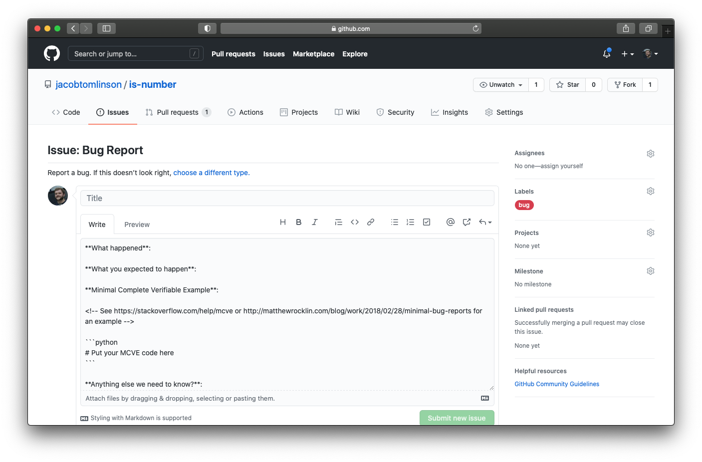

Once you finish the initial development push on your open source project it will likely fall back into maintenance mode. You may be using the project in your work, but you are not actively making code changes unless you find a bug or a missing feature. If your project is solving your problem and no giant bugs are rearing their head this code can go untouched for long periods of time. It is no longer your main focus.

However as other folks start using it and possibly pushing the code beyond the way you use it they will start running into bugs or desire other features. They may just want more aspects of it to be configurable. How you choose to respond to bug fixes and feature requests is one of the central differences between _maintaining an open source project_ and _coding in public_.

## Coding in public

Coding in public is like growing apples on a tree in your garden and then placing some of them in a box on the curb with a sign saying "free". You made a thing which is probably useful to others and you decide to give it away. But this is a one way relationship. You don't expect folks to knock on your door and tell you they don't like the apples, complain that they were bruised, or request a different variety. You are giving away your excess apples, take them or leave them.

I want to be clear that this is a great thing to do. Coding in public and adding a permissive license which allows folks to use and create derivations of your work helps people. Not every project on GitHub has to grow a huge contributor and user community. Maybe you wrote a small utility package or set of examples for your particular domain and someone else finds those and applies them to their own work.

That's very neighborly of you.

My only advice here is to be explicit in your README that you are not able to provide support. Perhaps even disable issues in the GitHub settings.

## Maintaining an open source project

Actively maintaining an open source project goes beyond coding in public. There is an exchange of value between the maintainer, contributors and users of the project. You need to provide support, fix bugs, review pull requests and add features that you will not use yourself. In exchange others will also support the user community, contribute bug fixes and build out new features. With contributors your project becomes useful to more people (including you), and as it becomes more useful you will gain more contributors. It is a virtuous circle but it requires you to be there to steer the ship and keep that momentum.

Maintenance duties generally boil down to the following tasks:

- Answering _"how do I do X?"_ or _"I can't get it to do Y"_ type questions
- Fix bugs reported by users
- Build features requested by users
- Engage in design discussions about new features and ultimately make final decisions
- Review bug fixes and features contributed by others
- Fix broken builds, CI and documentation
- Doing releases

That sounds like just about everything right! To quote [this excellent blog post](https://matthewrocklin.com/blog/2019/05/18/maintainer) on the _Role of an Open Source Maintainer_ by _Matthew Rocklin_:

> All responsibility eventually falls back onto the maintainer.

Not only are you ultimately responsible for everything but you are also the only person who feels true ownership over the project. That ownership means you think about the project differently to the contributors and will take on the tasks that nobody else wants to do.

Now that we know what is involved in maintaining a project let's discuss some ways we can reduce your time doing it. This mostly comes down to automation and documentation.

## Responding to issues

The first place you generally interact with your community is via issues. In an earlier post in this series we discussed [issue templates](https://jacobtomlinson.dev/posts/2021/building-a-user-community-for-your-open-source-project/). Issue templates are helpful not just for your users, they help to ensure you have all the information you need when you come to respond.

Don't hesitate to push back on users and ask for any missing information. The biggest thing that is going to be helpful to you is having a small reproducible example which you can use to dive into investigating the problem. If the user hasn't provided one then ask, link them to [advice on writing good issues](https://matthewrocklin.com/blog/work/2018/02/28/minimal-bug-reports) and move on.

It will benefit you to keep a warm and friendly tone when engaging with the community, but don't be afraid of being assertive at the same time. Many users raising issues will be new to open-source and will be used to interacting with proprietary software and services where there is a level of [expectation and entitlement](https://jacobtomlinson.dev/posts/2022/dont-be-that-open-source-user-dont-be-me/) which does not exist in your project.

If there are other members of your community who are knowledgeable in certain areas then don't hesitate to ping them on the issue too. You are likely the only person who is actively watching the issue tracker and most folks don't mind being pulled into a conversation from time to time.

Sadly you do need to have a thick skin sometimes, users like this one appear from time to time. Try not to take things personally and remind folks that you are a volunteer.

## Reviewing Pull Requests

## Auto merge

## Automating release notes
