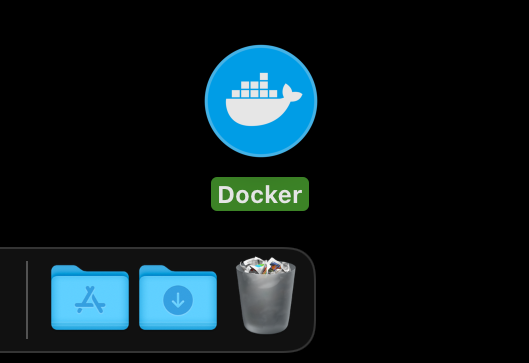
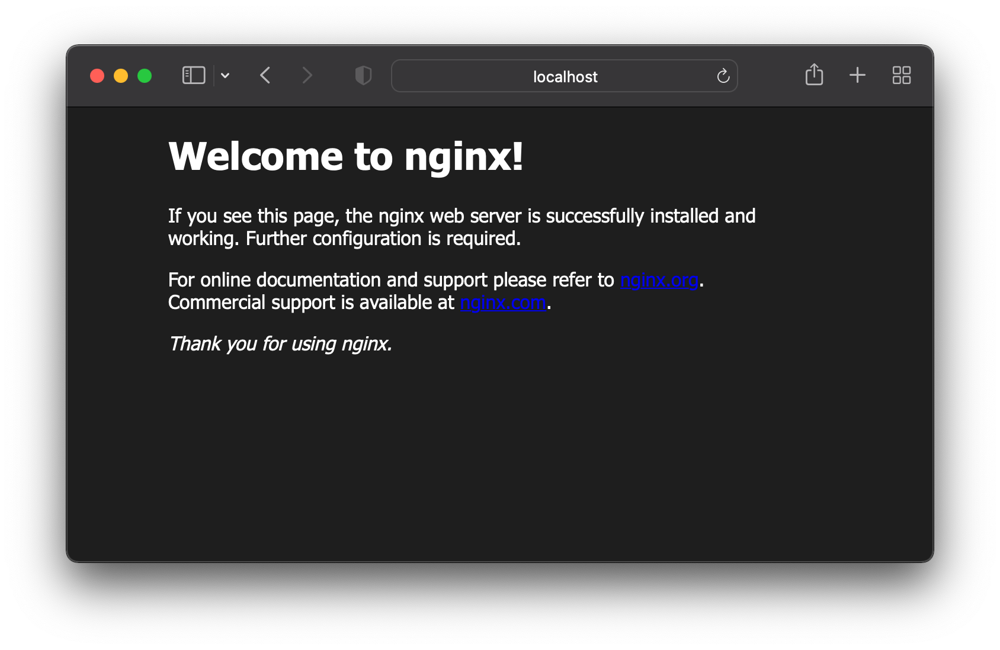

Today is the deadline for the [license changes to Docker Desktop for Mac and Windows](https://www.docker.com/blog/updating-product-subscriptions/). This means that if you are employed at a company with more than 250 employees or your company makes more than $10m you need to start paying a subscription to continue using Docker Desktop.

I don't need all the bells and whistles that come with a Docker subscription, I just need to be able to run Docker containers on my Mac. Docker Desktop brings a full GUI and Kubernetes support that I just don't use. I prefer the command line and I use [kind](https://kind.sigs.k8s.io/docs/user/quick-start/) for [Kubernetes](https://kubernetes.io/).

So today I'm uninstalling Docker Desktop and switching to [Colima](https://github.com/abiosoft/colima).

_If you're interested in why I chose Colima check out [my full post on exploring alternatives](https://jacobtomlinson.dev/posts/2022/docker-desktop-for-mac-alternatives-for-developers/)._

## What is Colima?

[Colima](https://github.com/abiosoft/colima) is Docker for Mac tool built on [Lima](https://github.com/lima-vm/lima). Lima is a virtual machine tool for MacOS with automatic file sharing and port forwarding. Using Lima feels a lot like using WSL on Windows.

> Lima launches Linux virtual machines with automatic file sharing and port forwarding (similar to WSL2), and containerd.
>
> Lima can be considered as a some sort of unofficial "containerd for Mac".

Colima builds on that foundation to run a VM with Docker installed and it also configures your local [Docker context](https://docs.docker.com/engine/context/working-with-contexts/) for you.

## Removing Docker Desktop

First things first I'm going to quit Docker Desktop and drag it to the trash.



Next we also need to remove the VM image that Docker Desktop created, this can be pretty large so we don't want to miss deleting it.

```console
$ du -sh ~/Library/Containers/com.docker.docker/
 52G    /Users/jtomlinson/Library/Containers/com.docker.docker/

$ rm -rf ~/Library/Containers/com.docker.docker/
```

We should also remove `~/.docker/config.json` so that we start with a fresh configuration that doesn't depend on binaries in the Docker Desktop app.

```console
$ rm ~/.docker/config.json

```

## Installing tools

Docker Desktop provided us with useful command line tools such as `docker` and kept them up to date for us. So we need to grab those from another source. Let's install everything from [Homebrew](https://brew.sh/).

```console
brew install docker docker-compose kubectl kubectx
```

This gives us the command line tools, but not a running Docker service. We can see that by running `docker ps`.

```console
$ docker ps
Cannot connect to the Docker daemon at unix:///var/run/docker.sock. Is the docker daemon running?
```

## Installing Colima

Next to start our Docker service we need to install and start Colima.

```console
$ brew install docker colima

$ colima start
INFO[0000] starting colima
INFO[0000] creating and starting ...                     context=vm
INFO[0030] provisioning ...                              context=docker
INFO[0031] restarting VM to complete setup ...           context=docker
INFO[0031] stopping ...                                  context=vm
INFO[0037] starting ...                                  context=vm
INFO[0058] starting ...                                  context=docker
INFO[0063] waiting for startup to complete ...           context=docker
INFO[0063] done
```

That's it! Colima is now running Docker in a Lima VM and it created a new `docker context` and switched to it so we can use the `docker` CLI straight away.

Let's run an nginx container to check everything works as expected.

```console
docker run --rm -p 8080:80 nginx
```

I can head to my browser and check that it works.



Hooray! That worked, our container started and our ports even mapped correctly.

## Kubernetes

Docker Desktop also optionally provides Kubernetes so let's start that too. [Minikube](https://minikube.sigs.k8s.io/docs/) and [kind](https://kind.sigs.k8s.io/docs/user/quick-start/) are popular choices for running Kubernetes locally for development and both just require Docker so should work fine with Colima.

My preference is `kind`, but sadly the current version (`v0.11.1`) contains a bug that prevents it from working with `colima`. This has been fixed upstream but is yet to be released, so first we need to install the latest development version of `kind`.

```console
brew unlink kind  # Unlink it if we already have it installed

brew install kind --HEAD
```

Now we can create our `kind` cluster.

```console
$ kind create cluster --name test
Creating cluster "test" ...
 ✓ Ensuring node image (kindest/node:v1.23.1) 🖼
 ✓ Preparing nodes 📦
 ✓ Writing configuration 📜
 ✓ Starting control-plane 🕹️
 ✓ Installing CNI 🔌
 ✓ Installing StorageClass 💾
Set kubectl context to "kind-test"
You can now use your cluster with:

kubectl cluster-info --context kind-test

Thanks for using kind! 😊
```

Hooray now we have a `kind` cluster running in a Docker container inside Colima. Let's use `kubectl` to check everything is up and running.

```console
$ kubectl get all --context kind-test -A
NAMESPACE            NAME                                             READY   STATUS    RESTARTS   AGE
kube-system          pod/coredns-64897985d-ksnlj                      1/1     Running   0          15s
kube-system          pod/coredns-64897985d-np59l                      1/1     Running   0          15s
kube-system          pod/etcd-test-control-plane                      1/1     Running   0          27s
kube-system          pod/kindnet-2zfr5                                1/1     Running   0          15s
kube-system          pod/kube-apiserver-test-control-plane            1/1     Running   0          27s
kube-system          pod/kube-controller-manager-test-control-plane   1/1     Running   0          27s
kube-system          pod/kube-proxy-gjqss                             1/1     Running   0          15s
kube-system          pod/kube-scheduler-test-control-plane            1/1     Running   0          27s
local-path-storage   pod/local-path-provisioner-5bb5788f44-d8ww5      1/1     Running   0          15s

NAMESPACE     NAME                 TYPE        CLUSTER-IP   EXTERNAL-IP   PORT(S)                  AGE
default       service/kubernetes   ClusterIP   10.96.0.1    <none>        443/TCP                  30s
kube-system   service/kube-dns     ClusterIP   10.96.0.10   <none>        53/UDP,53/TCP,9153/TCP   28s

NAMESPACE     NAME                        DESIRED   CURRENT   READY   UP-TO-DATE   AVAILABLE   NODE SELECTOR            AGE
kube-system   daemonset.apps/kindnet      1         1         1       1            1           <none>                   21s
kube-system   daemonset.apps/kube-proxy   1         1         1       1            1           kubernetes.io/os=linux   27s

NAMESPACE            NAME                                     READY   UP-TO-DATE   AVAILABLE   AGE
kube-system          deployment.apps/coredns                  2/2     2            2           28s
local-path-storage   deployment.apps/local-path-provisioner   1/1     1            1           19s

NAMESPACE            NAME                                                DESIRED   CURRENT   READY   AGE
kube-system          replicaset.apps/coredns-64897985d                   2         2         2       16s
local-path-storage   replicaset.apps/local-path-provisioner-5bb5788f44   1         1         1       16s
```

## Managing Colima's resource usage

Docker Desktop also provides a handy way to configure how much CPU, memory and storage Docker can use on your Mac. We can do this with Colima too via the `colima` command line.

It seems that [by default the VM has 2 CPU cores, 2GiB of memory and 60Gib of storage](https://github.com/abiosoft/colima#customizing-the-vm). We can modify the CPU and memory by stopping and starting Colima.

```console
$ colima stop
INFO[0000] stopping colima
INFO[0000] stopping ...                                  context=docker
INFO[0001] stopping ...                                  context=vm
INFO[0005] done

$ colima start --cpu 4 --memory 8
INFO[0000] stopping colima
INFO[0000] stopping ...                                  context=docker
INFO[0001] stopping ...                                  context=vm
INFO[0006] done
INFO[0000] using docker runtime
INFO[0000] starting colima
INFO[0000] starting ...                                  context=vm
INFO[0020] provisioning ...                              context=docker
INFO[0021] starting ...                                  context=docker
INFO[0026] waiting for startup to complete ...           context=docker
INFO[0026] done
```

However if we want to modify the storage allocation we need to delete the VM and recreate it, which is straight forward but means we will lose our container and images including our `kind` container.

```console
$ colima stop
INFO[0000] stopping colima
INFO[0000] stopping ...                                  context=docker
INFO[0001] stopping ...                                  context=vm
INFO[0005] done

$ colima delete
are you sure you want to delete colima and all settings? [y/N] y
INFO[0001] deleting colima
INFO[0001] deleting ...                                  context=vm
INFO[0001] done

$ colima start --cpu 4 --memory 8 --disk 100
INFO[0000] starting colima
INFO[0000] creating and starting ...                     context=vm
INFO[0030] provisioning ...                              context=docker
INFO[0031] restarting VM to complete setup ...           context=docker
INFO[0031] stopping ...                                  context=vm
INFO[0037] starting ...                                  context=vm
INFO[0057] starting ...                                  context=docker
INFO[0063] waiting for startup to complete ...           context=docker
INFO[0063] done
```

## Wrap up

That's it, Docker Desktop for Mac is gone and we now have a quick and simple replacement thanks to Colima.

It is worth noting that Colima doesn't auto start when we turn on our machine by default so we need run `brew services start colima` to enable autostart, or remember to run `colima start` after each reboot.

If you ever want to switch back you can also just reinstall Docker Desktop and switch your Docker context back.

```console
docker context use default
```

You can even run them side by side if you want to while you are evaluating.
