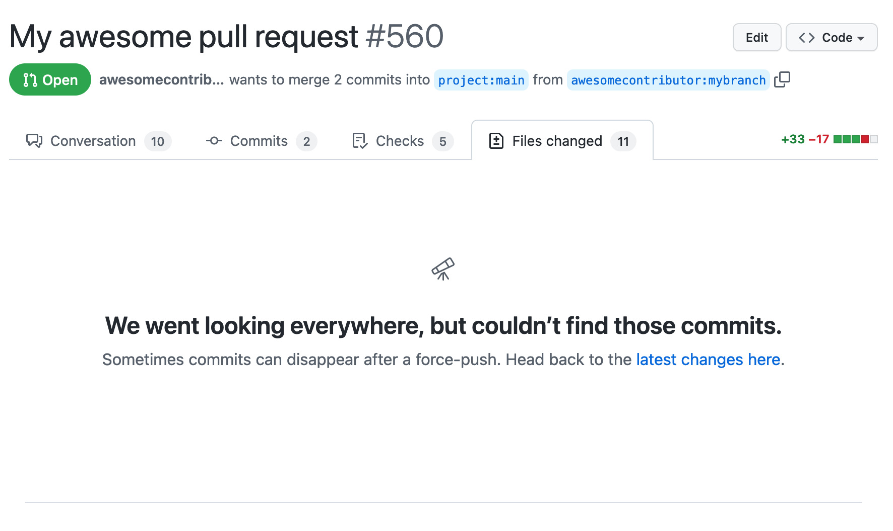
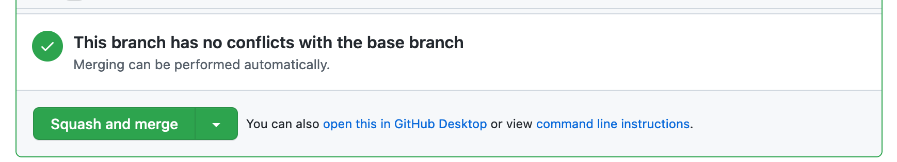
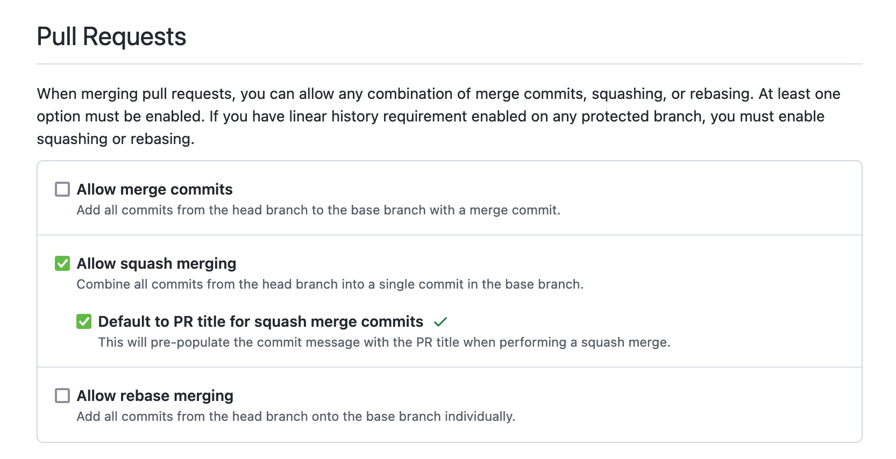

A big frustration for me when reviewing Pull Requests on GitHub is coming back to a PR you've already reviewed to check on recent changes and be greeted with "We went looking everywhere, but couldn’t find those commits".

## Why does this happen?

When you make additional changes to a PR the reviewer gets notified and when they head to the page it tries to show them the changes since they last looked. This is extremely useful when you are reviewing many PRs a day and changes may be happening days or weeks since you last looked.

However if you squash/rebase a PR and force push to the branch then GitHub doesn't know how to show the delta changes because the commit history doesn't match up with last time, so you get the unhelpful error.

Many folks squash/rebase and force push PRs out of a code hygiene habit. It's nice to have the commit history on the `main` branch consist of one descriptive commit per PR rather than many small commits based on review feedback. But this is an anti-pattern for the reviewer.

## How does this make the review harder?

When greeted with this page the reviewer has to check what they last wrote, check whether there were any comments since then and then look at the full diff and try and figure out what has changed since the last time they saw it. Often I find this impossible to do unless I've seen the PR very recently, so I generally have to start my mental review process from the beginning and review everything in the PR as if it's the first time I've seen it.

## How can we avoid this?

In nearly every project I work on we set the "Squash and merge" button to be the default merge scheme for PRs.

In some projects we have even explicitly disabled the other options such as merge commits and rebasing.

This means that any time a PR is merged in we get the nice clean history on `main` with one commit per PR. This allows PRs to be messy and evolve over time, they can have many of commits and change direction multiple times without worrying about polluting the history. Once merged the commit message will include the PR number, so if anyone wants to dive back into the history of how that change evolved they can.

This benefits contributors by removing the need for them to keep their PRs clean and tidy. As long as the PR title is descriptive and up to date everything will merge in nicely. It also means you can regularly pull from `main` to keep your PR up to date without worrying about all the merge commits that get created. I personally find this much easier than rebasing all the time.

Then also benefits reviewers by easily being able to see delta changes and how they relate to the feedback they gave previously without having to review the entire change every time they look at it.
