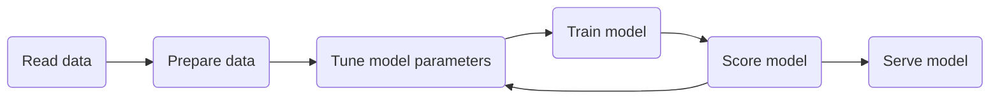
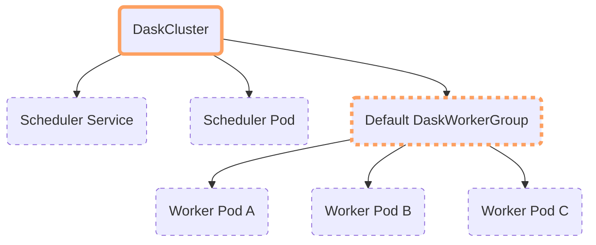

[Kubeflow](https://www.kubeflow.org/) is a popular Machine Learning and [MLOps](https://en.wikipedia.org/wiki/MLOps) platform built on [Kubernetes](https://kubernetes.io/) for designing and running Machine Learning pipelines for training models and providing inference services. It has a notebook service that lets you launch interactive [Jupyter](https://jupyter.org/) servers (and more) on your Kubernetes cluster as well as a [pipeline service](https://www.kubeflow.org/docs/components/pipelines/introduction/) with a DSL library written in Python for designing and building repeatable workflows. It also has tools for hyperparameter tuning and running model inference servers, everything you need to build a robust ML service.

## Machine learning workflows on KubeFlow

Machine learning workflows on KubeFlow commonly look like this.



### Reading and preparing data

The reading and cleaning of data generally happens interactively in Jupyter notebooks using Python libraries including [Pandas](https://pandas.pydata.org/) and [NumPy](https://numpy.org/). Notebook instances on KubeFlow are typically resource constrained compared to other parts of the workflow.

### Tuning and hyperparameter optimization

Kubeflow provides [Katib](https://www.kubeflow.org/docs/components/katib/overview/) for automating your machine learning by doing [hyperparameter tuning](https://en.wikipedia.org/wiki/Hyperparameter_optimization) and [neural architecture search](https://en.wikipedia.org/wiki/Neural_architecture_search). Many training jobs known as _trials_ are submitted as KubeFlow piplines allows users to parallelise many _trials_ within their larger _experiment_.

### Model training

When it comes to training models KubeFlow has a set of operators that can be used to do this with [custom resources like the PyTorchJob](https://www.kubeflow.org/docs/components/training/pytorch/) that can train a model on multiple nodes and leverage accelerated hardware like GPUs.

### Inferencing and serving models

Serving is also commonly scaled out and provided as some kind of web based API running many replicas in a deployment. Whether you are using the bundled [KServe](https://kserve.github.io/website/) utility or running an add-on like [NVIDIA Triton™ Inference Server](https://developer.nvidia.com/nvidia-triton-inference-server) inferencing can be performed by a cluster of pods that scale up and down with demand.

## How can Dask help?

With data sizes growing rapidly it is becoming more critical for us to accelerate the [ETL](https://en.wikipedia.org/wiki/Extract,_transform,_load) stages of the pipeline where we are loading and preparing our data. [Dask](https://www.dask.org/) allows users to distributed their Python code and it implements existing Python APIs and data structures to make it easy to switch between [NumPy](https://numpy.org/), [Pandas](https://pandas.pydata.org/), [scikit-learn](https://scikit-learn.org/stable/) to their Dask-powered equivalents. For folks who are using Pandas and NumPy in their ETL stages Dask provides a great way to accelerate that work by distributing it to many machines and it allows you to work with larger than memory datasets using chunking.

## How do we start using Dask on KubeFlow?

If you are using the default `jupyter-scipy` notebook image that KubeFlow provides you already have Dask. In custom environments you can [install it via pip or conda](https://docs.dask.org/en/stable/install.html).

Dask's schedulers scale to thousand-node clusters but also work just fine on personal machines. Many people use Dask today to scale computations on their laptop, leveraging multiple cores for computation.

When you are ready to explore scaling beyond your laptop or the Jupyter pod that KubeFlow provides we can use the Dask Operator for Kubernetes to create clusters just like we would create any other resource.

## Getting started

Let's walk through things from start to finish so first we need a vanilla KubeFlow cluster.

```info
If you already have a KubeFlow cluster or a preferred workflow for creating one then feel free to skip on to the [Installing the Dask Operator](#installing-the-dask-operator) section.
```

When I'm developing for Kubernetes or exploring new tools I like to use [Kind](https://kind.sigs.k8s.io/docs/user/quick-start/) to create throw-away clusters. It just requires you to have [Docker](https://www.docker.com/) installed on your machine runs a full Kubernetes cluster inside a single container. This is great especially when you want to start fresh as you can just nuke that container and create a new one.

At the time of writing KubeFlow doesn’t support Kubernetes `>1.21` so we need to manually set our Kubernetes version.

```yaml
# kind-kubeflow.yaml
kind: Cluster
apiVersion: kind.x-k8s.io/v1alpha4
name: kubeflow
nodes:
  - role: control-plane
    image: kindest/node:v1.21.2
```

```console
$ kind create cluster --config kind-kubeflow.yaml
Creating cluster "kubeflow" ...
 ✓ Ensuring node image (kindest/node:v1.21.2) 🖼
 ✓ Preparing nodes 📦
 ✓ Writing configuration 📜
 ✓ Starting control-plane 🕹️
 ✓ Installing CNI 🔌
 ✓ Installing StorageClass 💾
Set kubectl context to "kind-kubeflow"
You can now use your cluster with:

kubectl cluster-info --context kind-kubeflow

Thanks for using kind! 😊
```

I also like to use the [kubectx](https://github.com/ahmetb/kubectx) command to set the default context to our new cluster.

```console
$ kubectx kind-kubeflow
```

### Installing KubeFlow

Now we need to install KubeFlow. We can do that by cloning the KubeFlow manifests repo and installing them.

```console
$ git clone https://github.com/kubeflow/manifests.git

$ cd manifests

$ while ! kustomize build example | kubectl apply -f -; do echo "Retrying to apply resources"; sleep 10; done
```

This may take a while as there are many components to be created.

Once this finishes we also need to patch the Kubeflow Pipelines service to not use Docker, otherwise our pipelines will get stuck and report Docker socket errors. This happens because despite us running Kubernetes inside Docker the Docker socket isn’t made available inside the kind cluster. So from Kubeflow’s perspective we are using [containerd](https://containerd.io/) directly instead of Docker.

```console
$ kustomize build apps/pipeline/upstream/env/platform-agnostic-multi-user-pns | kubectl apply -f -
```

Now we wait for Kubeflow to bootstrap itself on our cluster. This can take upwards of 15 minutes so go ahead and make yourself a coffee ☕️.

Once our pods are in a `Running` state we should be able to port forward the KubeFlow web UI and access it in our browser.

```console
$ kubectl port-forward svc/istio-ingressgateway -n istio-system 8080:80
Forwarding from 127.0.0.1:8080 -> 8080
Forwarding from [::1]:8080 -> 8080
```

Navigate to `127.0.0.1:8080` and login with the default credentials `user@example.com` and `12341234`.


### Installing the Dask Operator

To be able to create our Dask clusters we need to [install some custom resource definitions](https://kubernetes.dask.org/en/latest/operator_installation.html).

```console
$ kubectl apply -f https://raw.githubusercontent.com/dask/dask-kubernetes/main/dask_kubernetes/operator/deployment/manifests/daskcluster.yaml
$ kubectl apply -f https://raw.githubusercontent.com/dask/dask-kubernetes/main/dask_kubernetes/operator/deployment/manifests/daskworkergroup.yaml
$ kubectl apply -f https://raw.githubusercontent.com/dask/dask-kubernetes/main/dask_kubernetes/operator/deployment/manifests/daskjob.yaml
```

Then we need the operator application that will watch the Kubernetes API for events related to those custom resources and act accordingly by creating Dask `Pods` and `Services` on our behalf.

```console
$ kubectl apply -f https://raw.githubusercontent.com/dask/dask-kubernetes/main/dask_kubernetes/operator/deployment/manifests/operator.yaml
```

We can check things installed correctly by listing our `daskclusters` and checking the operator pod is running.

```console
$ kubectl get daskclusters
No resources found in default namespace.

$ kubectl get pods -A -l application=dask-kubernetes-operator
NAMESPACE       NAME                                        READY   STATUS    RESTARTS   AGE
dask-operator   dask-kubernetes-operator-775b8bbbd5-zdrf7   1/1     Running   0          74s
```

Typically users in KubeFlow have the ability to create resources within their own namespace, this is allowed via `ClusterRole` policy called `kubeflow-kubernetes-edit`. But this role knows nothing about our Dask custom resources so we also need to patch that to give folks the ability to create Dask resources themselves.

```console
$ kubectl patch clusterrole kubeflow-kubernetes-edit --patch '{"rules": [{"apiGroups": ["kubernetes.dask.org"],"resources": ["*"],"verbs": ["*"]}]}'
```

That's it, the users of our KubeFlow cluster should now be able to leverage Dask Clusters in their workflows.

## Creating Dask Clusters from within Notebooks

Let's head into the KubeFlow Notebooks tab on the left of the UI and launch ourselves a Jupyter Notebook server. We can leave everything as default here and just give it a name.


Then once our notebook is running we can hit "Connect" to open Jupyter Lab in a new tab.


To create our Dask cluster we have two choices, we can either create a [`DaskCluster` custom resource](https://kubernetes.dask.org/en/latest/operator_resources.html#daskcluster) configuration in YAML and apply it with `kubectl` or we can use the Python API that is provided by the `dask_kubernetes` package.

### Using the `dask_kubernetes` Python API

Let's start with the Python API. While our environment likely already has Dask installed we will also need to install the `dask-kubernetes` package either via `pip` or `conda`.

```
$ pip install dask-kubernetes
```


Then we can import the `KubeCluster` class to create our cluster.

```info
To leverage the operator we need the new `experimental` version of `KubeCluster`, but this will eventually replace the classic implementation after a lengthy deprecation cycle.
```

```python
from dask_kubernetes.experimental import KubeCluster

cluster = KubeCluster(name="demo")
```

By instantiating this class with the default configuration it will create a `DaskCluster` resource for us automatically, and in turn the operator will create `Pod` resources for the Dask scheduler and three workers.


We can scale this cluster up and down either using the scaling tab in the Jupyter widget or by calling `.scale()` on our cluster.

```python
cluster.scale(5)
```

Note that the widget updates automatically to reflect the new cluster configuration.


We can also use `kubectl` to see what has been created for us.

```console
$ kubectl get daskclusters
NAME           AGE
demo-cluster   6m3s

$ kubectl get all -l dask.org/cluster-name=demo-cluster
NAME                                                      READY   STATUS    RESTARTS   AGE
pod/demo-cluster-default-worker-group-worker-7f49ee55ce   1/1     Running   0          3m15s
pod/demo-cluster-default-worker-group-worker-a331f6e6f4   1/1     Running   0          6m52s
pod/demo-cluster-default-worker-group-worker-b6192934c1   1/1     Running   0          3m15s
pod/demo-cluster-default-worker-group-worker-e167accf9e   1/1     Running   0          6m52s
pod/demo-cluster-default-worker-group-worker-e98b8a9c6f   1/1     Running   0          6m52s
pod/demo-cluster-scheduler                                1/1     Running   0          6m53s

NAME                           TYPE        CLUSTER-IP    EXTERNAL-IP   PORT(S)             AGE
service/demo-cluster-service   ClusterIP   10.96.91.48   <none>        8786/TCP,8787/TCP   6m53s
```

Now that we have a Dask cluster we can connect a client and do some work.

```python
from dask.distributed import Client

client = Client(cluster)
```

One of the excellent features of Dask is [its Dashboard](https://docs.dask.org/en/stable/diagnostics-distributed.html) that allows you to see what it is doing. As we are using the vanilla `jupyter-scipy` notebook image we don't have any of the nice-to-have features like the [Dask Jupyter Lab Extension](https://github.com/dask/dask-labextension) so for now let's just port forward the dashboard port from the scheduler service locally.

```console
$ kubectl port-forward -n kubeflow-user-example-com service/demo-cluster-service 8787
Forwarding from 127.0.0.1:8787 -> 8787
Forwarding from [::1]:8787 -> 8787
```

Now if we run some Dask code in our notebook and watch the dashboard we will see it processing our tasks.

```python
import dask.array as da

arr = da.random.random((10_000, 1_000, 1_000), chunks=(1000, 1000, 100))
result = arr.mean().compute()
```


The example array we create here is ~75GB in size with chunks of ~750MB. When we started our Notebook server earlier we left the default memory option of 0.5GB so if we were working with NumPy we wouldn't be able to fit even one chunk in memory, let alone the whole array. But with Dask we can leverage the cluster which gives us access to more memory and runs these tasks in parallel.


When we are all finished with our cluster we can shut it down to stop using up Kubernetes resources.

```python
cluster.close()
```

```info
When we instantiated the `KubeCluster` object it also registered a finalizer that will do this automatically when our Python session ends. This can be disabled by passing the keyword argument `KubeCluster(..., shutdown_on_close=False)`.
```

### Creating Dask clusters with `kubectl`

While the `KubeCluster` class provides a nice simple Python API everything under the hood is done with Kubernetes manifests for creating our custom resources. If you prefer you can create those resources directly.

A `DaskCluster` resources is made up of a scheduler `Pod`, scheduler `Service` and a `DaskWorkerGroup` which in turn is made up of worker `Pod` resources. Each of these resources is directly configurable.



```yaml
# cluster.yaml
apiVersion: kubernetes.dask.org/v1
kind: DaskCluster
metadata:
  name: simple-cluster
spec:
  worker:
    replicas: 3
    spec:
      containers:
      - name: worker
        image: "ghcr.io/dask/dask:latest"
        imagePullPolicy: "IfNotPresent"
        args:
          - dask-worker
          - --name
          - $(DASK_WORKER_NAME)
  scheduler:
    spec:
      containers:
      - name: scheduler
        image: "ghcr.io/dask/dask:latest"
        imagePullPolicy: "IfNotPresent"
        args:
          - dask-scheduler
        ports:
          - name: tcp-comm
            containerPort: 8786
            protocol: TCP
          - name: http-dashboard
            containerPort: 8787
            protocol: TCP
        readinessProbe:
          httpGet:
            port: http-dashboard
            path: /health
          initialDelaySeconds: 5
          periodSeconds: 10
        livenessProbe:
          httpGet:
            port: http-dashboard
            path: /health
          initialDelaySeconds: 15
          periodSeconds: 20
    service:
      type: NodePort
      selector:
        dask.org/cluster-name: simple-cluster
        dask.org/component: scheduler
      ports:
      - name: tcp-comm
        protocol: TCP
        port: 8786
        targetPort: "tcp-comm"
      - name: http-dashboard
        protocol: TCP
        port: 8787
        targetPort: "http-dashboard"
```

You can create the above example with `kubectl apply -f cluster.yaml` and delete it just as easily. This is great for folks who are comfortable with Kubernetes manifests and want native low-level control over their resources.

For more information [see the documentation](https://kubernetes.dask.org/en/latest/operator_resources.html).

## Closing notes

With the Dask Kubernetes Operator you can run and manage Dask clusters in your KubeFlow environment in a native way. You can easily scale your Dask Clusters up and down within your Kubernetes cluster in Python or via `kubectl`.

You can even submit your workflow as a single container that the operator attaches a Dask Cluster to the side of during execution with [the `DaskJob` resource type](https://kubernetes.dask.org/en/latest/operator_resources.html#daskjob).

For more information on using the Dask Kubernetes Operator see [the documentation](https://kubernetes.dask.org/en/latest/operator.html).
