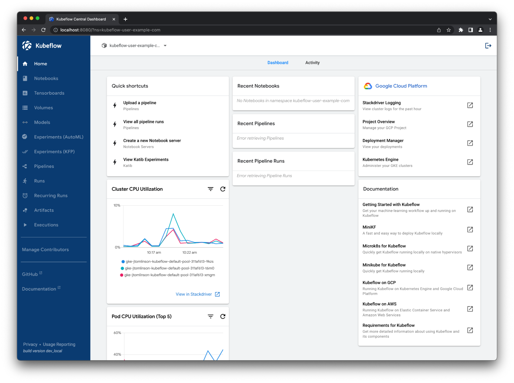
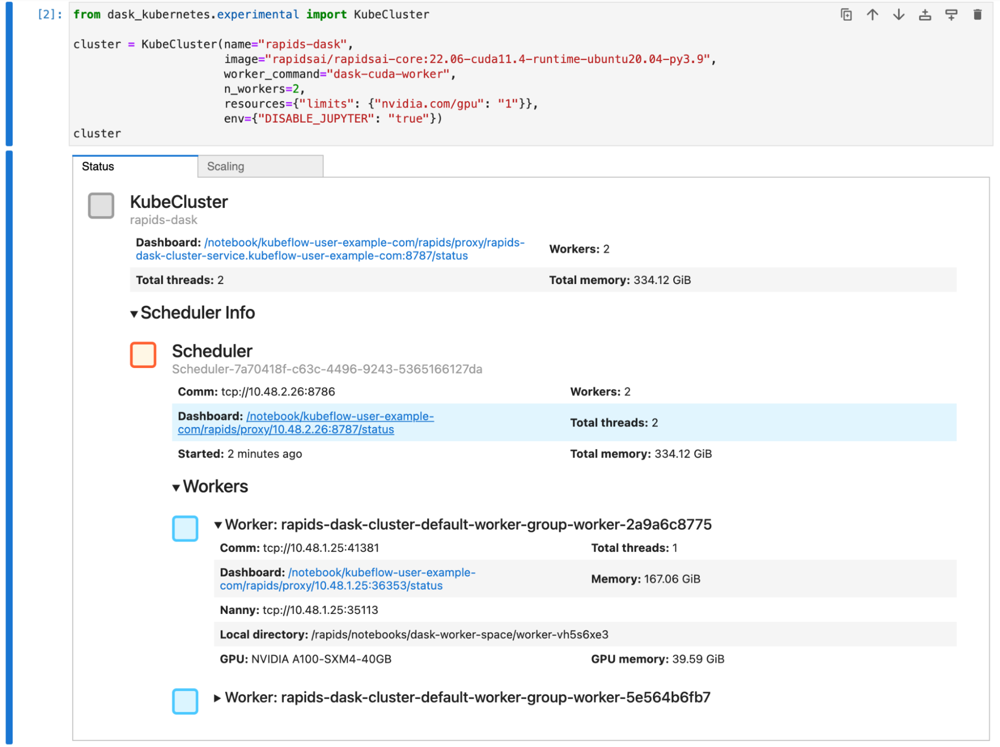
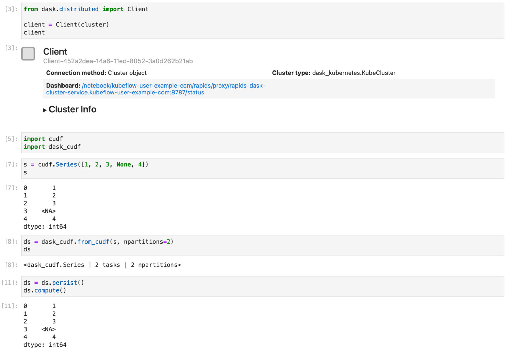
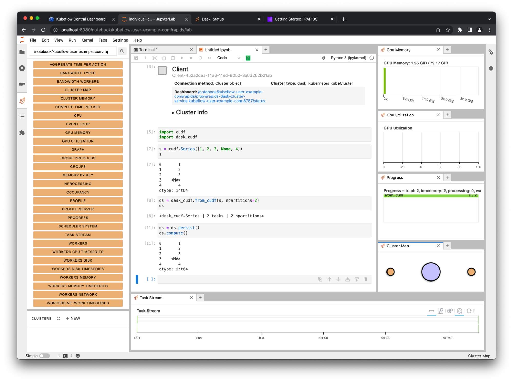

In the [machine learning](https://www.nvidia.com/en-us/deep-learning-ai/solutions/machine-learning/) and MLOps world, GPUs are widely used to speed up model training and inference, but what about the other stages of the workflow like ETL pipelines or hyperparameter optimization?

Within the [RAPIDS](https://rapids.ai/) data science framework, ETL tools are designed to have a familiar look and feel to data scientists working in Python. Do you currently use [Pandas](https://pandas.pydata.org/), [NumPy](https://numpy.org/), [Scikit-learn](https://scikit-learn.org/), or other parts of the [PyData stack](https://numfocus.org/sponsored-projects) within your KubeFlow workflows? If so, you can use RAPIDS to accelerate those parts of your workflow by leveraging the GPUs likely already available in your cluster.

In this post, I demonstrate how to drop RAPIDS into a KubeFlow environment. You start with using RAPIDS in the interactive notebook environment and then scale beyond your single container to use multiple GPUs across multiple nodes with Dask.

Optional: Installing KubeFlow with GPUs
---------------------------------------

This post assumes you are already somewhat familiar with Kubernetes and KubeFlow. To explore how you can use GPUs with RAPIDS on KubeFlow, you need a KubeFlow cluster with GPU nodes. If you already have a cluster or are not interested in KubeFlow installation instructions, feel free to skip ahead.

[KubeFlow](https://www.kubeflow.org/) is a popular machine learning and [MLOps](https://en.wikipedia.org/wiki/MLOps) platform built on [Kubernetes](https://kubernetes.io/) for designing and running machine learning pipelines, training models, and providing inference services.

KubeFlow also provides a notebook service that you can use to launch an interactive Jupyter server in your Kubernetes cluster and a pipeline service with a DSL library, written in Python, to create repeatable workflows. Tools for adjusting hyperparameters and running a model inference server are also accessible. This is essentially all the tooling that you need for building a robust machine learning service.

For this post, you use [Google Kubernetes Engine](https://cloud.google.com/kubernetes-engine) (GKE) to launch a Kubernetes cluster with GPU nodes and install KubeFlow onto it, but any KubeFlow cluster with GPUs will do.

### Creating a Kubernetes cluster with GPUs

First, use the `gcloud` CLI to create a Kubernetes cluster.

```console
$ gcloud container clusters create rapids-gpu-kubeflow\
  --accelerator type=nvidia-tesla-a100,count=2 --machine-type a2-highgpu-2g\
  --zone us-central1-c --release-channel stable
Note: Machines with GPUs have certain limitations which may affect your workflow. Learn more at https://cloud.google.com/kubernetes-engine/docs/how-to/gpus
Creating cluster rapids-gpu-kubeflow in us-central1-c...
Cluster is being health-checked (master is healthy)...
Created
kubeconfig entry generated for rapids-gpu-kubeflow.
NAME             	LOCATION   	MASTER_VERSION	MASTER_IP   	MACHINE_TYPE   NODE_VERSION  	NUM_NODES  STATUS
rapids-gpu-kubeflow  us-central1-c  1.21.12-gke.1500  34.132.107.217  a2-highgpu-2g  1.21.12-gke.1500  3      	RUNNING
```

With this command, you've launched a GKE cluster called `rapids-gpu-kubeflow`. You've specified that it should use nodes of type `a2-highgpu-2g`, each with two A100 GPUs.

KubeFlow also requires a stable version of Kubernetes, so you specified that along with the zone in which to launch the cluster.

Next, [install the NVIDIA drivers](https://cloud.google.com/kubernetes-engine/docs/how-to/gpus#installing_drivers) onto each node.

```console
$ kubectl apply -f https://raw.githubusercontent.com/GoogleCloudPlatform/container-engine-accelerators/master/nvidia-driver-installer/cos/daemonset-preloaded-latest.yaml
daemonset.apps/nvidia-driver-installer created
```

Verify that the NVIDIA drivers are successfully installed.

```console
$ kubectl get po -A --watch | grep nvidiakube-system   nvidia-driver-installer-6zwcn                               	1/1 	Running   0      	8m47s
kube-system   nvidia-driver-installer-8zmmn                               	1/1 	Running   0      	8m47s
kube-system   nvidia-driver-installer-mjkb8                               	1/1 	Running   0      	8m47s
kube-system   nvidia-gpu-device-plugin-5ffkm                              	1/1 	Running   0      	13m
kube-system   nvidia-gpu-device-plugin-d599s                              	1/1 	Running   0      	13m
kube-system   nvidia-gpu-device-plugin-jrgjh                              	1/1 	Running   0      	13m
```

After your drivers are installed, create a quick sample pod that uses some GPU compute to make sure that everything is working as expected.

```console
$ cat << EOF | kubectl create -f -
apiVersion: v1
kind: Pod
metadata:
  name: cuda-vectoradd
spec:
  restartPolicy: OnFailure
  containers:
  - name: cuda-vectoradd
	image: "nvidia/samples:vectoradd-cuda11.2.1"
	resources:
  	  limits:
     	    nvidia.com/gpu: 1
EOF
pod/cuda-vectoradd created
```

```console
$ kubectl logs pod/cuda-vectoradd
[Vector addition of 50000 elements]
Copy input data from the host memory to the CUDA device
CUDA kernel launch with 196 blocks of 256 threads
Copy output data from the CUDA device to the host memory
Test PASSED
Done
```

If you see `Test PASSED` in the output, you can be confident that your Kubernetes cluster has GPU compute set up correctly. Next, clean up that pod.

```console
$ kubectl delete po cuda-vectoradd
pod "cuda-vectoradd" deleted
```

### Installing KubeFlow

Now that you have Kubernetes, install KubeFlow. KubeFlow uses [kustomize](https://kustomize.io/), so be sure to have that installed.

```console
$ curl -s "https://raw.githubusercontent.com/kubernetes-sigs/kustomize/master/hack/install_kustomize.sh" | bash
```

Then, install KubeFlow by cloning the [KubeFlow manifests repo](https://github.com/kubeflow/manifests), checking out the latest release, and applying them.

```console
$ git clone https://github.com/kubeflow/manifests
$ cd manifests
$ git checkout v1.5.1  # Or whatever the latest release is
$ while ! kustomize build example | kubectl apply -f -; do echo "Retrying to apply resources"; sleep 10; done
```

After all the resources have been created, KubeFlow still has to bootstrap itself on your cluster. Even after this command finishes, things may not be ready yet. This can take upwards of 15 minutes.

Eventually, you should see a full list of KubeFlow services in the `kubeflow` namespace.

```console
$ kubectl get po -n kubeflow
NAME                                                     	READY   STATUS	RESTARTS   AGE
admission-webhook-deployment-667bd68d94-4n62z            	1/1 	Running   0      	10m
cache-deployer-deployment-79fdf9c5c9-7cpn7               	1/1 	Running   2      	10m
cache-server-6566dc7dbf-7ndm5                            	1/1 	Running   0      	10m
centraldashboard-8fc7d8cc-q62cd                          	1/1 	Running   0      	10m
jupyter-web-app-deployment-84c459d4cd-krxq4              	1/1 	Running   0      	10m
katib-controller-68c47fbf8b-bjvst                        	1/1 	Running   0      	10m
katib-db-manager-6c948b6b76-xtrwz                        	1/1 	Running   2      	10m
katib-mysql-7894994f88-6ndtp                             	1/1 	Running   0      	10m
katib-ui-64bb96d5bf-v598l                                	1/1 	Running   0      	10m
kfserving-controller-manager-0                           	2/2 	Running   0      	9m54s
kfserving-models-web-app-5d6cd6b5dd-hp2ch                	1/1 	Running   0      	10m
kubeflow-pipelines-profile-controller-69596b78cc-zrvhc   	1/1 	Running   0      	10m
metacontroller-0                                         	1/1 	Running   0      	9m53s
metadata-envoy-deployment-5b4856dd5-r7xnn                	1/1 	Running   0      	10mmetadata-grpc-deployment-6b5685488-9rd9q                 	1/1 	Running   6      	10m
metadata-writer-548bd879bb-7fr7x                         	1/1 	Running   1      	10m
minio-5b65df66c9-dq2rr                                   	1/1 	Running   0      	10m
ml-pipeline-847f9d7f78-pl7z5                             	1/1 	Running   0      	10m
ml-pipeline-persistenceagent-d6bdc77bd-wd4p8             	1/1 	Running   2      	10m
ml-pipeline-scheduledworkflow-5db54d75c5-6c5vv           	1/1 	Running   0      	10m
ml-pipeline-ui-5bd8d6dc84-sg9t8                          	1/1 	Running   0      	9m59s
ml-pipeline-viewer-crd-68fb5f4d58-wjhvv                  	1/1 	Running   0      	9m59s
ml-pipeline-visualizationserver-8476b5c645-96ptw         	1/1 	Running   0      	9m59s
mpi-operator-5c55d6cb8f-vwr8p                            	1/1 	Running   0      	9m58s
mysql-f7b9b7dd4-pv767                                    	1/1 	Running   0      	9m58s
notebook-controller-deployment-6b75d45f48-rpl5b          	1/1 	Running   0      	9m57s
profiles-deployment-58d7c94845-gbm8m                     	2/2 	Running   0      	9m57s
tensorboard-controller-controller-manager-775777c4c5-b6c2k   2/2 	Running   2      	9m56s
tensorboards-web-app-deployment-6ff79b7f44-g5cr8         	1/1 	Running   0      	9m56s
training-operator-7d98f9dd88-hq6v4                       	1/1 	Running   0      	9m55s
volumes-web-app-deployment-8589d664cc-krfxs              	1/1 	Running   0      	9m55s
workflow-controller-5cbbb49bd8-b7qmd                     	1/1 	Running   1      	9m55s
```

After all your pods are in a `Running` state, port forward the KubeFlow web user interface, and access it in your browser.

Navigate to `127.0.0.1:8080` and log in with the default credentials `user@example.com` and `12341234`. Then, you should see the KubeFlow dashboard (Figure 1).



Using RAPIDS in KubeFlow notebooks
----------------------------------

To get started with RAPIDS on your KubeFlow cluster, start a notebook session using the [official RAPIDS container images](https://hub.docker.com/r/rapidsai/rapidsai/).

Before launching your cluster, you must create a configuration profile that is important for when you start using Dask later. To do this, apply the following manifest:

```yaml
# configure-dask-dashboard.yaml
apiVersion: "kubeflow.org/v1alpha1"
kind: PodDefault
metadata:
  name: configure-dask-dashboard
spec:
  selector:
	matchLabels:
  	configure-dask-dashboard: "true"
  desc: "configure dask dashboard"
  env:
	- name: DASK_DISTRIBUTED__DASHBOARD__LINK
  	value: "{NB_PREFIX}/proxy/{host}:{port}/status"  volumeMounts:
   - name: jupyter-server-proxy-config
 	mountPath: /root/.jupyter/jupyter_server_config.py
 	subPath: jupyter_server_config.py
  volumes:
   - name: jupyter-server-proxy-config
 	configMap:
   	name: jupyter-server-proxy-config
---
apiVersion: v1
kind: ConfigMap
metadata:
  name: jupyter-server-proxy-config
data:
  jupyter_server_config.py: |
	c.ServerProxy.host_allowlist = lambda app, host: True
```

Create a file with the contents of this code example, and then apply it into the `user@example.com` user namespace with `kubectl`.

```console
$ kubectl apply -n kubeflow-user-example-com -f configure-dask-dashboard.yaml
```

Now, [choose a RAPIDS version](https://rapids.ai/start.html#get-rapids) to use. Typically, you want to choose the container image for the latest release. The default CUDA version installed on GKE Stable is 11.4, so choose that. As of version 11.5 and later, it won't matter as they will be backward compatible. Copy the container image name from the installation command:

```
rapidsai/rapidsai-core:22.06-cuda11.5-runtime-ubuntu20.04-py3.9
```

Back in KubeFlow, choose the **Notebooks** tab on the left and choose **New Notebook**.

On this page, you must set a few configuration options:

-   **Name:** rapids
-   **Namespace:** kubeflow-user-example-com
-   **Custom Image**: Select this checkbox.
-   **Custom Image:** `rapidsai/rapidsai-core:22.06-cuda11.4-runtime-ubuntu20.04-py3.9`
-   **Requested CPUs:** 2
-   **Requested memory in Gi:** 8
-   **Number of GPUs:** 1
-   **GPU Vendor:** NVIDIA

Scroll down to **Configurations**, check the **configure dask dashboard** option, scroll to the bottom of the page, and then choose **Launch**. You should see it starting up in your list of notebooks. The RAPIDS container images are packed full of amazing tools, so this step can take a little while.

When the notebook is ready, to launch Jupyter, choose **Connect**. Verify that everything works okay by opening a terminal window and running `nvidia-smi` (Figure 2).


Success! Your A100 GPU is being passed through into your notebook container.

The RAPIDS container that you chose also comes with some example notebooks, which you can find in [/rapidsai/notebooks](https://github.com/rapidsai/notebooks). Make a quick symbolic link to these from your home directory so that you can navigate using the file explorer on the left:

```bash
ln -s /rapids/notebooks /home/jovyan/notebooks.
```

Navigate to those example notebooks and explore all the libraries that RAPIDS offers. For example, ETL developers that use pandas should check out the cuDF notebooks for examples of accelerated DataFrames.

Scaling your RAPIDS workflows
-----------------------------

Many RAPIDS libraries also support scaling out your computations onto multiple GPUs spread over many nodes for added acceleration. To do this, use [Dask](https://www.dask.org/), an open-source Python library for distributed computing.

To use Dask, create a scheduler and some workers to perform your calculations. These workers also need GPUs and the same Python environment as the notebook session. [Dask has an operator for Kubernetes](https://kubernetes.dask.org/en/latest/operator.html) that you can use to manage Dask clusters on your KubeFlow cluster, so install that now.

### Installing the Dask Kubernetes operator

To install the operator, you create the operator itself and its associated custom resources. For more information, see [Installing](https://kubernetes.dask.org/en/latest/operator_installation.html) in the Dask documentation.

In the terminal window that you used to create your KubeFlow cluster, run the following commands:

```console
$ kubectl apply -f https://raw.githubusercontent.com/dask/dask-kubernetes/main/dask_kubernetes/operator/deployment/manifests/daskcluster.yaml

$ kubectl apply -f https://raw.githubusercontent.com/dask/dask-kubernetes/main/dask_kubernetes/operator/deployment/manifests/daskworkergroup.yaml

$ kubectl apply -f https://raw.githubusercontent.com/dask/dask-kubernetes/main/dask_kubernetes/operator/deployment/manifests/daskjob.yaml

$ kubectl apply -f https://raw.githubusercontent.com/dask/dask-kubernetes/main/dask_kubernetes/operator/deployment/manifests/operator.yaml
```

Verify that your resources were applied successfully by listing your Dask clusters. You shouldn't expect to see any but the command should succeed.

```console
$ kubectl get daskclusters
No resources found in default namespace.
```

You can also check that the operator pod is running and ready to launch new Dask clusters.

```console
$ kubectl get pods -A -l application=dask-kubernetes-operator
NAMESPACE       NAME                                        READY   STATUS    RESTARTS   AGE
dask-operator   dask-kubernetes-operator-775b8bbbd5-zdrf7   1/1     Running   0          74s
```

Lastly, make sure that your notebook session can create and manage the Dask custom resources. To do this, edit the `kubeflow-kubernetes-edit` cluster role that gets applied to your notebook pods. Add a new rule to the rules section for this role to allow everything in the `kubernetes.dask.org` API group.

```console
$ kubectl edit clusterrole kubeflow-kubernetes-edit
...
rules:
...
- apiGroups:
  - "kubernetes.dask.org"
  verbs:
  - "*"
  resources:
  - "*"
...
```

### Creating the Dask cluster

Now, create DaskCluster resources in Kubernetes to launch all the necessary pods and services for your cluster to work. You can do this in [YAML through the Kubernetes API](https://kubernetes.dask.org/en/latest/operator_resources.html) if you like but for this post, use the Python API from the notebook session.

Back in the Jupyter session, create a new notebook and install the `dask-kubernetes` package that you need for launching your clusters.

```ipython
!pip install dask-kubernetes
```

Next, create a Dask cluster using the KubeCluster class. Confirm that you set the container image to match the one you chose for your notebook environment and set the number of GPUs to 1. You also tell the RAPIDS container not to start Jupyter by default and run the Dask command instead.

This can take a similar amount of time to starting up the notebook container, as it also has to pull the RAPIDS Docker image.

```python
from dask_kubernetes.experimental import KubeCluster

cluster = KubeCluster(name="rapids-dask",
                  	image="rapidsai/rapidsai-core:22.06-cuda11.4-runtime-ubuntu20.04-py3.9",
                  	worker_command="dask-cuda-worker",
                  	n_workers=2,
                  	resources={"limits": {"nvidia.com/gpu": "1"}},
                  	env={"DISABLE_JUPYTER": "true"})
```

Figure 3 shows that you have a Dask cluster with two workers, and that each worker has an A100 GPU, the same as your Jupyter session.



You scale this cluster up and down with either the scaling tab in the widget in Jupyter or by calling `cluster.scale(n)` to set the number of workers, and therefore the number of GPUs.

Now, connect a Dask client to your cluster. From that point on, any RAPIDS libraries that support Dask, such as `dask_cudf`, use your cluster to distribute your computation over all your GPUs. Figure 4 shows a short example of creating a `Series` object and distributing it with Dask.



### Accessing the Dask dashboard

At the beginning of this section, you added an extra config file with some options for the Dask dashboard. These options are necessary to enable you to access the dashboard running in the scheduler pod on your Kubernetes cluster from your Jupyter environment.

You may have noticed that the cluster and client widgets both had links to the dashboard. Select these links to open the dashboard in a new tab (Figure 5).


You can also use the [Dask JupyterLab extension](https://github.com/dask/dask-labextension) to view various plots and stats about your Dask cluster right in JupyterLab.

On the **Dask** tab on the left, choose the search icon. This connects JupyterLab to the dashboard through the client in your notebook. Select the various plots and arrange them in JupyterLab by dragging the tabs around.



If you followed along with this post, clean up all the created resources by deleting the GKE cluster created at the start.

```console
$ gcloud container clusters delete rapids-gpu-kubeflow --zone us-central1-c
```

Closing thoughts
----------------

RAPIDS integrates seamlessly with KubeFlow enabling you to use your GPU resources in the ETL stages of your workflows, as well during training and inference.

You can either drop the RAPIDS environment straight into the KubeFlow notebooks service for single-node work or use the Dask Operator for Kubernetes from KubeFlow Pipelines to scale that workload onto many nodes and GPUs.

For more information about using RAPIDS, see the following resources:

-   [RAPIDS (Medium)](https://medium.com/rapids-ai)
-   [rapidsai/notebooks](https://github.com/rapidsai/notebooks) GitHub repo
-   [RAPIDS Docs](https://docs.rapids.ai/)
