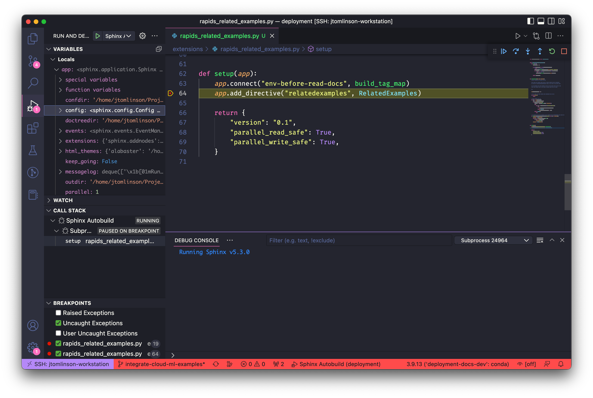

This week I've been working on some custom [Sphinx](https://www.sphinx-doc.org/en/master/) extensions for a documentation site.

Sphinx is a pretty complex tool with a broad ecosystem so documentation tends to be spread across the upstream project, dependencies like [docutils](https://docutils.sourceforge.io/) and popular extensions like [MyST](https://www.sphinx-doc.org/en/master/usage/markdown.html#markdown). Therefore figuring out what is going on can be challenging, so I almost always resort to digging through state in a debugger and doing code spelunking on GitHub.

I have a nice debugging workflow set up with VSCode that I wanted to share.

## Build Tools

Almost all of the Sphinx sites I work on these days use at least one extension from the [Executable Books Project](https://executablebooks.org/en/latest/tools.html). My favorite of these is [sphinx-autobuild](https://github.com/executablebooks/sphinx-autobuild) which replaces the regular `make html` build step.

This tool watches for changes to your files as you edit them and reruns the sphinx build to keep things up to date. It also injects a live reload script into the built HTML so that it can trigger your browser window to automatically refresh when you hit save.

```console
$ sphinx-autobuild docs docs/_build/html
[sphinx-autobuild] > sphinx-build ./docs ./docs/_build/html
Running Sphinx v5.3.0
loading pickled environment... done
...
build succeeded.

The HTML pages are in build/html.
[I 230124 10:08:13 server:335] Serving on http://0.0.0.0:8000
[I 230124 10:08:13 handlers:62] Start watching changes
[I 230124 10:08:13 handlers:64] Start detecting changes
```

## Extensions

When working on a Sphinx extension that is specific to your docs site it's common to put it in a directory in your docs source and add that to the Python path in `conf.py`.

```python
# conf.py
...

import os
import sys

sys.path.insert(0, os.path.abspath("../extensions"))

extensions = [
    ...,
    "my_awesome_extension",
]

...
```

```console
$ tree extensions
extensions
└── my_awesome_extension.py
```

When working on my awesome extension I want to be able to set [breakpoints in VSCode](https://code.visualstudio.com/docs/editor/debugging) so that I can explore the state.

## VSCode config

To hook the VSCode debugger into your docs build you can create a new launch profile in `.vscode/launch.json` which runs `sphinx-autobuild`. The `sphinx-autobuild` CLI is a Python entrypoint so it is effectively the same as running `python -m sphinx_autobuild`. VSCode has a launch profile for executing Python modules so we just need to configure VSCode to run the `sphinx_autobuild` module with the same arguments that we would set on the CLI.

Because Sphinx Autobuild is a Python module and it imports and calls methods from Sphinx to run the build, which in turn imports your extensions and calls `setup(app)` the VSCode debugger is aware of the whole call stack and can set set breakpoints and pause execution anywhere within that.

So `sphinx-autobuild docs docs/_build/html` becomes:

```json
{
    "version": "0.2.0",
    "configurations": [
        {
            "name": "Sphinx Autobuild",
            "type": "python",
            "request": "launch",
            "module": "sphinx_autobuild",
            "args": [
                "docs",
                "docs/_build/html"
            ],
            "justMyCode": false
        }
    ]
}
```

This config tell VSCode to `launch` a `python` module via the debugger called `sphinx_autobuild` with the `docs docs/_build/html` arguments. I've also set `justMyCode` to `false` which means we can set breakpoints anywhere in `sphinx`, `myst`, etc which are installed in my `site-packages`.

With this configuration I can set breakpoints in my extension and launch the whole build from the VSCode debugger.


