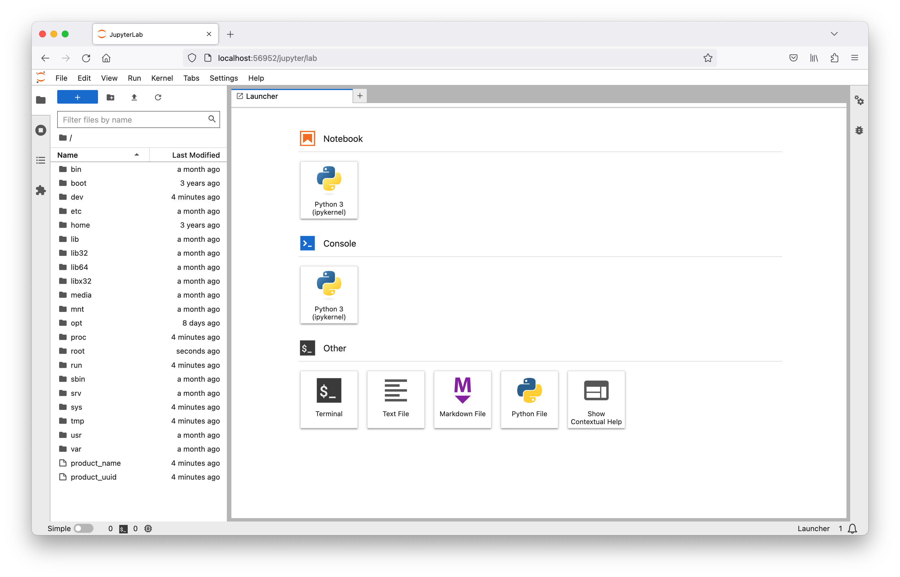

Did you know that the [Dask scheduler](https://docs.dask.org/en/stable/deploying-cli.html#dask-scheduler) has a `--jupyter` flag that will start a Jupyter server running within the Dask Dashboard?


## Dask Kubernetes

When launching Dask clusters on Kubernetes with [dask-kubernetes](https://kubernetes.dask.org/en/latest/) you can also set this flag in your cluster config to run Jupyter in your `KubeCluster`.

```info
The `jupyterlab` package needs to be installed in your container image. If you're using the default Dask images you can install this at runtime by setting the `EXTRA_PIP_PACKAGES` environment variable to `jupyterlab`.
```

```python
from dask_kubernetes.operator import KubeCluster, make_cluster_spec

# Create a cluster spec
spec = make_cluster_spec(
    name="jupyter-example",
    n_workers=2,
    env={"EXTRA_PIP_PACKAGES": "jupyterlab"},
)
# Append the --jupyter flag to the scheduler command args
spec["spec"]["scheduler"]["spec"]["containers"][0]["args"].append("--jupyter")

# Create your cluster
cluster = KubeCluster(custom_cluster_spec=spec)
```

Now that your cluster is up and running let's find where our Jupyter is running.

```python
>>> print(cluster.dashboard_link)
http://localhost:56952/status
```

Ok we can see the Dask dashboard is being port forwarded to port `56952` on localhost. So we can access Jupyter at `http://localhost:56952/jupyter/lab`.


