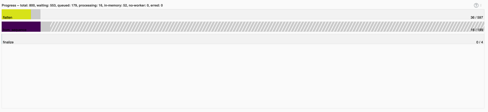

The more we scale up our workloads the more we run into bugs that only appear at scale. Reproducing these bugs can be expensive, time consuming and error prone. In order to report a bug on a GitHub repo you generally need to isolate the bug and come up with a minimal reproducer so that the maintainer can investigate. But what if a minimal reproducer requires hundreds of servers to isolate and replicate?

This week I spent some time debugging a problem that was discovered when running [Apache Beam](https://beam.apache.org/), on a [Dask](https://dask.org/) cluster with hundreds of GPUs, on an batch compute cluster at NVIDIA. I thought it might be interesting to write up my debugging process for looking into bugs at this scale.

## The problem

This bug came to my attention when some Data Scientists approached me and asked why Dask was failing to scale into the hundreds of workers. They reported that when scaling to hundreds of GPUs they could see in the telemetry that many GPUs were sitting idle.

They had spent some time digging into the problem and found that jobs with 10, 50 or 100 GPU workers would fully utilize the cluster. However when they went to 200 workers and beyond they would lose performance and many of them would sit idle and the Dask dashboard showed no tasks being assigned to those workers.

## Collecting information

The first things I needed to figure out were what did the workflow look like and what software, tools and platforms were being used. They had approached me as a Dask maintainer because they could see the problem in the HPC telemetry and the Dask dashboard, but it wasn't clear whether Dask was causing the problem.

I discovered that the workflow was using [Apache Beam](https://beam.apache.org/) with the [Dask Runner](https://beam.apache.org/releases/pydoc/2.44.0/apache_beam.runners.dask.dask_runner.html). The Dask cluster was being created as an HPC-style batch job on a large on-prem compute cluster. The workflow read in some files from shared storage and used Beam to map functions onto those files and write the output back to shared storage.

They had very helpfully put together a simplified version of their workload which created some temp files (one per worker), created a collection with [`beam.Create`](https://beam.apache.org/documentation/transforms/python/other/create/) and performa and element-wise operation onto it with [`beam.ParDo`](https://beam.apache.org/documentation/transforms/python/elementwise/pardo/). This function read in the input file, used `torch` to simulate some GPU intensive compute for a few seconds and then wrote the same file back to disk. They had run this simplified workload a few times and had seen the same behavior of idle workers at large scale.

This was a great start because they had recreated the same IO, compute and scaling setup they were using in their project, but they had removed all of the business logic. This made it much easier for me to dig into solving the problem without having to understand their project.

## Isolating variables

My next steps were to continue boiling their reproducer down as much as possible by isolating the different components and removing them one by one.

I wanted to remove GPUs from the equation if possible. Having workers sitting idle suggested a graph problem or a scheduling problem and that the compute being done was probably unrelated. Removing `torch` from the reproducer would mean that my workers could be much smaller and cheaper.

It was unclear to me whether [PyTorch](https://pytorch.org/) was part of the stack they were using in their real workload or whether they were just using it to highlight which workers had 100% GPU utilization and which had 0%. So my first step was to replace the `ParDo` operation with one that just sleeps, this removed `torch` from the dependencies altogether. I was confident that I could spot idle workers another way.

I removed all of the file generation and IO operations from the example as I didn't think that would be causing worker idleness. This was just a gut feeling more than anything and I was totally prepared to add this back in.

My plan was to run a Dask cluster and then use Apache Beam to map a no-op function over a list of integers at a large scale and see if I saw the same behavior. So the next thing I needed to isolate was the compute environment.

I wanted to avoid opening an issue on Dask or Beam (the two most likely candidates for the bug) and say that I had a problem that I could only reproduce on an on-prem cluster that the other maintainers of those projects didn't have access to.

## Cost effective scale

I needed a Dask cluster with a few hundred workers to try and replicate this. The first thing I tried was `dask.distributed.LocalCuster(n_workers=250)` but I quickly ran into problems with the workers and scheduler timing out and losing connection to each other. My local machine was overwhelmed with the overhead of such a large cluster before even trying to run anything.

So I turned to public cloud to run a large cluster for a few hours while digging into the problem.

I chose [Google Cloud](https://cloud.google.com/) to run this workload because I had access already configured on my laptop and I knew that if the reproducer needed large scale it was common enough that other folks would be able to reproduce my findings.

I also chose [Google Kubernetes Engine](https://cloud.google.com/kubernetes-engine) to manage the cluster because I wasn't sure whether the problem was coming from the number of workers in the cluster, the number of items Beam was processing, or both. I wanted to be able to grab some resources and quickly start/stop ephemeral Dask clusters with varying numbers of workers within it to try things out at different scales, but without losing my resources of having to wait for nodes to provision.

I had a quick look at my account quotas and saw that I could provision up to 500 CPUs in the N2 family of instances. I wanted each worker to have a dedicated CPU core in case I did need to fully load them to reproduce the problem so I wanted a few hundred CPU cores.

I launched a 5 node cluster of `c2-standard-60` instances. Each instance had 60 CPU cores, giving me 300 total which should be enough to reproduce my problem.

```console
$ gcloud container clusters create jtomlinson-beam-test \
    --machine-type c2-standard-60 --spot \
    --zone us-central1-c --release-channel stable \
    --num-nodes 5

$ gcloud container clusters get-credentials jtomlinson-beam-test \
    --zone us-central1-c
```

```info
Setting the `--spot` flag helped keep costs down at the expense of potentially losing my cluster part way through, luckily this didn't happen. At the time of writing the spot price for `c2-standard-60` was around $0.80 so my 5 node cluster would cost around $4/hour.
```

Then I installed the [Dask Kubernetes Operator](https://kubernetes.dask.org/en/latest/operator.html) to manage launching Dask clusters.

```console
$ helm install --repo https://helm.dask.org \
    --create-namespace -n dask-operator \
    --generate-name dask-kubernetes-operator
```

After waiting 5-10 mins for my cluster to launch I could begin debugging.

## Debugging

The minimal example I had been given was quite long and still included the PyTorch code. It also imported functions from a few utility libraries in the project that it had been extracted from that were being used to connect to the Dask cluster and configure the Beam runner. I had never used Beam before so decided to dig into their documentation and figure out what was the most minimal script I could put together to run some Beam pipeline. So I started from scratch and I ended up with something like this.

```python
import time

import apache_beam as beam
from apache_beam.options.pipeline_options import PipelineOptions
from apache_beam.runners.dask.dask_runner import DaskRunner

from dask.distributed import Client
from dask_kubernetes.operator import KubeCluster

class NoopDoFn(beam.DoFn):
    def process(self, item):
        time.sleep(10)
        return [item]

def main() -> None:
    n_items = 128
    n_workers = 128

    # Create a Dask Cluster
    cluster = KubeCluster(name="beam-test", n_workers=n_workers)
    client = Client(cluster)
    client.wait_for_workers(n_workers)
    print(f"Dashboard at: {cluster.dashboard_link}")

    # Start a beam pipeline with a dask backend, and its options.
    print("Running Pipeline")
    pipeline = beam.Pipeline(
        runner=DaskRunner(),
        options=PipelineOptions(
            ["--dask_client_address", cluster.scheduler_address]
        ),
    )
    (
        pipeline
        | "Create collection" >> beam.Create(range(n_items))
        | "Noop 1" >> beam.ParDo(NoopDoFn())
        | "Noop 2" >> beam.ParDo(NoopDoFn())
        | "Noop 3" >> beam.ParDo(NoopDoFn())
    )
    result = pipeline.run()
    result.wait_until_finish()

    # Clean up
    client.close()
    cluster.close()


if __name__ == "__main__":
    main()
```

This script allowed me to quickly run a Dask cluster on Kubernetes with [`KubeCluster`](https://kubernetes.dask.org/en/latest/operator_kubecluster.html) and then execute a Beam pipeline on it, then clean up the cluster again.

The two variables I wanted to explore were the number of items in the Beam pipeline and the number of workers in my Dask cluster. Making those actual variables at the top of my `main()` function allowed me to tweak those, run the script and watch the dashboard.

```info
Using `KubeCluster` meant that I didn't need to care about how to access Dask within my Kubenetes cluster. It automatically port-forwarded the Dask scheduler to my laptop so I could just print the dashboard link in my script and click on it in the terminal.
```

Having my Kubernetes cluster running in the cloud with 300 available cores allowed me to run my script over and over with 10, 50, 100, 150, 200, 250, 300, etc workers without having to wait more than a couple of seconds for the Dask cluster to setup.

## Reducing noise

Next was enhancing up my debug script so that I could repeatedly reproduce my workload and remove as much noise as possible. At this point it's fine for the script to grow and get more complex, we can cut it down again later.

The first few times I ran my script I was seeing a lot of warning output that was unrelated to what I was testing so I updated my script a little to suppress those.

I kept getting errors from the Dask scheduler saying that it couldn't find `apache-beam` due to a recent change in Dask which [requires the scheduler to have a consistent software environment](https://blog.dask.org/2023/04/14/scheduler-environment-requirements) with the client machine. I set an environment variable `EXTRA_PIP_PACKAGES` to ensure this was installed at runtime.

Installing packages at runtime slowed the cluster startup by a few seconds so I also decided to set `KubeCluster(..., shutdown_on_close=False)` and remove the `cluster.close()` so that the Dask cluster wouldn't be deleted at the end of the script, and added a `cluster.scale(n_workers)` call to ensure the cluster was the right size if the script reused an existing one.

```info
I was able to quickly clean up the Dask cluster with `kubectl delete daskcluster beam-test` between runs if I wanted a fresh start.
```

I noticed that my workers had unbounded resources and were assuming they each had the whole node to play with, so I also added some resource constraints to the worker Pods to limit them to one CPU each.

Finally I moved the Dask cluster setup/teardown logic into a context manager to separate the Beam code from the Dask code. I ended up with something like this.

```python
import warnings
import time
from contextlib import contextmanager

import apache_beam as beam
from apache_beam.options.pipeline_options import PipelineOptions
from apache_beam.runners.dask.dask_runner import DaskRunner

from dask.distributed import Client
from distributed.versions import VersionMismatchWarning
from dask_kubernetes.operator import KubeCluster

# Reduce output noise
for warn_type in [VersionMismatchWarning, FutureWarning]:
    warnings.filterwarnings("ignore", category=warn_type)


@contextmanager
def daskcluster():
    """Get a Dask cluster however you prefer."""
    n_workers = 200
    with KubeCluster(
        name="beam-test",
        n_workers=n_workers,
        env={"EXTRA_PIP_PACKAGES": "apache-beam"},
        resources={
            "requests": {"cpu": "500m", "memory": "1Gi"},
            "limits": {"cpu": "1000m", "memory": "1.85Gi"},
        },
        shutdown_on_close=False,  # Leave running for reuse next time
    ) as cluster:
        cluster.scale(
            n_workers
        )  # Ensure the right number of workers if reusing a cluster
        print(f"Dashboard at: {cluster.dashboard_link}")
        with Client(cluster) as client:
            print(f"Waiting for all {n_workers} workers")
            client.wait_for_workers(n_workers=n_workers)
            yield client


class NoopDoFn(beam.DoFn):
    def process(self, item):
        time.sleep(10)
        return [item]


def main() -> None:
    n_items = 200

    with daskcluster() as client:
        # Start a beam pipeline with a dask backend, and its options.
        print("Running Pipeline")
        pipeline = beam.Pipeline(
            runner=DaskRunner(),
            options=PipelineOptions(
                ["--dask_client_address", client.cluster.scheduler_address]
            ),
        )
        (
            pipeline
            | "Create collection" >> beam.Create(range(n_items))
            | "Noop 1" >> beam.ParDo(NoopDoFn())
            | "Noop 2" >> beam.ParDo(NoopDoFn())
            | "Noop 3" >> beam.ParDo(NoopDoFn())
        )

        result = pipeline.run()
        result.wait_until_finish()


if __name__ == "__main__":
    main()
```

## Exploring the results

Now I had a script that would start running in a few seconds and I had two variables I could tweak to figure out what was going on.

I would run the script, click the dashboard link once it was printed and then watch the output to see what was going on.


At first I kept the `n_items` and `n_workers` variables the same as I changed them because the initial testing from the data science folks said that they were assuming a 1:1 mapping between workers and files.

I found with tens of workers and files things would behave as expected and each worker would be given one task at a time. The workers would move through the four stages in the pipeline and then the job would complete.

I also tried doubling the number of items to have a 2:1 ratio with the Dask workers and I saw that each stage in the pipeline would just get done in two halves by the workers.

I did notice that the names that Dask gave to each stage did not match with the names of any of the functions or pipeline stages that I  had created. Dask showed one task called `from_sequence`, one called `flatten` and one called `finalize`. There were always three times as many `flatten` tasks as `from_sequence` tasks, and there were always four `finalize` tasks regardless of the number of items/workers.



My assumption was that `beam.Create` mapped directly to `from_sequence` but then any `beam.ParDo` call would be translated to a `flatten` call. I had three `beam.ParDo` steps in my pipeline so it made sense why there were three times as many `flatten` calls. I also guessed that one `finalize` task would happen for each stage in my pipeline.

As I increased the number of items/workers these tasks would grow until I got into the 200s, then they would drop down and always stay a 404 tasks.

| Workers     | Items       | Tasks             |
| ----------- | ----------- | ----------------- |
| 1           | 1           | 8   (1 * 4 + 4)   |
| 2           | 2           | 12  (2 * 4 + 4)   |
| 10          | 10          | 44  (10 * 4 + 4)  |
| 50          | 50          | 204 (50 * 4 + 4)  |
| 100         | 100         | 404 (100 * 4 + 4) |
| 150         | 150         | 604 (150 * 4 + 4) |
| 190         | 190         | 764 (190 * 4 + 4) |
| 199         | 199         | 800 (199 * 4 + 4) |
| 200         | 200         | 404 (?)           |
| 250         | 250         | 404 (?)           |
| 300         | 200         | 404 (?)           |

Things behaved as expected until hitting a threshold of 200, then the number of Dask tasks in each stage would drop down to 100 every time.

I also tried changing the number of workers and keeping it the same and exactly the same thing happened.

| Workers     | Items       | Tasks             |
| ----------- | ----------- | ----------------- |
| 100         | 50          | 204 (50 * 4 + 4)  |
| 100         | 100         | 404 (100 * 4 + 4) |
| 100         | 150         | 604 (150 * 4 + 4) |
| 100         | 190         | 764 (190 * 4 + 4) |
| 100         | 199         | 800 (199 * 4 + 4) |
| 100         | 200         | 404 (?)           |
| 100         | 250         | 404 (?)           |
| 100         | 200         | 404 (?)           |


## Creating an MRE

At this point I was confident that the problem was with how Beam generated the Dask Graph for it's pipelines. So it was time for me to open an issue on Beam's repo with a Minimal Reproducible Example (MRE).

It looked like once there are more than 200 items in a [Beam PCollection](https://beam.apache.org/documentation/programming-guide/#pcollections) they get batched under the hood into batches of 100 items. No matter how many items were in the PCollection Beam would create 100 `flatten` calls for each `beam.ParDo`.

If the PCollection has 199 items then it will create 199 `flatten` tasks, but beyond that it will only create 100. This effectively means that if your Dask cluster has more than 199 workers (or more than 100 if your PCollection is larger than 199) then those workers will not be assigned any tasks.

Now that I know the problem is that the `ParDo` doesn't scale when using the Dask Runner, rather than Dask not scaling I can create a simple script that will run on just my laptop.

````info
I don't need my Kubernetes cluster any more so I can easily clean that up.

```
$ gcloud container clusters delete jtomlinson-beam-test --zone us-central1-c
```

````

Here's the final MRE script.

```python
import apache_beam as beam
from apache_beam.options.pipeline_options import PipelineOptions
from apache_beam.runners.dask.dask_runner import DaskRunner

from dask.distributed import Client, performance_report

class NoopDoFn(beam.DoFn):
    def process(self, item):
        import time
        time.sleep(0.1)
        return [item]


def run_pipeline(n_items):
    client = Client()
    pipeline = beam.Pipeline(
        runner=DaskRunner(),
        options=PipelineOptions(["--dask_client_address", client.cluster.scheduler_address]),
    )

    (
        pipeline
        | "Create collection" >> beam.Create(range(n_items))
        | "Noop 1" >> beam.ParDo(NoopDoFn())
        | "Noop 2" >> beam.ParDo(NoopDoFn())
        | "Noop 3" >> beam.ParDo(NoopDoFn())
    )

    with performance_report(filename=f"dask-report-{n_items}.html"):
        result = pipeline.run()
        result.wait_until_finish()

def main() -> None:
    # If this is 199 I get one task per item per stage (800 tasks, 199 concurrent)
    run_pipeline(199)
    # If this is 200 I get max 100 tasks per stage (404 tasks, 100 concurrent)
    run_pipeline(200)


if __name__ == "__main__":
    main()
```

This script uses `dask.distributed.Client` which by default creates a `dask.distributed.LocalCluster` that on my laptop creates a cluster with 12 workers.

Then it runs my no-op pipeline twice, once with 199 items and again with 200 items.

As I was looking at the dashboard to know how many tasks there were for each run I am using [`dask.distributed.performance_report()`](https://distributed.dask.org/en/stable/diagnosing-performance.html#performance-reports) to capture the dashboard and write it to a file.

So this MRE script produces two reports [`dask-report-199.html`](https://gistcdn.githack.com/jacobtomlinson/7cd1d4b0ffb67034f64385628996e38f/raw/deeaa2cb93c7f98b3d6e32c32a5ec121bb0d328c/dask-report-199.html) and [`dask-report-200.html`](https://gistcdn.githack.com/jacobtomlinson/7cd1d4b0ffb67034f64385628996e38f/raw/deeaa2cb93c7f98b3d6e32c32a5ec121bb0d328c/dask-report-200.html). I've uploaded those reports to a [GitHub Gist](https://gist.github.com/jacobtomlinson/7cd1d4b0ffb67034f64385628996e38f) to make it easy to share them in [the issue](https://github.com/apache/beam/issues/26669) along with the MRE script.

## Summary

When large workloads fail at scale it can be daunting to dig into them a figure out what is going wrong. In this example the bug was happening on clusters with hundreds of GPUs, so the cost of repeatedly running the workload and trying to interactively debug it could feels like it could add up quickly.

But it's likely that the scale of the problem can be emulated in some other way. In this example, once I ruled out the computation being a factor, I switched from hundreds of GPUs to hundreds of slower CPU cores which are much cheaper. But even then when I dug deeper into the problem I discovered I didn't need all of those cores and could reproduce the problem on a laptop.

Instrumentation and telemetry is also key. The folks who discovered the bug did so by looking at resource usage from the batch system they were using. When I dug into the problem I heavily used the [Dask dashboard](https://distributed.dask.org/en/stable/diagnosing-performance.html) and [performance reports](https://distributed.dask.org/en/stable/diagnosing-performance.html#performance-reports) along with [k9s](https://k9scli.io/) to see what was going on in the Kubernetes cluster.

As with all debugging processes it's a matter of isolating the problem and removing anything unnecessary. When debugging at scale you need to start removing the biggest, most expensive and most cumbersome things first. The deeper you get into debugging the less complex the problem starts to get. Moving from HPC to Cloud and finally to me laptop allowed me to iterate faster and faster with each development.
