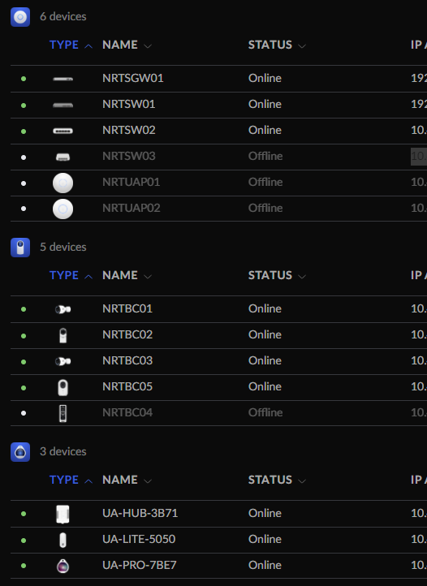

Since upgrading to a [UniFi Dream Machine (UDM) Pro](https://eu.store.ui.com/eu/en/products/udm-pro) I've had a problem with some of my UniFi devices showing as offline. **TLDR It turned out that I accidentally had two controllers on my network and the devices were hopping back and forth between them.**

I found [this forum post](https://community.ui.com/questions/Unifi-devices-show-offline-in-console-but-are-actually-online/a5611da8-fad2-4461-90fd-824ecbd2d5cd#:~:text=%22Offline%22%20in%20the%20controller%20means,to%20the%20right%20Controller%20address.) with folks running into the same problem but the thread is locked so I can't comment with my own solution, hence this blog post.



I tried factory resetting the devices and also manually SSHing into them and running `set-inform https://<UDM PRO IP>:8080/inform` as suggested in the post and it would work for a little while and then the devices would show as offline again.

I also ended up buying two new switches and noticed that they didn't have the problem with going offline, only the devices I had before getting the UDM Pro would go offline.

In the forum thread it suggested SSHing to the device and running `info`, one user in the thread did this and saw that their device couldn't connect to the controller. However when I did this I saw it was connected, but the IP didn't match my UDM Pro.

```console
OfficeSwitch-US.6.5.59# info

Model:       USW-16-PoE
Version:     6.5.59.14777
MAC Address: d0:21:f9:57:bb:6b
IP Address:  10.51.100.17
Hostname:    OfficeSwitch
Uptime:      1064431 seconds
NTP:         Synchronized

Status:      Connected (http://<NOT MY UDM PRO>:8080/inform)
```

Before getting the UDM Pro I had a [UniFi Security Gateway (USG)](https://store.ui.com/us/en/products/usg) and was running the controller software as an [add-on container on my Home Assistant box](https://community.home-assistant.io/t/home-assistant-community-add-on-unifi-controller/56297). It turned out that I had successfully replaced the router with the UDM Pro and migrated the devices across, but I had forgotten to stop the old controller. For some reason any device that had previously been registered to the old controller would intermittently migrate back to it and show as offline in the UDM Pro controller.

Once I stopped the old controller the devices migrated back to the UDM Pro within a few seconds and have not gone offline since 🎉.

This turned out to be a pretty niche problem but hopefully this post helps someone!
