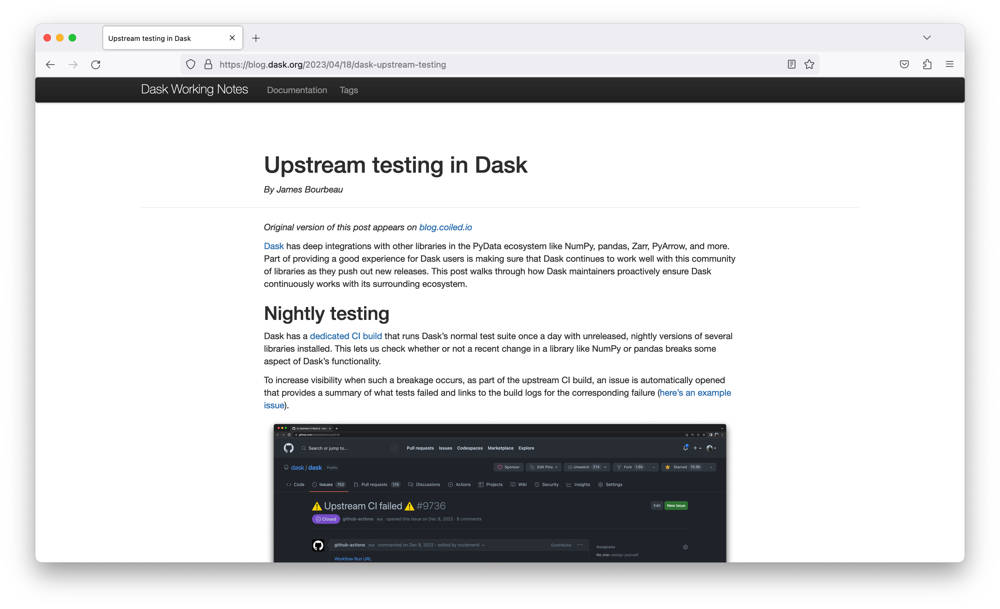
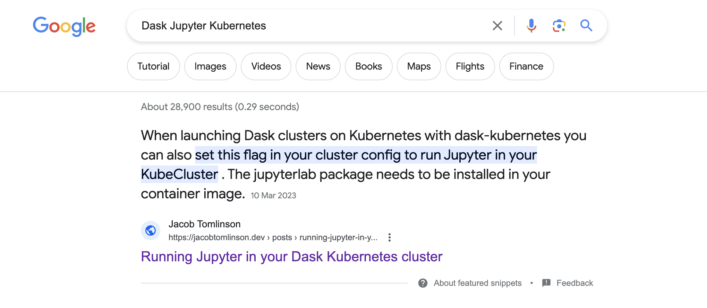
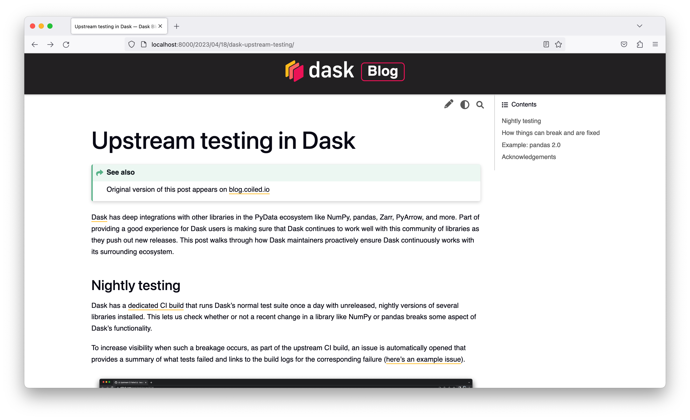

The Dask blog is a bit neglected these days. The website is an aging Jekyll blog and is well past it's prime. Bringing it into current decade has been on my backlog for a while and today I decided to dedicate some time getting it up to date.

However, after tinkering for a couple of hours I realised I was engineering myself into a corner. Rather than being stubborn and trying to code myself back out of this cul-de-sac I decided I would discard what I had done and write up some notes about why this approach failed.

Consider this blog post an essay on the challenges of doing community communications in a multi-organisation project, combined with personal notes on what not to try next time I have a free morning and want to take a run at this.

## Background

Before digging into the technical solution that I tried today and why it didn't work let's explore some of the foundations and requirements.

### Who is the Dask Blog for?

The purpose of the blog is to communicate more narrative-driven information to the Dask community. Typically Dask blog posts are either [feature overviews](https://blog.dask.org/2023/04/12/from-map), [deep-dives into high-impact bug fixes](https://blog.dask.org/2022/11/15/queuing) or meta information about the [project](https://blog.dask.org/2023/04/14/scheduler-environment-requirements), [developers](https://blog.dask.org/2021/12/15/dask-fellow-reflections) or [community](https://blog.dask.org/2021/06/25/dask-down-under). Blog posts [add context that isn't covered in the changelog](https://blog.dask.org/2023/02/02/easy-cpu-gpu), [combine Dask with other projects in the ecosystem](https://blog.dask.org/2021/03/29/apply-pretrained-pytorch-model) or [bring together long-term engineering efforts that build into a high-level story arc](https://blog.dask.org/2023/03/15/shuffling-large-data-at-constant-memory).

### Who writes the Dask Blog?

The blog is written by the developers of Dask with the occasional community contribution from a power user (we love these btw, keep them coming!).

This means that the folks who write the blog spend most of their time writing Python and using GitHub. They are familiar with markup languages such as [Markdown](https://daringfireball.net/projects/markdown/syntax), templating languages like [Jinja2](https://jinja.palletsprojects.com/en/3.1.x/) and document formats like [Jupyter Notebooks](https://jupyter.org/).

### What is wrong with the current blog?

The blog today is very basic, the first post was created in 2014 and I expect it hasn't been updated much since then other than adding new posts. Visually it looks very generic as it is using an off-the-shelf Jekyll theme and doesn't fit with the modern [Dask branding](https://www.dask.org/brand-guide). It also doesn't provide much navigation to help you get to other parts of the Dask web ecosystem.

Writing posts is done in markdown and the review process uses GitHub Pull Requests, so that fits very well with the typical writer of the blog. However Jekyll is a Ruby tool which means building the blog can be a little outside the comfort area of many contributors. The flavor of markdown is also the generic GitHub flavor which has some limitations that requires authors to work around occasionally in HTML.

Lastly the blog isn't super well optimised for the modern web, it is missing a bunch of metadata that is important to ensure it gets ranked highly by search engines. For example if you search "Dask Pandas XGBoost" on Google this post titled ["Dask and Pandas and XGBoost"](https://blog.dask.org/2017/03/28/dask-xgboost) isn't listed anywhere near the top. Compare that with my own blog which is built in a similar way but uses modern metadata conventions if you search "Dask Jupyter Kubernetes" my post ["Running Jupyter in your Dask Kubernetes cluster"](https://jacobtomlinson.dev/posts/2023/running-jupyter-in-your-dask-kubernetes-cluster) is not only the top result but has a featured snippet.

Nobody wants to put time and effort into writing a blog post to have it be displayed on an old fasioned website and rank poorly in search. The result of all of this is that when Dask developers want to publish new blog posts they do so on their employer's blogs, which perform much better visually and in search, instead of the community one. However this leads to confusion in the community about where the voice of Dask is coming from, because it seems to be coming from many places at once.

### Syndication

To try and keep the Dask Blog up to date with relevant content and have a single voice we syndicate almost every post there these days. So a Dask developer will publish a post on their employer's blog, then we will post a duplicate on the Dask blog with attribution. Typically dual posting the same content harms both pages in search rankings so we need to [set a metadata header](https://yoast.com/rel-canonical/) on the Dask Blog copy to tell the search engine that they original post is the _canonical_ copy, effectively ignoring this second copy.

This is useful for folks who navigate to the Dask blog because they can see all the content, and it's great for folks subscribed to the Dask Blog RSS feed. But it doesn't help the Dask Blog in search rankings because the original corporate hosted blog will appear. My hope is that with a refreshed Dask Blog we will publish more OSS Dask content on our own blog as a first port of call rather than reaching to corporate infrastructure.

### Why not use a "real blog"?

When we overhauled the Dask website we switched the [Dask landing page](https://www.dask.org/) to [Webflow](https://webflow.com/) and we had some discussions around using Webflow for our blog too.

However there were too many technical and workflow hurdles to do this. Firstly the Dask blog contains a lot of technical content, there are many code examples which require syntax highlighting to be readable. There are also things like maths syntax, custom scripts and custom layouts. The Webflow editor was just not advanced enough to allow folks to do everything they wanted without some serious hacks.

The other challenge was the submission and review process. We would need to create Webflow accounts for anyone who wanted to submit or review a post, and these cost money. To avoid costs a workflow where folks write and review in Google Docs was proposed and then someone with an account would migrate the post and publish it. But for an OSS community driven blog this felt cumbersome and unsustainable.

The same would go for Wordpress, Medium or any other blogging infrastructure. For a developer blog written by developers we need to keep the process in git and on GitHub.

## Requirements

Now that we have discussed the background let's boil this down into a concrete set of requirements. This is what I was aiming for when I attempted this overhaul.

### Must

- Posts **must** be able to be written in markdown.
- Posts **must** support ["dollar math"](https://mystmd.org/guide/math) for maths and equations.
- The blog **must** fit with the [Dask Branding Guidelines](https://www.dask.org/brand-guide).
- The blog **must** have modern HTML metadata and preview images to perform well in search.
- Posts **must** be able to set the canonical header to point to original content.
- Anyone **must** be able to submit a new post easily without manual human interaction.
- Reviews **must** be performed in an open way such as in PRs on GitHub.
- Any Dask steering council member **must** be able to publish content to the blog.
- Readers **must** be able to subscribe via RSS.

### Should

- The blog _should_ be built using a tool familiar to Python developers.
- Posts _should_ allow comments (the current blog uses Disqus).
- Posts _should_ support custom JavaScript, CSS and HTML for when authors want to go off-road.

### Could

- Posts _could_ use [MyST](https://mystmd.org/) to reduce the amount of custom HTML that is used.
- Posts _could_ be written in [Jupyter Notebooks](https://jupyter.org/).

## My failed attempt

This brings me to the attempt that I made this morning.

I decided to try and migrate the blog to [Sphinx](https://www.sphinx-doc.org/en/master/). We use Sphinx for all of our documentation in Dask so it is clear that the tool will be familiar to folks working on Dask. I used the `myst-parser` and `myst-nb` extensions to ensure posts could be written in MyST flavour markdown (with dollar math support) as well as Jupyter Notebooks.

I used the [Sphinx Book Theme](https://sphinx-book-theme.readthedocs.io/en/stable/) which looks modern and uses modern metadata conventions to ensure good search ranking. I then added a bunch of custom CSS and configuration to get it to look like a Dask website.

I did all of this on a branch of the existing Dask Blog which both the source and website is hosted on GitHub which would allow the GitHub submission and review process to continue working the same way it currently does.

### Challenges

It was starting to look ok, but this is where I started running into challenges.

#### Post metadata

Underneath the post title I would like to show metadata information including the author, date of publication, estimated reading time, tags, etc. However with Sphinx it's unclear how to do this without adding a custom directive to every post. This would mean writing that directive and also ensuring every post author used it correctly, this leaves a lot of room for error.

#### URLs

With the current Jekyll site all the posts live in one directory and at build time are put into a certain file structure to create the URL format you want. Today we use `blog.dask.org/{YYYY}/{MM}/{DD}/{TITLE_SLUG}`. To avoid breaking these URLs we either need to ensure the new site replicates the same structure, or add some redirects to a new structure.

Sphinx assumes a 1:1 mapping between source paths and output paths, so to recreate the same structure we need to move a post that currently lives at `_posts/2023-04-18-dask-upstream-testing.md` to `source/2023/04/18/dask-upstream-testing/index.md` which adds complexity and potential confusion for authors.

If we wanted to use a new structure we would need to use a plugin like [sphinx-redirects](https://pypi.org/project/sphinx-reredirects/) and set up a load of redirects in `conf.py`. In other blogging tools the [redirect metadata lives in the post frontmatter](https://gohugo.io/content-management/urls/), but for Sphinx it would need to go in a separate configuration file which again is a potential source of confusion.

#### RSS Feeds

It was also unclear how to replicate the current RSS feeds so that new posts would be added to the feed. This is just not something Sphinx is built to handle out of the box.

#### Index page

The Blog home page should be a list of all the blog posts in chronological order with metadata such as the date, author, etc. Getting Sphinx to list a toctree of all the posts using [`:glob:`](https://www.sphinx-doc.org/en/master/usage/restructuredtext/directives.html) got some of the way there with listing the posts but didn't include any metadata.

### Trying the Sphinx ablog extension

After trying to solve some of these challenges I came across the [ablog extension](https://ablog.readthedocs.io/) for Sphinx which addresses some of these issues.

However it seems to still require using custom directives and only fills some of the gaps listed above. At this point I was really starting to feel like I was pushing Sphinx to be something it isn't and instead of pushing deeper into plugins, addons and hacks to get it to work I decided to stop, take a step back and write this blog post.

The [Executable Books Blog](https://executablebooks.org/en/latest/blog/) seems to use this extension within their Sphinx docs to build their blog and while the content is awesome it seems to suffer from the same challenges I faced above including missing metadata, lacking clean URLs, etc. It looks more like documentation than a blog.

## What next?

I want the Dask Blog to be modern, clean and easy to find, which will reopen the doors to it being filled with new content regularly and the trusted source for Dask community communications.

I ran out of time on this attempt but maybe next time I'll explore [other tools](https://jamstack.org/generators/) or just revisit Sphinx + ablog and get deeper into the customisations.

If you have any ideas or recommendations I'd love to hear about it!
