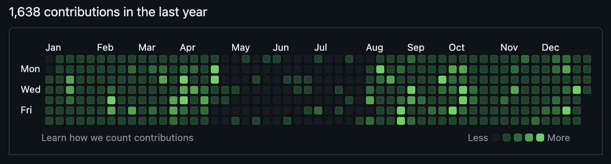
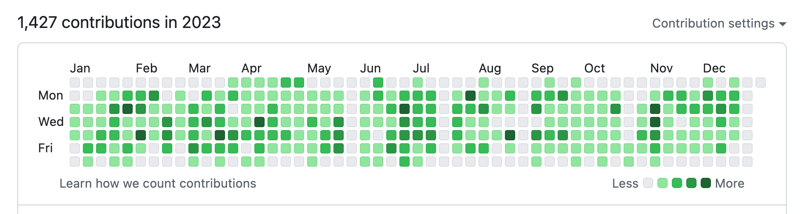
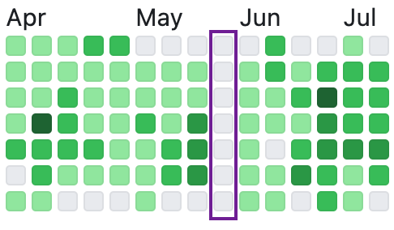

I recently read [Loving and hating the Streak by Cassidy Williams](https://blog.cassidoo.co/post/the-streak/). The post was all about committing code on GitHub every single day to maintain a streak.

One thing I took away from the post was the gap in Cassidy's streak where she was out on maternity leave. She totally counts that time as part of the streak, which I think is a great mindset!

I am fortunate to have a job where I am paid to work mostly on open source projects on GitHub, so maintaining a streak isn't especially difficult. I also am an OSS enthusiast so I sometimes work on side-projects on the weekend, but less so since having kids.

With that in mind I found it fun to look at my own graph from 2023 and dig into my "streak" as well as my work/life balance.

Looking at this graph I can see my longest streak was 14 days in April, which was around the time I was getting [kr8s](https://github.com/kr8s-org/kr8s) off the ground. But actually after looking more closely at this graph I feel like **I was only 5 days away from having a perfect streak**. Let me explain.

First, my weekends are my own. Any contributions on Saturday/Sunday were purely for my own enjoyment. Any weekend days that I didn't contribute I'm sure I enjoyed spending time with my family, renovating my house, playing video games or any other comparable life activities. So let's exclude weekends from my streak.

That leaves me me with 39 weekdays that I didn't contribute anything on GitHub. Nine of those would have been [public holidays in the UK](https://www.gov.uk/bank-holidays) (eight plus an extra one in 2023 for the King's Coronation), and I guess I didn't choose to work on hobby code on those days off, so let's subtract those.

I'm also very proud of the solid weeks off that you can see spaced throughout the year. I feel like they show a good work/life balance and represent quality time spent with my family. My eldest daughter started school this year, so we are now more limited in what times we can travel as a family as we can only go away at expensive school holiday times. So during 2023 we made the most of getting away and we had a few awesome trips to France and Spain.

I get 25 days paid time off, and let's assume I didn't choose to spend any of those days working on hobby code either. Subtracting those days leaves 5 days unaccounted for.

I expect these would've been days where I happened to have only worked on internal repos (which aren't hosted on GitHub), very meeting heavy days or perhaps conference attending days. These are the days I consider a gap in my streak.

My goal for 2024 is to get a perfect streak, which will look almost exactly the same as 2023 but with five more green boxes.
