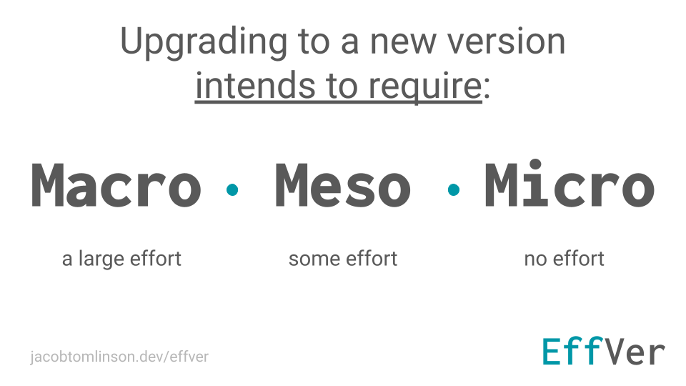

Version numbers are hard to get right. Semantic Versioning [(SemVer)](https://semver.org/) communicates backward compatibility via version numbers which often lead to a [false sense of security and broken promises](https://hynek.me/articles/semver-will-not-save-you/). Calendar Versioning [(CalVer)](https://calver.org/) sits at the other extreme of communicating almost [no useful information at all](https://jacobtomlinson.dev/posts/2023/sometimes-i-regret-using-calver/). 

Going forward I plan to version the projects I work on in a way that communicates _how much effort I expect a user will need to spend to adopt the new version_. I'm going to refer to that scheme as **Intended Effort Versioning (<span style="color: #0097a7">EffVer</span> for short)**.



<span style="color: #0097a7">EffVer</span> follows the same pattern of incrementing numbers to communicate with users that SemVer does, and is forward and backward compatible with SemVer (you don't need to use something like a [Python version epoch](https://packaging.python.org/en/latest/specifications/version-specifiers/#version-epochs) to switch between the two schemes). The difference is that instead of quantifying the orthogonality of a change EffVer tries to quantify the intended work required to adopt the change.

If a change fixes a small bug, adds a new feature that is orthogonal with existing features or is generally a noop for existing users then you should bump the **Micro** version. This signals to users that **"this change doesn't intend for you to need to do anything"**.

If a change fixes a larger bug that some users may have grown accustom to or put workarounds in place for, or makes small breaking changes to features in a way that may require some adoption then you should bump the **Meso** version. This signals to users that **"some small effort may be required to make sure this version works for you"**.

If you make a huge breaking change or overhaul some large aspect of your project you should bump the **Macro** version. This signals to users that **"you will need to dedicate some significant time to upgrading to this version"**.

## Why use <span style="color: #0097a7">EffVer</span>?

<span style="color: #0097a7">EffVer</span> may sound like "SemVer-lite" or just "SemVer done a certain way" but there are a few key things that makes <span style="color: #0097a7">EffVer</span> different and worth considering. 

1. <span style="color: #0097a7">EffVer</span> communicates intentions. Software is created by humans (for now) and that while humans have the best of intentions around the impacts that new versions have, sometimes things are more impactful than expected. Instead of trying to quantify the techinical scope of a change <span style="color: #0097a7">EffVer</span> tries to communicate the expected downstream impact.
2. <span style="color: #0097a7">EffVer</span> respects that all releases impact users and will require effort to adopt them, even if that's some simple testing or updating a lock file. By trying to quantify and communicate the effort required to adopt a release developers demonstrate respect for their user's time.
3. <span style="color: #0097a7">EffVer</span> doesn't make a distinction between bugs fixes, enhancements and features (because release often include all of these things). Instead we focus only on the effort required for existing users to adopt new versions.
4. <span style="color: #0097a7">EffVer</span> users can more clearly reason that _any_ change can result in them needing to do some work, but that the developer using <span style="color: #0097a7">EffVer</span> is trying to give them information to help them quantify and plan this work.

## Fixing mistakes

Another core principle of <span style="color: #0097a7">EffVer</span> is to acknowledge that sometimes code gets released with the wrong version number, and responsible developers should reactively fix that. 

Imagine 1% of my users are experiencing a bug, so I make a bug fix release where I intend for only those users notice that positive change. So I increment the _micro_ version number and cut a release. 

However I was wrong, other users are negatively impacted by the change and have to make a small adjustment to their workflow to work around it. On reflection I am still happy with the change and don't intend to revert it, but I should've incremented the _meso_ version number instead to signal a larger impact. I made the change that I wanted to make, but I have accidentally generated work for others and I should respectfully communicate that to them.

With <span style="color: #0097a7">EffVer</span> we encourage developers to take some steps to update the communicated impact by cutting a few more releases.

- Imagine my starting point was version `2.3.4`. 
- My bug fix was then released as `2.3.5`. 
- The unhappy users open issues on GitHub and I want to change the version number to communicate the impact better. 
- I check out the original `2.3.4` tag and create another new tag for this commit called `2.3.6`, this effectively reverts the impactful release so that no more users pick up the change. 
- Then I check out `2.3.5`, the impactful change, and create a new tag called `2.4.0`. 

Now users who have pinned to `~2.3.4` will be upgraded to `2.3.6` which is exactly the same commit and therefore doesn't cause them any impact. And users who have pinned to `^2.3.4` will be upgraded to `2.4.0` which correctly communicates that there may be some small intentional impact.

I haven't needed to change my code or make any new commits, I just add more tags to clearly communicate the impact of the releases. In theory I could also yank `2.3.5` because it is "wrong", but in practice superseding it with `2.3.6` should be enough.

## Zero version

In SemVer the `0.x.x` version has become known as the YOLO version because anything goes. Any change can be breaking and so the semantics around backward compatibility become meaningless. 

In <span style="color: #0097a7">EffVer</span> the meaning of the zero version still denotes a codebase under development but should be treated as `0.Macro.Micro`. In a development project it is more likely that changes will have a large impact, that's just in their nature, but it's still useful to be able to quantify the impact between each release.

You could also use a four segment version number with `0.Macro.Meso.Micro` if you would prefer to have the full fidelity of <span style="color: #0097a7">EffVer</span> communication during development.

As your project matures you will likely find yourself incrementing the _Macro_ version less and the _Micro_ version more which is a good signal for developers that it's time to switch to a `1.0.0` release.

## Projects using <span style="color: #0097a7">EffVer</span>

Here are some notable projects that use EffVer:

- [kr8s](https://github.com/kr8s-org/kr8s)

_Want to add your project to this list, [make a PR here](https://github.com/jacobtomlinson/website/blob/master/content/posts/2024/2024-01-15-effver/index.md)._

## Supporting <span style="color: #0097a7">EffVer</span>

Do you like the sound of <span style="color: #0097a7">EffVer</span>? If so that's great! You can support the movement by sharing this post with people and by adding the [](https://jacobtomlinson.dev/effver) badge to any projects that are using it.

```markdown
# Badge URL
https://img.shields.io/badge/version_scheme-EffVer-0097a7

# Markdown
[](https://jacobtomlinson.dev/effver)

```

## Background and history

At PyCon UK in 2023 I gave a lightning talk based on my blog post ["Sometimes I regret using CalVer"](https://jacobtomlinson.dev/posts/2023/sometimes-i-regret-using-calver/). My talk was immediately followed by [Hynek Schlawack](https://hynek.me/about/) who aside from creating great Python libraries like [`attrs`](https://github.com/python-attrs/attrs) and [`structlog`](https://github.com/hynek/structlog) is known for his blog post ["Semantic Versioning Will Not Save You"](https://hynek.me/articles/semver-will-not-save-you/). 

Interestingly many folks assumed that our dislike of different version schemes meant we vehemently disagreed with each other, but far from it. We totally agreed that the two most popular versioning schemes were imperfect and this resulted in some excellent post-conference pub discussion.

Ever since then I've not been able to stop thinking "there has to be another option".

### The challenges of existing schemes

Both my and Hynek's blog posts go into detail about the failings of existing schemes, but I want to focus on the attributes that translate to work required by downstream users.

#### SemVer

SemVer attempts to communicate if an upgrade is safe or not, but can easily get this wrong. 

When you fix a bug in your code you can argue that the code is now "more correct". SemVer assumes it is safe for _everyone_ to adopt this new code immediately because of this increased "correctness", but the trap that SemVer falls into is the fact that **every bug has users**.


People trust SemVer to not break their code and then feel angry when things go wrong because when SemVer fails users have to react and often have urgent work to do.

#### CalVer

CalVer attempts to communicate that no upgrade is safe, but in doing so strips all useful information from the version number. 

For example if you fix a small bug in your code and make a release, then the next day you delete half the API and make another release, nobody can tell the difference between the two versions.


People feel anxious about upgrading CalVer projects because they don't know if the change will be small or huge. As a result they are more likely to pin their dependencies and upgrade in a more proactive and managed way, which is good, but the lack of information makes upgrading hard to schedule and so it often gets put off.

If you read the CalVer website they [highlight Ubuntu](https://calver.org/#ubuntu) as a high-profile user of CalVer. However, Ubuntu has shoehorned in a bunch of semantics to their versioning scheme by only creating April and October releases to make it clearer to users which versions are _major_ versions. They wanted to communicate which versions take more effort to migrate between because they agree that **communicating user impact is important**.

### Momentum

The biggest challenge for switching version scheme is the momentum of other schemes in the ecosystem. SemVer is well established, and CalVer is also very common. Because of that <span style="color: #0097a7">EffVer</span> is intentionally identical in structure to SemVer. This means that any tooling or process assumptions built around SemVer will work for <span style="color: #0097a7">EffVer</span>.

Any SemVer project can switch to <span style="color: #0097a7">EffVer</span> by just changing how they decide the version number of the next release. If you try <span style="color: #0097a7">EffVer</span> out and would prefer to go back to traditional semantics then switching back is also just the same process change.

Switching to CalVer is more of a one way street, and although some languages have a [process for switching back](https://packaging.python.org/en/latest/specifications/version-specifiers/#version-epochs) it's not guaranteed to be a smooth ride. So if you ever do switch to CalVer can I suggest you use `YY.MM.DD` instead of `YYYY.MM.DD`, that way you could switch back to <span style="color: #0097a7">EffVer</span>/SemVer and keep your _major_ version number below 100.
