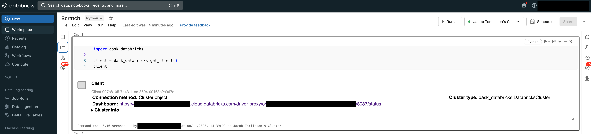

[Databricks](https://www.databricks.com/) is a very popular data analytics platform used by data scientists, engineers, and businesses around the world. It was founded by the creators of [Apache Spark](https://spark.apache.org/), a powerful open-source data processing engine, and builds on top of Spark to provide a comprehensive analytics platform.

[Dask](https://dask.org/) is a very popular tool in the Python community for scaling out common [PyData](https://pydata.org/) workloads that use libraries like [Pandas](https://pandas.pydata.org/), [NumPy](https://numpy.org/) and [Scikit-Learn](https://scikit-learn.org/stable/). While Dask and Spark both provide distributed Dataframe processing Dask is a framework for general distributed computing and has a whole load of other APIs which are popular in [many other use cases too](https://docs.dask.org/en/stable/why.html).

If you're a Databricks user then being able to run Dask alongside Spark can be very useful.

## Dask Databricks

To make deploying Dask on Databricks easier there is now the [dask-databricks](https://github.com/dask-contrib/dask-databricks) package which can beinstalled via pip or conda.

```bash
pip install dask-databricks
# or
conda install -c conda-forge dask-databricks
```

### Cluster launch

When you launch a [multi-node Databricks cluster](https://docs.databricks.com/en/compute/cluster-config-best-practices.html#cluster-mode) a _driver VM_ will be provisioned. This VM runs the Spark driver node and also handles things like executing notebook cells from [Databricks Notebooks](https://docs.databricks.com/en/notebooks/index.html). Then based on your configuration a number of _worker VMs_ will be launched which run the Spark worker processes that the Spark driver will use to distribute computations.


To get Dask running on this Databricks cluster we want the [Dask Distributed Scheduler](https://distributed.dask.org/en/stable/scheduling-state.html) to be launched on the driver VM and [Dask Workers](https://distributed.dask.org/en/stable/worker.html) to be started on the worker VMs.

To do this we can create a [Databricks Cluster init script](https://docs.databricks.com/en/init-scripts/index.html) that installs [dask-databricks](https://github.com/dask-contrib/dask-databricks) and uses a Dask CLI command to start the Dask cluster components.

Upload the following script into your workspace.

```bash
#!/bin/bash

# Install Dask + Dask Databricks
/databricks/python/bin/pip install --upgrade dask[complete] dask-databricks

# Start Dask cluster components
dask databricks run
```

Then when you create a new cluster under advanced options select "Init scripts" and enter the path to the script and select "Add".


Set any other config options you like on your cluster for Spark and your general workflow.

When each node in the cluster boots up they will all run the script: 
- The first command will install `dask` and `dask-databricks`. 
- The second command will detect whether the node is the driver or a worker and start the appropriate Dask processes.

### Using the cluster

Once your Databricks cluster is up and running you can use Databricks Notebooks and Spark as you normally would, but the cluster also now has Dask running on it.

To leverage the Dask cluster from a Databricks Notebook you will need to create a [Dask Client](https://distributed.dask.org/en/latest/client.html). The `dask-databricks` package has a utility to find the scheduler and create the client for you.

```python
import dask_databricks

client = dask_databricks.get_client()
```

If you inspect the client you will see that it has located the Dask cluster and also provides useful information like the URL of the [Dask Dashboard](https://docs.dask.org/en/latest/dashboard.html).



Now you can run any Dask code you like and it will leverage the multi-node Databricks cluster.

```python
import dask.array as da

arr = da.random.random((100_000, 100_000), chunks=(10_000, 1000))
arr.mean().compute()
```


### Limitations

Being able to quickly run Dask on a compute platform you are already using is a great way to get started. But running Dask on Databricks has a few limitations:

1. **Databricks autoscaling does not work.** Databricks uses metrics from the Spark driver to autoscale, and because Dask is running independently the scaling operations are never triggered. You'll need to manually set the minimum number of workers to whatever you want to use with Dask.
2. **Failed Dask components cannot recover.** If the Dask scheduler or workers crash in an unrecoverable way there is no supervisor process to restart them, so the only way to recover is to restart the Databricks cluster.
3. **Databricks Notebooks do not support the Dask Extension.** Databricks provides their own frontend on top of [Jupyter server](https://jupyter.org/), so plugins for Jupyter Lab like the [dask-labextension](https://github.com/dask/dask-labextension) are not compatible.

If any of these are a deal breaker and you want managed Dask clusters with autoscaling, automatic environment syncing, failure recovery and Jupyter Lab you should check out [Coiled](https://www.coiled.io/).
