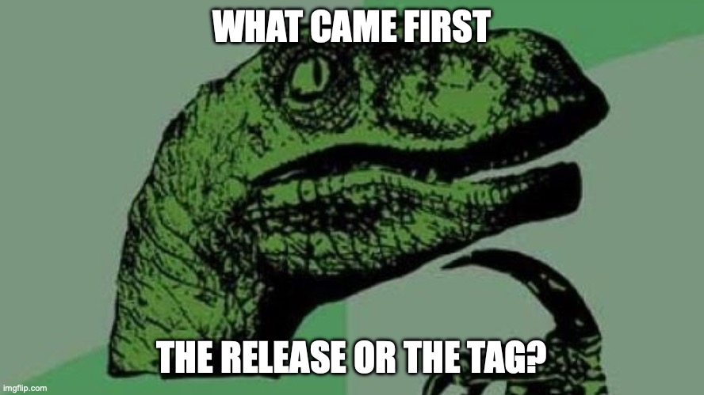
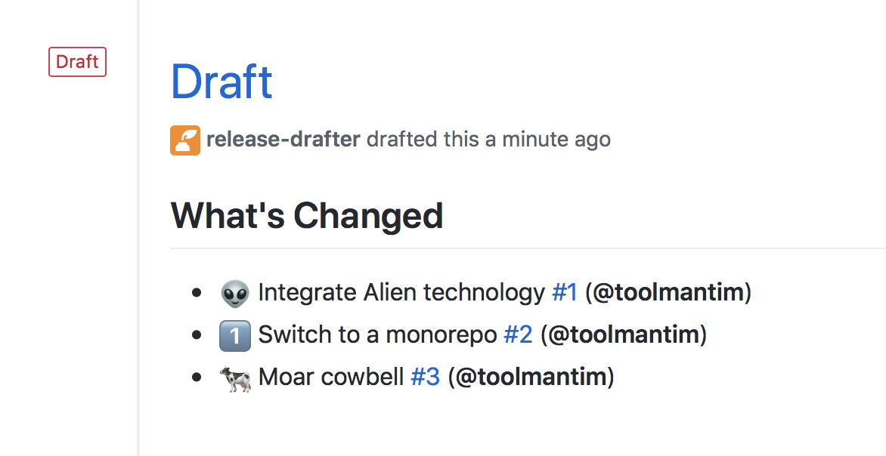

[GitHub Releases](https://docs.github.com/en/repositories/releasing-projects-on-github/about-releases) is a feature where you can create a page associated with a git tag that contains a description of the changes in that tag along with build artifacts for users to download.

Many of the open-source projects I work on are Python projects where package distributions for new versions are pushed to [PyPI](https://pypi.org) and [Conda Forge](https://conda-forge.org). There aren't any build artifacts that we want to distribute via GitHub and many projects already keep a changelog file up to date, so creating a GitHub Release feels like duplication of effort that provides little value.

However, GitHub Releases are a core part of the social and community side of the GitHub platform. When you create a new Release all of the GitHub users that have starred your project will see the Release page in their feed. Releases can also be written in markdown and the rendered page benefits from similar features to Issues and Pull Requests where issue/PR numbers, commit hashes and usernames are [automatically linked up](https://docs.github.com/en/get-started/writing-on-github/working-with-advanced-formatting/autolinked-references-and-urls). This can be a much more pleasant changelog experience than reading through a text file.

## Release mechanisms

Many projects use GitHub Releases as the primary mechanism for creating a new version of their software. From the GitHub web interface a maintainer can create a new Release, which will automatically create a new tag. That tag may trigger a GitHub Action which builds some artifacts (for Go/Rust projects this would be static binaries for different CPU architectures) and attaches them to the release via the GitHub API.

Other projects, like the ones I primarily work on, the tag is created first and pushed to GitHub. The tag then triggers a GitHub Action that builds source distributions and wheels for the Python package and uploads them to PyPI.



My preferred release process is to simply run:

```bash
git tag v1.2.3 
git push upstream main --tags
```

Then have every other release action triggered via GitHub Actions. Anything more complex than this can result in human error. But doing things in a "tag first" way means we miss out on the social benefit of Releases.

## Release Drafter

There is an excellent GitHub Action called [Release Drafter](https://github.com/release-drafter/release-drafter) which runs every time a PR is merged to main that automatically generates release notes for the next release using PR titles and updates a draft GitHub Release with it.



It can use PR labels to sort changes into categories. It also can use those labels to [infer what the next version number will be](https://github.com/release-drafter/release-drafter?tab=readme-ov-file#version-resolver) according to SemVer (this also works well with [EffVer](https://jacobtomlinson.dev/effver)).

This workflow generally assumes you are using the first type of release mechanism. To create a new release you simply edit the draft created by Release Drafter, check it over to make sure you are happy with the body text, then hit publish.

## Using Release Drafter with existing tags

Release Drafter can also be configured to fit with the "tag first" approach of releases, here's an example.

First we need to create our Release Drafter config called `.github/release-drafter.yml`. We are not going to use any of the version resolving logic or name/tag templating features because we will choose the tag name ourselves at the moment we create it, so we can leave most of this config out and just set the name/version tags to an arbitrary value that will be overridden later. You just need to configure the release notes templates and categories however you like.

```yaml
# These will be overridden by the publish workflow and set to the new tag
name-template: 'Next Release'
tag-template: 'next'

# Optionally configure your categories and other templates
categories:
  - title: '🚀 Features'
    labels:
      - 'feature'
      - 'enhancement'
  - title: '🐛 Bug Fixes'
    labels:
      - 'fix'
      - 'bugfix'
      - 'bug'
  - title: '📖 Documentation'
    label: 'documentation'

change-template: '- $TITLE @$AUTHOR (#$NUMBER)'
change-title-escapes: '\<*_&' # You can add # and @ to disable mentions, and add ` to disable code blocks.

template: |
  ## Changes

  $CHANGES
```

Next let's create a workflow that updates the draft release every time we merge a PR to main, let's call it `.github/workflows/release-drafter.yml`. Technically this workflow is optional as we wont be manually editing and publishing the draft outselves, but it can still be nice to see a preview of the Release.

```yaml
name: Release Drafter

on:
  push:
    branches:
      - main

permissions:
  contents: read

jobs:
  update_release_draft:
    # if: github.repository == 'myorg/reponame'  # Uncomment this and set the repo name to ensure releases are not created on forks
    permissions:
      # Write permission is required to create a GitHub release
      contents: write
      pull-requests: read
    runs-on: ubuntu-latest
    steps:
      - uses: release-drafter/release-drafter@v5
        with:
          disable-autolabeler: true
        env:
          GITHUB_TOKEN: ${{ secrets.GITHUB_TOKEN }}
```

Then finally we can create the publishing workflow which will be triggered when we push new tags. This workflow will override the name and tag name to match the new tag, and set the Release status to published instead of draft. Let's call this workflow `.github/workflows/release-publish.yml`.

```yaml
name: Release Publisher

on:
  push:
    tags:
      - "v*.*.*"

permissions:
  contents: read

jobs:
  publish_release:
    # if: github.repository == 'myorg/reponame'  # Uncomment this and set the repo name to ensure releases are not created on forks
    permissions:
      # Write permission is required to publish a GitHub release
      contents: write
      pull-requests: read
    runs-on: ubuntu-latest
    steps:
      - name: Set version env
        # Use a little bit of bash to extract the tag name from the GitHub ref
        run: echo "RELEASE_VERSION=${GITHUB_REF#refs/*/}" >> $GITHUB_ENV
      - uses: release-drafter/release-drafter@v5
        with:
          disable-autolabeler: true
          # Override the Release name/tag/version with the actual tag name
          name: ${{ env.RELEASE_VERSION }}
          tag: ${{ env.RELEASE_VERSION }}
          version: ${{ env.RELEASE_VERSION }}
          # Publish the Release
          publish: true
        env:
          GITHUB_TOKEN: ${{ secrets.GITHUB_TOKEN }}
```

## Use on existing projects

A quick warning, if you're planning to use this with a large existing project the first time a release is created the release notes will contain every PR ever merged into the project. This could be very large. The reason this happens is because the Release Drafter includes every PR since the last release, not the last tag, so if there has never been a release this will be every PR.

To avoid this you can manually create a release for the latest tag in the project, you could even just leave the body empty. Then the first automated release will correctly calculate the notes. You can then go back and delete the release you manually created if you wish.

## Conclusion

That's it! With a couple of GitHub Actions workflows and a config file we will automatically create a GitHub Release for each tag. These workflows can run alongside your existing workflows that build and publish artifacts for each tag and you get the benefits of using GitHub Releases with out any additional work at release time.
