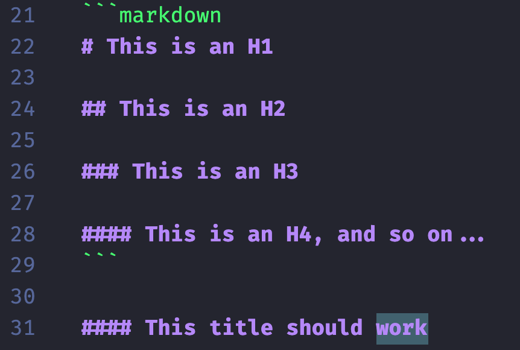

I write a lot of markdown. I use it on [GitHub](https://github.com/) when creating issues/PRs, I use it in [Obsidian](https://obsidian.md/) when I take notes, I use it in [Hugo](https://gohugo.io/) when writing blog posts ([like this one](https://github.com/jacobtomlinson/website/blob/master/content/posts/2025/2025-03-14-why-cont-my-markdown-titles-work/index.md?plain=1)), I use it in [Jupyter Notebooks](https://jupyter.org/) when working with data and I use it in [Sphinx](https://www.sphinx-doc.org/en/master/) with [MyST](https://myst-parser.readthedocs.io/en/latest/) when writing documentation.

Therefore, I make a lot of markdown titles, but sometimes they don't work ([_tl;dr skip to the answer_](#answer)).

```markdown
# This is an H1

## This is an H2

### This is an H3

#### This is an H4, and so on...
```

#### This title should work

Look 👆 this title is broken. This happens to me from time to time and I could never figure out why. If we look at the markdown it looks like this.

```markdown
#### This title should work
```

In VSCode it gets highlighted as a title. 



But ~~GitHub~~, Obsidian, Hugo, Jupyter and Sphinx all fail to render it correctly.

```info
**Update:** Looks like GitHub has fixed this!
```

It makes me feel like I'm going crazy. Especially when I type out exactly the same thing underneath and it works.

```markdown
#### This title works

#### This title should also work but doesn't

#### This title works though! Whyyyy!
```

Renders as:

#### This title works

#### This title should also work but doesn't

#### This title works though! Whyyyy!

## Here's the answer why {#answer}

Sometimes I accidentally type the wrong kind of space!


On a Mac you type the `#` character by pressing `option + 3`. When typing a title you type a bunch of `#` characters and then a space (unicode `\x20`). However, if you accidentally keep holding down `option` and type `option + space` you get a non-breaking space (unicode `\xa0`).

```info
**Update:** Turns out this is a UK specific thing! In other keyboard language settings the `#` is typed with `shift + 3`, and `£` is typed with `option + 3`. I guess that it makes sense for the `£` to be more accessible than `#` for most UK Mac Users.
```

A non-breaking space looks exactly the same as a space, but is not considered as whitespace.

```markdown
#### A title with non-breaking spaces

#### A title with normal spaces
```

Whenever this happens to me I've accidentally typed a non-breaking space after the hashes and the markdown parser considers it as one long word. Here's a little example of this in Python:

```python
# Here's a title with all normal spaces
>>> "#### This title does work".split("\x20")
['####', 'This', 'title', 'does', 'work']

# Here's a title with an accidental non-breaking space
>>> "#### This title should work".split("\x20")
['####\xa0This', 'title', 'should', 'work']
```

So if this happens to you and you can't figure out why your titles aren't rendering, check your spaces!
