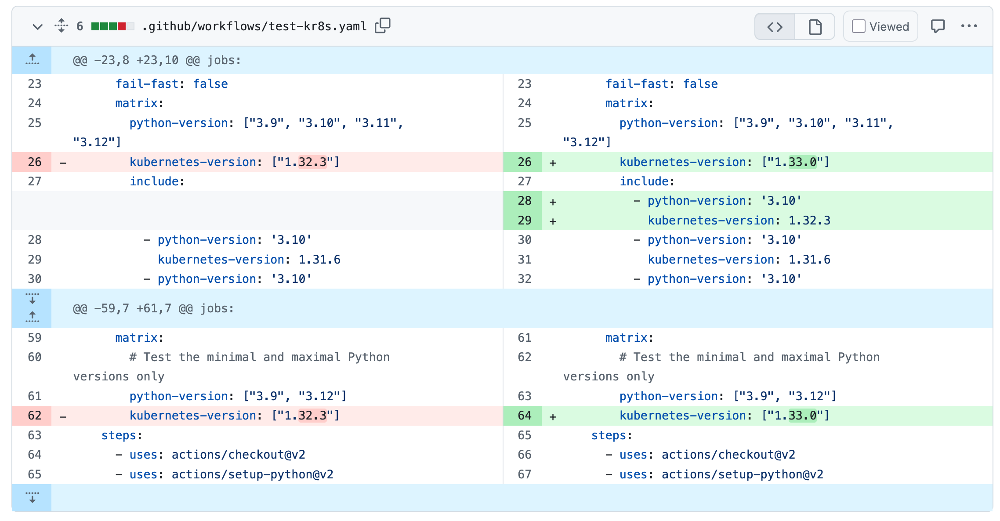
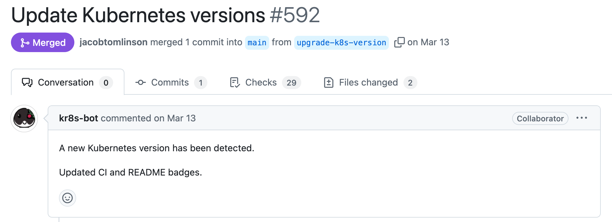
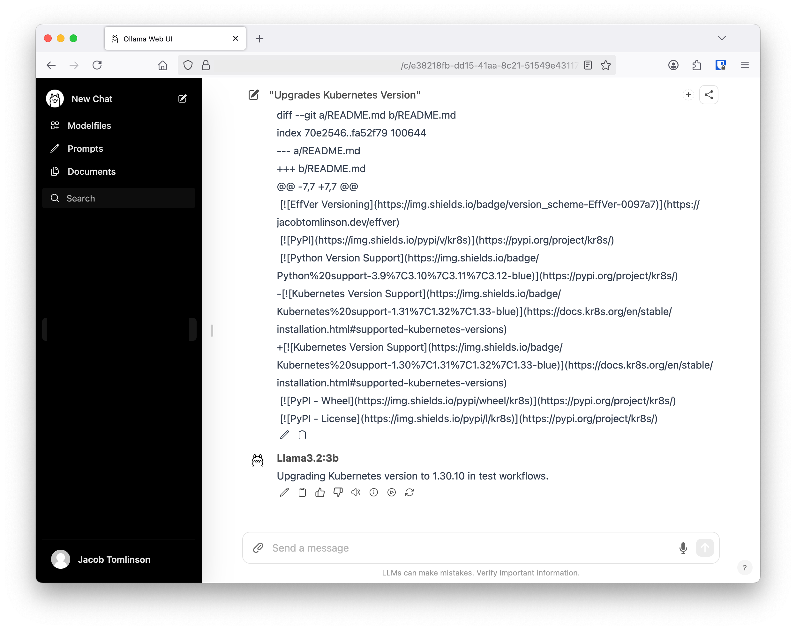
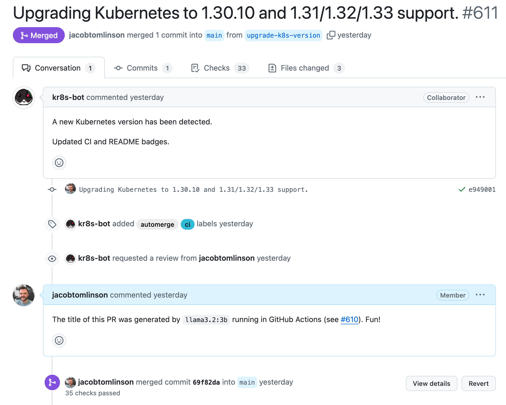

In [kr8s](https://github.com/kr8s-org/kr8s) I have a GitHub Actions workflow which runs a script nightly on a cron job. The workflow grabs a list of actively supported Kubernetes versions from [endoflife.date](https://endoflife.date/kubernetes) and then cross-references them with the [available `kind` container images](https://hub.docker.com/r/kindest/node/tags) for running the tests in CI.

The script then updates the GitHub Actions config and README with the latest versions and opens an [auto generated Pull Request like this one](https://github.com/kr8s-org/kr8s/pull/592). New releases of Kubernetes happen every few months, and patch releases come out intermittently in between. I usually review and merge one of these PRs each week.



The logic in [the script](https://github.com/kr8s-org/kr8s/blob/main/ci/update-kubernetes.py) is quite simple. It gets the currently supported versions and replaces whatever versions are listed in the workflow YAML with them. It doesn't have any understanding of what was there before, it just updates things with the current state of the world. As a result the PR that gets generated is pretty generic. It doesn't say anything about what has changed, only that things have been updated.



I can look at the diff to know what has changed when I review it, but it would be really nice if the title was a little more specific. This got me thinking, _can I give the diff to an LLM and get it to generate a nice title for me?_

I set myself a couple of goals for this side-quest:
- Generation should be done using an open-weights model
- Title generation must happen as part of the GitHub Actions workflow
- No calling out to third-party APIs and managing API keys and associated costs

My starting point was my existing workflow that looked something like this:

```yaml
name: "Update Kubernetes Versions"
on:
  schedule:
    - cron:  '30 2 * * *'
  workflow_dispatch: {}

jobs:
  update-kubernetes:
    runs-on: ubuntu-latest
    steps:
      - name: Checkout
        uses: actions/checkout@v3

      - name: Install uv
        uses: astral-sh/setup-uv@v5

      - name: Run update Kubernetes script
        run: uv run ./ci/update-kubernetes.py

      - name: Create Pull Request
        uses: peter-evans/create-pull-request@v5
        if: github.repository == 'kr8s-org/kr8s' # Don't run on forks
        with:
          base: main
          commit-message: "Update Kubernetes versions"
          title: "Update Kubernetes versions"
          token: "${{ secrets.SOME_TOKEN }}"
          branch: "upgrade-k8s-version"
          body: |
            A new Kubernetes version has been detected.

            Updated CI and README badges.
```

The workflow checks out the code, runs the update script and then uses the [peter-evans/create-pull-request](https://github.com/peter-evans/create-pull-request) action to create the PR. If there are no changes after running the script the create PR action just exits as a noop.

## Adding an LLM

The first thing I needed was a step to get the diff of the changes and also to figure out if we should even bother making the PR. While the create PR action just exits successfully if there are no changes it felt cleaner to have a step figure out if there are changes and then use an `if` on subsequent steps. There's no point in generating a PR title if we aren't going to open a PR.

To solve this I added a step which calls `git diff` and sets a `diff` output with the contents of the diff along with a `has_changes` output containing `true` or `false` depending on whether the diff was empty or not.

```yaml
      - name: Show diff
        id: diff
        run: |
          echo 'diff<<END_OF_DIFF' >> $GITHUB_OUTPUT
          git diff --unified=0 | tee -a $GITHUB_OUTPUT
          echo 'END_OF_DIFF' >> $GITHUB_OUTPUT

          if [ -z "$(git diff --unified=0)" ]; then
            echo "No changes to commit"
            echo "has_changes=false" >> $GITHUB_OUTPUT
          else
            echo "Changes to commit"
            echo "has_changes=true" >> $GITHUB_OUTPUT
          fi
```

Next I used the [ai-action/ollama-action](https://github.com/ai-action/ollama-action) to generate the PR title. This action takes a model name and a prompt as inputs. It starts [ollama](https://ollama.com/), pulls the model and invokes the model with your prompt. It then sets a GitHub Actions output called `response`.

````yaml
      - name: Generate PR title
        uses: ai-action/ollama-action@v1.0.0
        if: steps.diff.outputs.has_changes == 'true'
        id: title-llm
        with:
          model: llama3.2:3b
          prompt: |
            You are a helpful assistant that generates PR titles for 
            Kubernetes version updates by summarising a git diff.
            The title should be concise and to the point, and should not 
            include any markdown formatting.
            The title should be in the present tense.
            Your response must be no more than 50 characters.

            ```diff
            ${{ steps.diff.outputs.diff }}
            ```

            Please summarize the changes in the diff with particular attention 
            to the Kubernetes version that is being updated.
            Don't include the Python version information in the title or 
            which files are being edited. Focus only on the Kubernetes version.
````

You can see here that we only call this step if the diff shows some changes. 

Getting the prompt right took some experimentation. To try things out I ran [ollama](https://ollama.com/) and [open-webui](https://github.com/open-webui/open-webui) locally and played around in the chat window with my prompt and various diffs that I generated until it was outputting something sensible.



I also added a small debugging step to show the title that would be generated.

```yaml

      - name: Show PR title
        if: steps.diff.outputs.has_changes == 'true'
        run: |
          echo "The action would generate the following PR title: ${{ steps.title-llm.outputs.response }}"
```

Then finally I could update my create PR step to use this title.

```yaml
      - name: Create Pull Request
        uses: peter-evans/create-pull-request@v5
        if: steps.diff.outputs.has_changes == 'true' && github.repository == 'kr8s-org/kr8s'  # Don't run on forks, skip if no changes
        with:
          base: main
          commit-message: ${{ steps.title-llm.outputs.response }}
          title: ${{ steps.title-llm.outputs.response }}
          token: "${{ secrets.SOME_TOKEN }}"
          branch: "upgrade-k8s-version"
          body: |
            A new Kubernetes version has been detected.

            Updated CI and README badges.
```

Then to try things out I removed Kubernetes `1.30` from the CI workflow and merged that into `main`. This way the next time the automated workflow ran it would reintroduce `1.30` and I could see what title it would generate.



## Final thoughts

The titles generated by the LLM are not bad. They roughly explain what is in the PR, and it's more helpful than a generic message. If you want to give this a spin for yourself you can find the [full workflow here](https://github.com/kr8s-org/kr8s/blob/main/.github/workflows/update-kubernetes.yaml).

This is far from the most compute efficient way to run these LLMs. When testing locally ollama was using the NVIDIA GPU in my machine and was generating titles instantly. In the GitHub Actions workflow it is using the CPU to do the inferencing, producing far fewer tokens per second and taking many seconds to generate the title. However, this doesn't really matter for this application, in the grand scheme of things pulling the model weights is going to take the majority of the time regardless.

Which models you can use will also be limited by the amount of memory available on the GitHub Actions runner. I experimented with a few llama3 variations including `llama3:8b`, `llama3.2:1b` and `llama3.2:3b`. The 1 billion parameter model was giving poor quality titles, and the 8 billion parameter one took too long to download. I ultimately settled on `llama3.2:3b` which comes in at 2GB and felt like a good balance of quality vs download size. I did also try `gemma3:12b` which is a newer ~8GB model, however it wan't giving much better results for 4x the size and ollama was sometimes erroring in GitHub actions although it wasn't clear why.

I also tried using GitHub's built in caching to store the model in between CI runs. However, I found this to be slower than letting ollama pull the model every time. I expect ollama can pull multiple layers of the model in parallel compared to the cache trying to decompress and store a single artifact. If you do want to do this though here's the directory you need to cache.

```yaml
- uses: actions/cache@v4
  with:
    path: ~/.ollama
    key: ${{ runner.os }}-ollama
```
