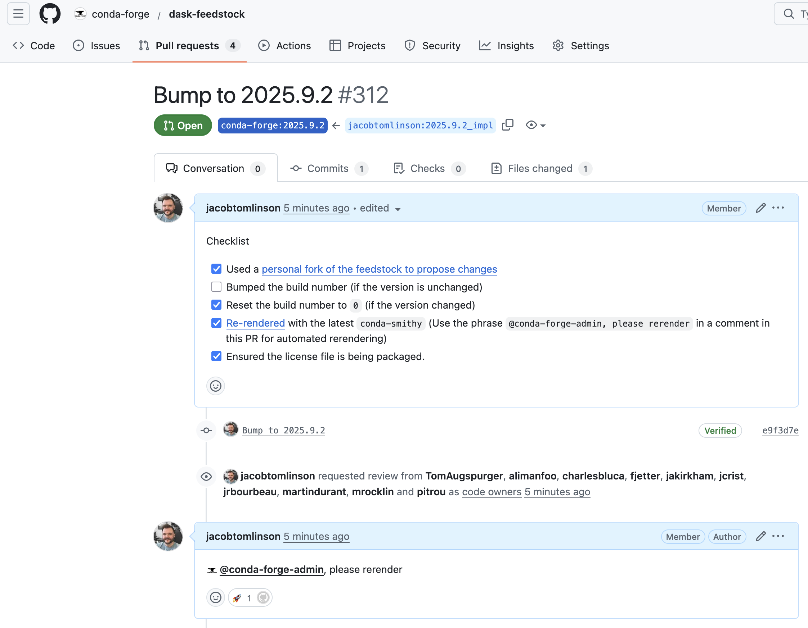
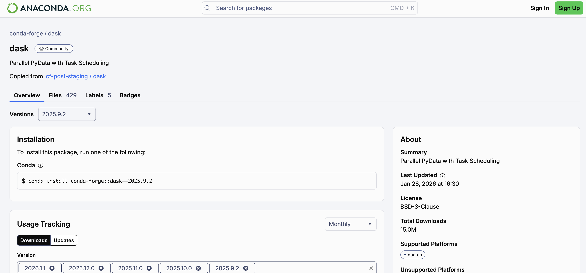

Some quick notes on how to make a backport Conda Forge release.

## Context

We recently had a security vulnerability in Dask which we patched in `2026.1.1` (see [GHSA-c336-7962-wfj2](https://github.com/dask/distributed/security/advisories/GHSA-c336-7962-wfj2) for more information on what happened).

When security fixes happen like this projects often want to backport that fix to various older releases, especially if those releases are still widely used. It was reported to us that the `2025.9.1` release was still being actively used by one community of Dask users and it was not possible for them to upgrade to `2026.1.1` quickly.

To resolve this we backported the fix and created `2025.9.2` which is identical to `2025.9.1` except that it contains a patch for the CVE.

## Making the backport release

Making the release itself was pretty straight forward. You just check out the older release, make a new branch from there, cherry-pick the security patch, then create a tag and publish the package.

```bash
# Check out the release commit
git checkout 2025.9.1

# Make a new branch
git checkout -b backport-2025-9-2

# Cherry pick the fix
git cherry-pick ab72092a8a938923c2bb51a2cd14ca26614827fa

# Make any updates necessary to pyproject.toml, changelog.md, etc and commit them
# ...
git commit -a -m "Version 2025.9.2"

# Make a new release tag
git tag -a 2025.9.2 -m 'Version 2025.9.2'

# Push the backport branch to GitHub with the tag
git push upstream backport-2025-9-2 --tags

# Build and release the package to PyPI
git clean -xfd
pyproject-build  # or uv build
twine upload dist/*  # or uv publish
```

## Backporting to Conda Forge

Now that the backport release is on PyPI we also need to publish it to Conda Forge. However, there is so much automation in Conda Forge releases that I got a little stuck here. Thankfully [John Kirkham](https://github.com/jakirkham) kindly walked me through the process. The point of this post is to write that process down for future reference.

```note
Since publishing this I've also been pointed to the [Conda Forge | How to maintain several versions](https://conda-forge.org/docs/how-to/advanced/several-versions/) docs page which outlines the background on what automation is happening here. My search abilities let me down and I didn't find this page when originally trying to figure this process out.
```

To make releases on Conda Forge I usually push a new package to PyPI then wait for the Conda Forge Bot to automatically make a PR. This PR updates the version and the sha256 hash for the new package on PyPI. Then that PR gets merged to `main` which triggers the package to be built and pushed to Anaconda.

Making a backport is similar, but instead of making a PR to `main` you make a new branch and then make a PR to that branch. Then when the PR is merged the same release automation happens.

```warning
The backport branch must be in the upstream feedstock repo, and the PR needs to be made from a personal fork.
```

First we need to search the git history to find the commit where the release we are targeting was made. In the Dask example we want to find the `2025.9.1` merge commit.

Then we create a new branch with the name of the new release and push this branch to the upstream feedstock.

```bash
git checkout adc96e614a4db8268501a256078cc5cc5a53dc4d
git checkout -b 2025.9.2
git push upstream 2025.9.2
```

Then we need to make another branch off from here where we will update the version to be the new PyPI package. 

```bash
git checkout -b 2025.9.2_impl
```

Now we can update the `recipe/recipe.yaml`. As we are working with a pure Python package we just need to bump the version number and update the SHA checksum to match the PyPI distribution. The easiest way to do this is with [grayskull](https://github.com/conda/grayskull).

```bash
uvx grayskull pypi dask==2025.9.2
```

This will generate a new recipe in `dask/meta.yaml` which is excluded from version control by the default Conda Forge `.gitignore`. You might want to just replace `recipe/recipe.yaml` with this file, or if you've customized your recipe (as we have in Dask) you can copy the `sha256` and version number over manually (which is what I did).

```diff
diff --git a/recipe/recipe.yaml b/recipe/recipe.yaml
index aeeb031..b763d48 100644
--- a/recipe/recipe.yaml
+++ b/recipe/recipe.yaml
@@ -1,7 +1,7 @@
 schema_version: 1
 
 context:
-  version: "2025.9.1"
+  version: "2025.9.2"
   python_min: 3.10
 
 package:
@@ -10,7 +10,7 @@ package:
 
 source:
   url: https://pypi.org/packages/source/d/dask/dask-${{ version }}.tar.gz
-  sha256: 718df73e1fd3d7e2b8546e0f04ce08e1ed7f9aa3da1eecd0c1f44c8b6d52f7e0
+  sha256: 5b64239bfb50abb12d397bf7f73699b0493d01577fe379aa4cad3cb62ba11519
 
 build:
   number: 0
```

Next we can commit that and push it to your personal fork of the feedstock.

```bash
git commit -am "Bump to 2025.9.2"
git push --set-upstream origin 2025.9.2_impl
```

Then open a pull request and be sure to target the `2025.9.1` branch (or whatever you named it) on the upstream.

Then you need to comment on the PR with the phrase `@conda-forge-admin, please rerender` which will cause the Conda Forge Bots to update any tooling in the PR to the latest version required for Conda Forge automated publishing.



Once the rerender is complete and the CI has passed you can merge the PR. This will trigger the release and once the CI works it's way through you will see the package on Anaconda.


