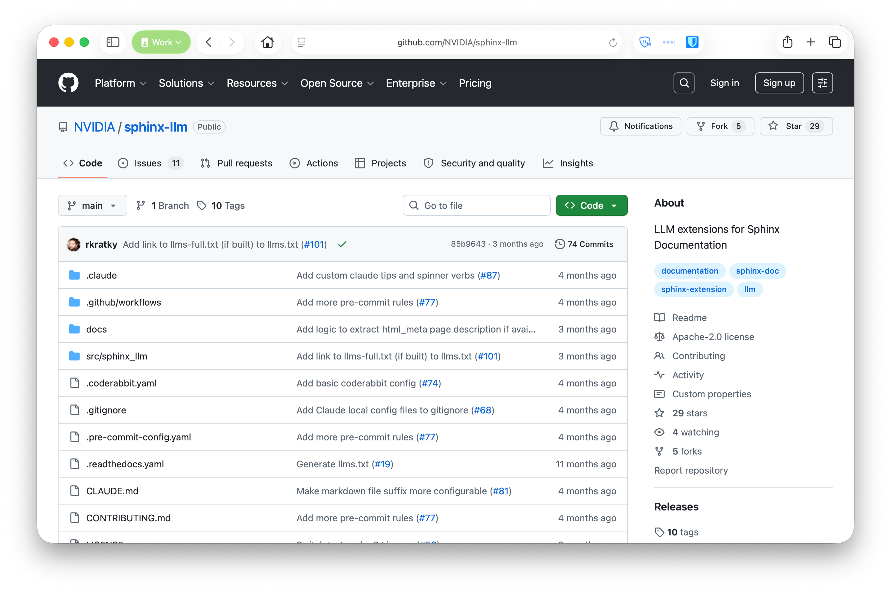

```info
This post is a companion to a talk I gave at [PyData London 2026](https://pretalx.com/pydata-london-2026/talk/3MAU9W/). You can watch the [recording here](https://www.youtube.com/watch?v=bRDtplyhRYw) and see the [slides here](https://speakerdeck.com/jacobtomlinson/documenting-your-open-source-projects-for-machines).
```

I've spent a lot of my software engineering career working on open source tools, libraries and frameworks. These are chunks of software that other software engineers use to build their software. I make things for makers, and I like that. A large part of working on these projects is telling people about the library, and explaining to them how to use it. Open Source Software Engineers spend a big chunk of their time on grassroots marketing, getting other engineers to use their code.

Coding Agents have flipped a lot of things on their head, and one of them is software libraries. I've had a few conversations lately about whether we even need software libraries at all, or whether our tools can just vibe up whatever we need in the moment. Personally, I think there is a strong argument for continuing to put shared code into libraries, but I also think the software supply chain will look very different in a few years time where soft-forking and vibed-from-reference will be commonplace. But that's an aside and would make a fun post for another day. For now let's continue with the premise that people will keep building libraries, but the consumers of libraries will be predominantly coding agents.

## The step zero problem

A couple of years ago I created [`kr8s`](https://docs.kr8s.org/en/latest/), a Pythonic Kubernetes client library. A core mission of `kr8s` is to have the look at feel of `kubectl`. This was partly to benefit from the familiarity and muscle memory people have for `kubectl`. It was also because I wanted to use some of the high-level features that `kubectl` has in Python, like port forwarding, which the official Kubernetes Python client doesn't have out of the box. I found the `kubernetes` library unergonomic to use and lacking in a few features which resulted in building boilerplate and scaffolding code around it.

Fast forward to today where agents build things for us and now both of those benefits are much less valuable. If I want to build some Python code that interacts with Kubernetes my agent will almost certainly reach for the official `kubernetes` Python client, and it will happily write out any scaffolding in a matter of seconds. Building ergonomic libraries for humans is now much less valuable than building well designed and maintainable libraries for machines. 

```info
There are other libraries like [cloudcoil](https://github.com/cloudcoil/cloudcoil) and [lightkube](https://github.com/gtsystem/lightkube) which lean heavily into the Python type system and have very verbose APIs. This isn't great for a one off human written script (the bread and butter for `kr8s`), but for a large agent maintained codebase they are probably going to be easier for agents to use and maintain.
```

Regardless of which third-party client library you prefer, your agent is always going to prefer what is in it's model weights. The official library has been around for a long time and there is a lot of content around on the internet about it, so it's going to dominate in LLM text generation. If you prompt your agent to write some Python code that interacts with Kubernetes it will almost certainly default to the official library. As we move closer and closer to code being a black box that we train and test just like a model the implementation details within that box matter less. So who cares if the agent just grabs the official library?

This brings us to the one thing we Software Engineers still supposedly bring to the table, 'taste'. Based on my experience and understanding of interacting with Kubernetes from Python I would recommend using a strongly typed and composable client library to ensure simpler implementations that have lower maintenance burden over time. Equally I know that for one-off scripts `kr8s` is a much simpler choice and will result in very readable code which will speed up the review step of my vibe-review-execute-delete workflow for single-use scripts.

In order to deviate from the default I need to explicitly tell my agent to do this. In large projects you would include your library preferences in your `AGENTS.md` file. For one-off scripts you would probably just tell it in the prompt. Or perhaps your agent has memory and draws on your preferences from there.

This means that library adoption still mainly depends on humans discovering and choosing to use your library, and many of the old rules still apply. 

## How agents get their knowledge

Agents know about things in two different ways:

**Training**

They ingest documentation and code into their weights. This is biased towards libraries that are better represented in the training set.

**Context**

They use tools to fill gaps, get up-to-date information, or pull out specific details. If something is not in their weights they need to add it to their context.

If you ask your agent to analyse a CSV file in Python it will likely reach for the `pandas` library. It is the default because it is so popular and well entrentched in the community and the model will have good knowledge of it in it's weights.

```text
❯ Can you analyse the titanic.csv data and group by age range and mortality?
```
```python
Let me read the Titanic CSV to understand its structure first.

⏺ Reading 1 file, running 1 shell command…
  ⎿  $ python3 -c "
     import pandas as pd
     df = pd.read_csv('titanic.csv')
     bins = [0, 12, 18, 30, 45, 60, 100]
     labels = ['0-12', '13-18', '19-30', '31-45', '46-60', '61+']
     df['AgeRange'] = pd.cut(df['Age'], bins=bins, labels=labels, right=True)
     result = df.groupby('AgeRange', observed=True).agg(
     Total=('Su…
```

But when you reach the edge of what the model can recall it will start to hallucinate, and at this point a good agent harness will have set things up in a way where the model starts trying to make tool calls to learn more about the library and add that information to it's context.
Equally if you instruct the agent to use a more obscure library, or an internal library the model has never seen before, then the agent is going to need to go and learn about it.

## Everything it reads next is its documentation

Agents are non-determistic by nature so they won't perform the exact same process every time. Broadly they will explore the local filesystem for anything they can learn about the library and they will sometimes search the web to gather information. Making web search calls are generally slower and more expensive than using ripgrep to hunt through the filesystem, so they often do local first, or at least this is the step that returns fastest if it doesn them in parallel. 

If you've asked your agent to use a library written in an interpreted language like Python it will usually check to see if the library is installed, and then will hunt through the source to learn about it. In our example above it might grep for the `groupby` function or any mentions of groupy by operations. It will find the implementation, the docstrings and possibly tests if you've included them in your package.

```warning
Your tests might not be the best place for an agent to learn about your library 😅.
```

The search will also probably return your documentation site, blog posts, stack overflow questions and other resources. However, this content is often less accurate because it could be referring to a different version of the library than the one you have installed.

Another thing it often does with libraries is walk the `__init__.py` structure to look at the `__all__` declarations to find the layout of the library. This means that combined with the grep results for the operation you're trying to do it will have a good look through the top level entrypoint files.

## Is an API reference all you need?

Some of you might be thinking "that's great, all of my code is self-documenting so why would the agent need to read anything else?". 

For many year's I've been a fan of the Diátaxis Framework. 


> Diátaxis identifies four distinct needs, and four corresponding forms of documentation - tutorials, how-to guides, technical reference and explanation. It places them in a systematic relationship, and proposes that documentation should itself be organised around the structures of those needs.
> 
> https://diataxis.fr/

I would argue that self-documenting code, or code with good docstrings only covers the _reference_ quadrant of the framework. Often within your project's documentation you will have other kinds of text, such as tutorials, cookbook examples and broad sections explaining why something is done the way that it is. More mature projects often have some form of [enhancement proposal](https://numpy.org/neps/) process for making architectural decisions where maintainers write up what they want to do and make arguments for it. None of this knowledge is contained in the code, but is valuable information for users of a library. 

It's great that agents can just grep through code to see how it works, but they are often missing a lot of the _why_ something works a certain way, or what the conventions are.

Usually all of this is published as part of your project's documentation website, not in the code itself. So if we want the agent to learn about these things we need to nudge it, from within the code, to read the resources we want them to read.

A simple first step is just adding an index of resources to your `__init__.py`.

```python
# __init__.py
"""supercsv: My custom CSV analysis library.

Docs:    https://supercsv.dev/llms.txt
Source:  https://github.com/supercsv/supercsv
Skills:  Agent Skills are in the bundled skills/ folder.
"""
```

## Progressive Disclosure

This idea of giving your agents a nudge towards another resource is called _progressive disclosure_, a term borrowed from the UX community.

> Progressive disclosure is an interaction design pattern used to make applications easier [by] designing workflows where information is revealed when it becomes relevant to the current task
>
> https://en.wikipedia.org/wiki/Progressive_disclosure

If you've used [agent skills](https://agentskills.io/home) you'll be familiar with this idea as they are one standardised implementation of this concept. Instead of dumping everything you could possibly know into the context you leave breadcrumbs. You reveal small amounts of information along with pointers on how to learn more about a particular subject. This allows you to keep your context small, but gives your agent the possibility to learn more when it needs to.

This is one area where agents differ from humans. If we provided long index pages in our documentation with one-line summaries of each page nobody would read it end-to-end. Once a human gets to the tenth item they probably will stop and will fall back to search or just navigating through cross-links organically from a start page. However, agents will happily consume a big index of concepts and then later on look any of the up as and when it needs them.

## Where should our breadcumbs point?

As we've discovered we currently have one quarter of our documentation (docstrings and the code itself) sitting on the local disk, and the rest are on a web page on the internet somewhere. We can point our agents to those pages, and it can discover them via search, but then it will need to read them and just extract what they need.

For a while I've been a proponent of the [llms.txt](https://llmstxt.org/) specification. This describes that all websites should publish a simplified markdown version at a discoverable URL, along with a sitemap with descriptions of each page also in markdown. I even built out a Sphinx extension called [sphinx-llm](https://github.com/NVIDIA/sphinx-llm) which I'm using on many projects to generate these markdown pages as part of the documentation build.



`sphinx-llm`:

- Generates `llms.txt` and `llms-full.txt` alongside your HTML.
- Runs a parallel markdown Sphinx build and merges it into the output.
- Runs all extensions including autodoc and intersphinx.
- Works with RST, MyST, whatever you already write.
- `pip install sphinx-llm`

Honestly though it's currently unclear to me how many agent harnesses actually make use of this standard in their webfetch tools. I know that Cursor does, but other tools like Claude Code and Codex prefer to just read the HTML and extract the contents their own way.

Regardless this still means that our coding agents need to make HTTP requests for every page they want to read, and they can't easily grep through those pages like they can with files on disk.

## Your docs should be on the disk

The more I thought about this the more I came to the realisation that we should just be shipping our docs pages alongside our library code. A few extra KB of highly-compressible markdown isn't going to make a meaningful difference to package sizes and it means our agents will be able to grep through all of the tutorials, examples, cookbook pages, explaintation and accepted enhancement proposals. They will be able to gather a much more targeted and well rounded set of knowledge about a library, and they will be able to do it quickly.

You don't need to include images or anything else that would bloat the filesize because the agent's are ignoring them when reading the HTML version anyway.

Another benefit of shipping your docs alongside your code is you can be confident that the version of the docs exactly matches the version of the library you have installed. 

I have a theory that every problem we need to solve for agent harnesses has already been solved by unix. Unix has had [man pages](https://en.wikipedia.org/wiki/Man_page) since the 1970s, which are effectively just plain text documentation files stored on disk alongside an application. Let's just start doing that again!

## What about skills?

We already briefly touched on skills, the standardised way of doing progressive discovery in many agent harnesses. Many project maintainers have been busy adding skills to their projects, but many of these are focused on maintainer specific tasks. Skills for working on the library, not using it.

I would encourage all projects to build skills for your users. Skills which will help their agents use your library more effectively.

One pattern I quite like is to put maintainer skills in the usual place your coding agent will find them, but then also provide user facing skills in a top level directory.

```text
.
├── .agents
│   └── skills  # Maintainer skills
├── src
├── ...
└── skills  # User skills
```

Users still need to discover these skills. Registries like [ClawHub](https://clawhub.ai/) and [skills.sh](https://www.skills.sh/) help with this, but these are separate from the registries you are getting your software from. Ideally if I install the `pandas` library in my software environment I want some pandas skills to come with it. But right now we only have the distinction between global skills and project skills, both of which I need to discover and install manually. I want software environment skills from within the packages themselves. Recently a friend suggested that we should have a [`SKILLS_PATH` environment variable](https://betatim.github.io/posts/skills-search-path-for-agents/), only reinforcing my theory about unix.

I don't think we are near solving this problem yet. But that doesn't stop us from shipping our skills in our packages too. So put your skills alongsde your documentation right into your wheel. Get them on people's systems so when their agents go grepping about they find them.

## Final thoughts

Everything your library outputs gives your agent more information. This includes error messages. If you're not already putting actionable information in your errors you certainly should, but with agents it's even more important because they can follow the error, read the associated documentation and ideally fix the problem via it's feedback loop.

Lean into language features like type hints. This adds even more information for agents to leverage when working with your library.

Lastly make sure you test all of this! Due to the non-deterministic nature of LLMs a lot of this kind of work is becoming loosely defined and fuzzy. But you can still objectively test the changes you're making to your library to verify they are having a positive impact. Spin up a fresh agent in a sandbox with no memory or context, get it to do some things with your library. Then implement the things I've suggested here, bundle your docs, add breadcrumbs, improve your errors, etc. Then get it to repeat those same tasks and see if there is an improvement.
