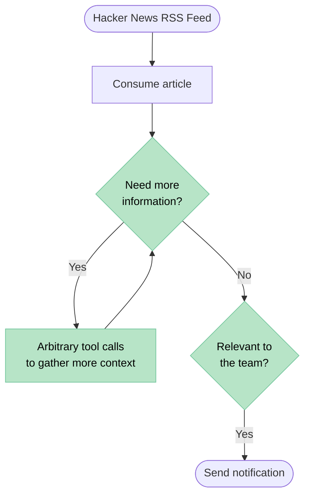

Agents are powerful because they can reason their way towards a goal using tools to interact with the world. Some tools gather new information, other tools perform actions. The most compelling agentic workflows are tasks where you have a well defined end goal, but the intermediate steps are unclear. 

The steps could be unclear for one of two reasons, either because this task has not been attempted before and the agent needs to figure out the steps as it goes, or because the task is repetitive but the steps change each time based on some external factor.

## Ad-hoc tasks

The first category often starts with an ad-hoc message in a chat. The user will message the agent and say "do this task for me" and the agent will iterate until the task is complete using all of the tools it has available. In these situations we want the agent to have access to all of the tools it could possibly need. 

Right now we are having a heatwave in the UK. I can drop my [OpenClaw](https://openclaw.ai/) agent a message on WhatsApp and say "let me know when the temperature drops below 20°C (68°F) this evening so I know when it's safe to walk the dogs". This is a task I've never asked it to do before, so it will need to figure out that it needs to use tools like `web_search` and `web_fetch` to look up the weather information, as well as the `schedule_task` tool to set itself a reminder to periodically check the temperature. Eventually the temperature will drop below the threshold and it will use the `send_message` tool to drop me a message and will also use the `schedule_task` tool again to cancel the periodic task. 

This is a good agent task because I might never ask it to do this action again. If I lived somewhere with a hot climate I would probably set up a [Home Assistant](https://www.home-assistant.io) automation or some kind of script to robustly notify me about this every day. But I live in England, and weather like this only happens for a handful of days each year so being able to send my agent ad-hoc tasks like this is extremely powerful. Tomorrow I might ask it to do a completely different novel task which will involve a completely different combination of tools.

## Repetitive tasks

The other category of task is usually some kind of queue processing. There will be a feed of information, whether that's an RSS feed, a mailing list or a notification queue. This could also be an event driven flow where some external event like receiving an email should nudge the agent to process the email. The goal will be to process each item from the feed and perform certain actions depending on what the item is. I often write a skill that encapsulates the goal the agent should work towards for each item.

The beginning and end of these workflows are usually extremely well defined, but in the middle will be some kind of decision. Making that decision will rely on loosely defined steps, usually involving gathering more information from disparate sources. 

One example of this is an agent I have that watches [Hacker News](https://news.ycombinator.com) for interesting and relevant articles/posts/projects to what my team is working on. The source of the stream is just an RSS feed of the Hacker News front page. The sink of the workflow is an optional notification to the team in Slack, the agent posts interesting and relevant articles into a dedicated channel. At the core of this workflow is a decision, is this link interesting to the team?

For a first iteration you could just take the ad-hoc approach and tell your agent something like: 

```text
Read each article on this feed one-by-one [link to feed]. If the post seems relevant to a software engineering team working on data science tools in Python then send the link to me.
```

Agent harnesses like OpenClaw could certainly complete a broad task like this, but the problem with a prompt like this is your agent will spend a large amount of tokens on basic housekeeping tasks. How does it avoid processing articles more than once? How does it decide if the article is relevant to the team? How do I send the post to the user? If you put this kind of instruction in your agent's heartbeat it will consider these questions every time. It might make skills to encapsulate each recurring task, but this still means it will spend a bunch of tokens handling those steps.

The value the agent is providing here isn't consuming an RSS feed or sending notifications. The value is processing information, enriching that information from additional sources, then making a decision around whether that information is relevant to a specific group of people.



In this flow the logic of the "Consume article" and "Send notification" steps is deterministic. It would make much more sense to write these as code instead of letting the agent figure them out each time. 

## Logic encapsulation

Every time the agent wants to consume a new article it should be given exactly one article, and it should be unique.

Instead of giving the agent our RSS feed directly we could write a small [MCP](https://modelcontextprotocol.io) server using a library like [`fastmcp`](https://gofastmcp.com) that exposes a simple tool. Each time you call the tool it feeds a new article, or returns an error that no new articles are available.

```python
import sqlite3
import feedparser
import fastmcp

mcp = fastmcp.FastMCP("hn-feed")

DB = "seen.db"
FEED = "https://news.ycombinator.com/rss"

def init_db():
    with sqlite3.connect(DB) as db:
        db.execute("CREATE TABLE IF NOT EXISTS seen (id TEXT PRIMARY KEY)")

@mcp.tool()
def next_article() -> dict:
    """Return the next unseen article from Hacker News."""
    feed = feedparser.parse(FEED)
    with sqlite3.connect(DB) as db:
        for entry in feed.entries:
            row = db.execute("SELECT 1 FROM seen WHERE id=?", (entry.id,)).fetchone()
            if not row:
                db.execute("INSERT INTO seen VALUES (?)", (entry.id,))
                return {"title": entry.title, "url": entry.link, "summary": entry.summary}
    raise ValueError("No new articles available")

if __name__ == "__main__":
    init_db()
    mcp.run()
```

The agent shouldn't need to care about any of the deduplication logic here. It should just have one simple tool that pops articles off a queue. This allows the agent to be more efficient and spend more time on the steps where LLMs actually add value.

## Flexible steps

Once the agent has an article it can reason about whether it has enough information to make a decision. The title alone may be strong enough signal to send the notification. But if not it might choose to read the article, follow additional links in the article, search for related topics in some wiki or knowledgebase used by the team, or a myriad of other steps to enrich the information it has. You could ask it to read the HN comments and decide if the article or project is being positively recieved. This is where arbitrary tool calls are valuable, the choices made will be article dependent and therefore flexibility is key.

Once the agent has enough information it can decide if the article is relevant to the team, probably using some description of the team's interests that are stored in the skill.

```text
We are working in a team that is interested in GPUs, Cloud infrastructrure, High Performance Computing, HPC, Supercomputers, Python, Kubernetes, and general Data Science and MLOps deployment.

Your job is to act as an article inspector. You should review articles which have been posted on Hacker News and decide if they would be relevant for the team.

Do you think the team would be interested in this post? If so notify the team and include a summary and justification on why it is relevant.
```

## Credential encapsulation

If the agent decides to notify the team about the post it only needs a simple tool to send the notification. The actual implementation of the notification doesn't matter to the agent, there's no need to give your agent broad credentials to a chat platform. We can just add another tool to our MCP to send the notification. Our team may choose to implement this as a post to a Slack channel, another may send it via email or do something else. With an MCP tool all of the notify logic and credentials are encapsulated and kept private from the agent. This allows you to downscope credentials to just the operation you want the agent to be able to perform, even if that token has a broader permission set.

```python
import os
import fastmcp
from slack_sdk import WebClient

mcp = fastmcp.FastMCP("hn-feed")
slack = WebClient(token=os.environ["SLACK_TOKEN"])  # The agent never sees this token

@mcp.tool()
def notify(message: str) -> str:
    """Post a message to the team Slack channel."""
    slack.chat_postMessage(channel="#interesting-links", text=message)
    return "Sent"
```

## Extra credit

If your team has a shared knowledge wiki or other resources you might want to move the description of the team and criteria outside of the agent instructions. This allows you more flexibility to choose relevant articles. The agent could draw on recent meeting transcripts and other resources to gather an up-to-date list of relevant topics. When your team discusses some new concept in morning standup and then later that day your agent notifies you of a relevant article hitting the HN frontpage on the same topic it starts feeling like a magical additional team member instead of just a pile of automations.

This information about the team's interests will move at a slower speed than the article processing pipeline. You don't want to give the agent the tools to gather the team's interests from scratch each time. Reading all the meeting transcripts from the last week every time it processes an article is not an efficient use of tokens. Instead you can have a sibling workflow which runs periodically, hourly, daily, etc, that updates some central description.

```text
Read the wiki page [team description] to get a high-level overview of the team and what they work on. Then read the meeting transcripts from the last week and any new wiki pages that have been created in the last month. Identify all topics that the team may be interested in at the moment and store them as a succinct bullet point list in the wiki page [current team interests].
```

Then in your article workflow you can defer to that wiki page to get the updated list each time.

```text
We are working in a software engineering team. The team's current interests are stored in the wiki page [current team interests], read that page before proceeding.
```

## Conclusion

Agents are extremely powerful, they give us the ability to work in ways we've never dreamed of before. We should lean into their strengths instead of replacing every part of a workflow with LLM calls. If you have workflows that rely on agents chaining together repetitive tool calls, or require them to reason to the same conclusion every time there is opportunity to optimize and simplify.

Skills can be a great way to streamline repetitive tasks and cut out re-reasoning. But consider whether the flexible nature of LLMs is adding value to that step, or can you cut it out entirely with a script or an MCP.

You should also consider whether your agents need access to certain tools. Does your agent really need the ability to arbirarily post to any Slack channel it chooses, or should it just post to certain channels in certain circumstances? Does your agent really need that API key, or can you abstract it behind an MCP? I'm generally [team CLI](https://huggingface.co/blog/nielsr/mcp-vs-cli) when it comes to empowering agents to do useful things, but encapsulating and downscoping credentials in an MCP tool is powerful when it comes to derisking what the agent can do. 
